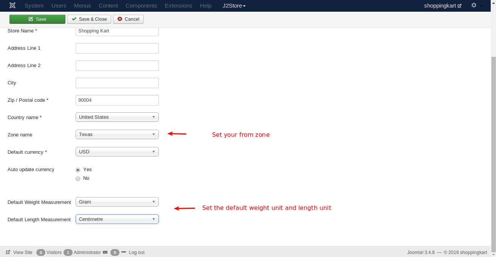
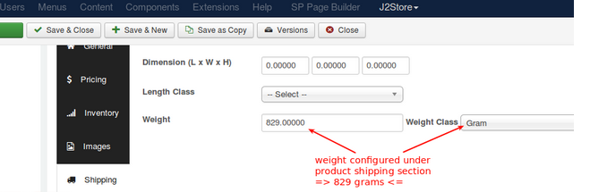
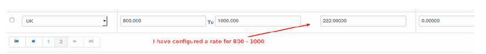
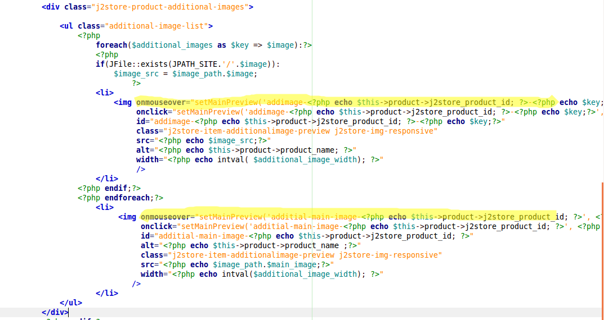
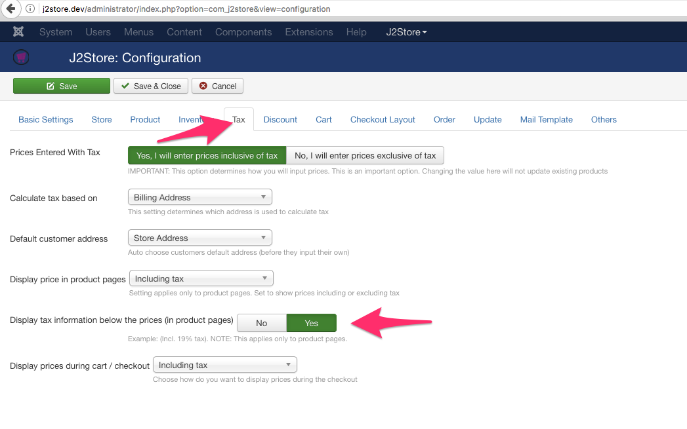
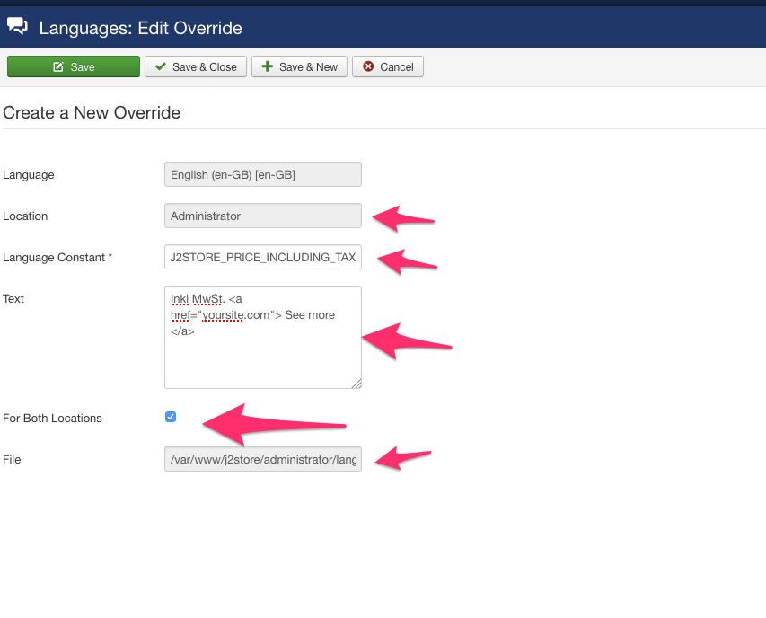
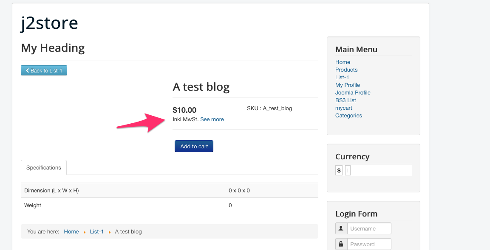
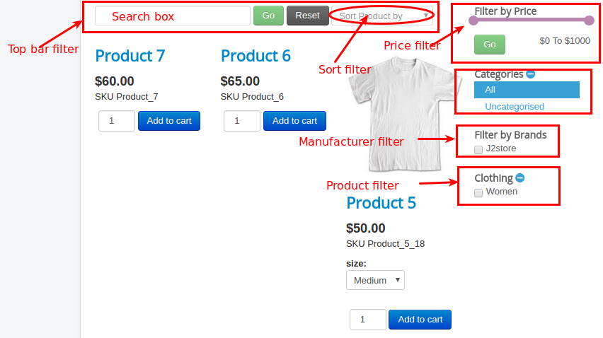
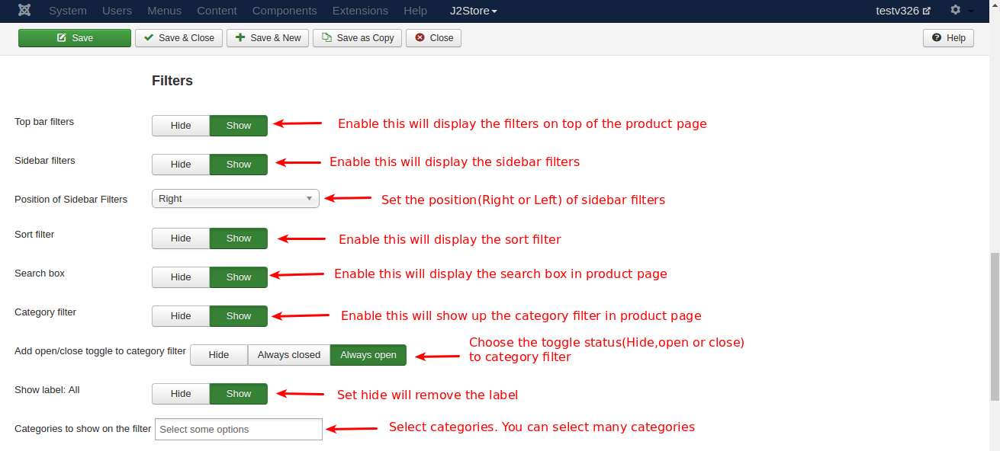
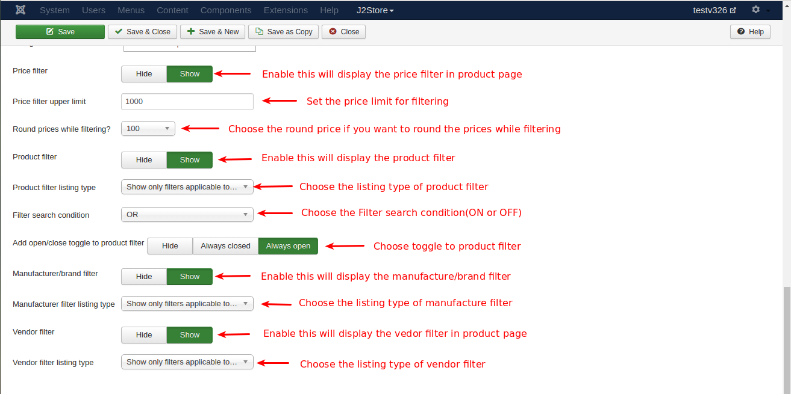

#Frequently Asked Questions

* **[Product Options not working or displaying option](#product_options_not_working)**
* **[Vat not appears in check out](#vat_not_appears_in_checkout)**
* **[Donation plugin is empty.Why](#donation_plugin_empty)**
* **[Multiple stores / different notification receiver depending on category](#multiplestores_differentnotification_depending_oncategory)**
* **[New Line Characters (\r\n) in Checkout form](#new_line_character)**
* **[Shipping Not Working](#shipping_not_working)**
* **[Why the order is listed in the backend even didnt make a payment? How to see the paid products?](#order_listed_without_payment)**
* **[Grid layout not working/columns.Why?](#layout_problem)**
* **[Preview additional image after click](#avoid_mouseover)**
* **[Remove Thumbnail image](#remove_thumbnail)**
* **[How to display the tax information(Incl. 19% tax) with follow text have to be linked to a several page?](#text_after_tax)**
* **[Make the product name a link to administrator panel](#product_name_link)**
* **[Remove image from orders and invoices while the image in cart remains based on the setting](#remove_image_invoice_email)**
* **[Logo doesn't show on PDF emailed to customer](#logo_not_showing)**
* **[Clicking on cart button redirecting to home and URL contains &AMP](#remove_ &amp)**
* **[Error: No shipping method was selected. Selection of a shipping method is mandatory](#checkout_shipping_error)**
* **[Show/Hide Filters](#show_hide_filters)**
* **[Re-order checkout fields](#reorder_checkout_fields)**
* **[[WHY] payment options are not showing at checkout payment method step](#payment-options)**

<a name="product_options_not_working" />
####Product Options not working or displaying option
This problem may happen due to Jquery.
Check your j2store basic settings tab in Joomla admin->J2store->setup->configuration.
You might have set Load jQuery UI to only frontend.It should be always in Both frontend and backend.

**[Video tutorial](https://youtu.be/AA9cLYTuXZE)**

<a name="vat_not_appears_in_checkout" />
####Vat not appears in check out
In Configuration - Tax, tax is set to be applied on the shipping address
In the tax profile, it is set to apply billing address.

<a name="donation_plugin_empty" />
####Donation plugin is empty.Why
The donation app adds a Donation option type.
So go to j2store - catalog - options
Create an option. Choose the option type as donation
Save.

Open your product (simple should work good)
go to J2Store Cart - Options
Search for the donation option you just created.
Add it and save.

<a name="multiplestores_differentnotification_depending_oncategory" />
####Multiple stores / different notification receiver depending on category
J2Store is a B2C solution where you can maintain only one store.
It does not support multi-store system. 
As a result, when an order is placed, all the store administrators will be notified.

If you just want the email notifications to be controlled and made dependent on the category, 
then a custom app could be developed that will send email for the party concerned.

<a name="new_line_character"></a>
####New Line Characters (\r\n) in Checkout form
Go to Joomla admin - J2Store - Configuration - Checkout Layout
Click the Populate/re-set button and Save

<a name="shipping_not_working"></a>
####Shipping Not Working
Make sure about two things
1.Setting under J2Store > Configuration > Store > Weight Unit


2.Setting under Edit Product > shipping tab

* Enable shipping.
* The configured shipping rates with shipping rates does has an entry with matching rate.
For eg: In case the item has 829 grams, you have to configure a rate between 800 and 1000 and the estimate shipping lists the rate.



<a name="order_listed_without_payment"></a>
####Why the order is listed in the backend even didnt make a payment? How to see the paid products?
The purpose of the order status column is to differentiate between the new, paid, pending orders.
If the order status is NEW, then no payment has been made.

If you do not like the word NEW, you can change it. Go to J2Store - Localisation - Order status.
Edit NEW and change it to something like UNPAID

**Why the order is listed in the backend :**

When customer reaches the last step of Checkout, we have to save the data as the order. Because, when he clicks Place order, he will be redirected to PayPal. That also means we will lose the data if we did not save. 
So J2Store saves the order as NEW.

When a payment is succesfully made, the order status will be set to CONFIRMED.
So by looking at the order status, you can differentiate which orders are paid which are not.

There is a marketing opportunity as well. You can follow up with the unpaid customers and convert them.

<a name="layout_problem"></a>
####Grid layout not working/columns.Why?

The issue seems to be the wrong sub-template. Open your product list layout menu. In Common options tab -> set the sub-template as Bootstrap3. Save

This should solve the issue. If it is already set to Bootstrap 3, then try to set it as Default.

<a name="avoid_mouseover"></a>
####Preview additional image after click

copy /components/com_j2store/templates/default/view_images.php

to

/templates/YOUR_TEMPLATE/html/com_j2store/templates/default/view_image.php

edit the file and remove the highlighted line fully.


<a name="remove_thumbnail"></a>
####Remove Thumbnail image
* Goto Extensions -> Plugins -> select the type content. You can find        Content_J2Store plugin.
* Open the plugin and goto the Item view tab.
* Set Display image to No.

<a name="text_after_tax"></a>
####How to display the tax information(Incl. 19% tax) with follow text have to be linked to a several page?

##### Step-1 Enable tax information to be displayed on product page

Go to J2Store -> Configuration - Tax settings
Set Display tax information below the prices (in product pages) to YES.
See the screenshot below



It would display a text like this: (Incl. XX% tax )

This might be in English.

You can change this with a language override for below language constant
Language constant is: J2STORE_PRICE_INCLUDING_TAX

##### Step-2 Creating language override

Go to Extensions -> Language(s) -> select Overrides.

Choose your language(For example, English(en-GB-Administrator)) in filter section and click new on top left.

Add J2STORE_PRICE_INCLUDING_TAX in Language constant text box.

In Text box, add **Inkl %s MwSt (add the link using html anchor tag)**. For example, 
```html
Inkl %s MwSt. <a href="yoursite.com">See more</a>
```

Check For both locations.

Location should be administrator.

Save and close.

Here is a screenshot showing the language override



Here is how it looks in the front end



<a name="product_name_link"></a>
####Make the product name a link to administrator panel

Copy from /components/com_j2store/views/myprofile/tmpl/ordersummary.php

to

/administrator/templates/YOUR_TEMPLATE/html/com_j2store/myprofile/ordersummary.php

Open the file and add the below lines after the line no 30

```php
$product_helper = J2Store::product();

$product = $product_helper->setId($item->product_id)->getProduct();
```
And on around line no 42 you can find the below line

<?php echo $item->orderitem_name; ?>

change this with

```php
<a target="_blank" href="index.php?option=com_content&task=article.edit&id=<?php echo $product->product_source_id; ?>"><?php echo $item->orderitem_name; ?></a>
```
<a name="remove_image_invoice_email"></a>
####Remove image from orders and invoices while the image in cart remains based on the setting

You may create a template override for the below file

Copy the file from
/components/com_j2store/views/myprofile/tmpl/orderitems.php

Paste into
/templates/YOUR_TEMPLATE/html/com_j2store/myprofile/orderitems.php

Now edit the file and remove the following chunk of code,(around line no 68)
```php
<?php if($this->params->get('show_thumb_cart', 1) && !empty($thumb_image)): ?>
							<span class="cart-thumb-image">
								<?php if(JFile::exists(JPATH_SITE.'/'.$thumb_image)): ?>
									" >
								<?php endif;?>
							</span>
						<?php endif; ?>
```
<a name="logo_not_showing"></a>
####Logo doesn't show on PDF emailed to customer

Sometimes you might have added the image of your company logo in your invoice template but it will not display.

**Solution:**
* Open the invoice template
* Choose the toggle editor
* Now change the image path
```html

```
* Dont close the toggle editor when saving.

<a name="remove_ &amp"></a>
####Clicking on cart button redirecting to home and URL contains &AMP

**SOLUTION:**

* Itseems you have set NO to SEF URLs in joomla's global configuration.

* Please go to Joomla system > Global Configuration

* In SEO settings, set **YES** to Search Engine Friendly URLs.
Save.

<a name=checkout_shipping_error></a>
####Error: No shipping method was selected. Selection of a shipping method is mandatory

**SOLUTION:**

* Itseems due to your cart settings in J2store > configuration.

* You might have set **YES** to Prevent customer from checking out if shipping method was not chosen option in J2store > configuration > cart.

* Please make sure before choosing YES to this option you must enable and configure shipping methods. Otherwise it will display the error as **No shipping method was selected. Selection of a shipping method is mandatory** and prevent customers from placing order.

<a name="show_hide_filters"></a>
####Show/Hide Filters

Go to menu manager and open the menu which links to J2store > Product List View. You can find the filter settings in Item view options in category listings.

Please refer the below image which shows the name of the filters.


**To hide Top bar filter completely:** Set HIDE to Top bar filters.

**To hide search box alone in Top bar filter:** Set HIDE to Search box.

**To hide sort filter alone in Top bar filter:** Set HIDE to Sort filter.

**To hide price filter in sidebar:** Set HIDE to price filter.

**To hide category filter in sidebar:** Set HIDE to Category filter.

**To hide Manufacturer filter(Filter by Brands):** Set HIDE to Manufacturer/Brand filter.

**To hide Product filter:** Set HIDE to Product filter.

**To hide all filters(price filter, category filter, manufacturer filter, product filter):** Set HIDE to Sidebar filters. You can change the positon of sidebar filter by changing the postion of sidebar filters to Right and Left.





<a name="reorder_checkout_fields"></a>
####Re-order checkout fields

Go to J2Store > Configuration > Checkout Layout where you can find the fields for both checkout billing address layout and checkout shipping address layout.

The fields are enclosed with square bracket. For example, [first_name]

You can re-locate the field to anywhere in the layout and you can also add the custom field there.

Below video explains you briefly.
**[Video tutorial](https://youtu.be/KLn_u3CgUzc)**

<a name="payment-options"/>
## [WHY] payment options are not showing at checkout payment method step

Please go to J2Store -> Set up - payment methods
Open the payment methods you are using.
And make sure the Geozone field is set to All

And make sure your order total (cart total ) is above zero. If it is zero, payment methods wont be necessary at the checkout.