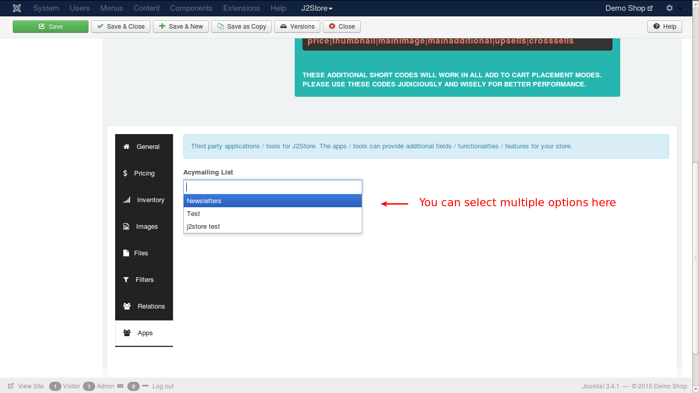

# AcyMailing Integration App

This app integrates J2Store with AcyMailing to enable option for subscription to newsletters.

#### Requirements

* PHP 5.2 or higher
* Joomla 2.5 or above
* J2Store 3.1.6 or above

#### Installation Instructions
1. Use the Joomla installer to install the app. 
2. In the backend, go to **Extensions -> Plugin Manager** and open the Acymailing plugin.	(type=j2store). 
3. Enable the plugin 
4. Enter the parameters (read the explanation about each parameter given below) 
5. Save and close it.

#### Parameters
The below image illustrates the settings of parameters:

1. **Acymailing List** -
This option is used to display all your Acymailing subscribers list. You can select multiple lists in this option.

2. **Acymailing List Title** -
The text entered here will be displayed when customer is about to select payment method. If you use a muliti-lingual site, language constants can be entered here and then language over-ride can be made.

3. **Auto Subscription** -
If you enable this by choosing **Yes**, then the customer will be automatically added to subscribers' list. A confirmation email will be sent to the customer. All this will be done on successful order placement.

4. **Display Auto subscription in products** -
If you enable this option, then a check box will appear in both the back end and front end. This is to offer product specific newsletters.

