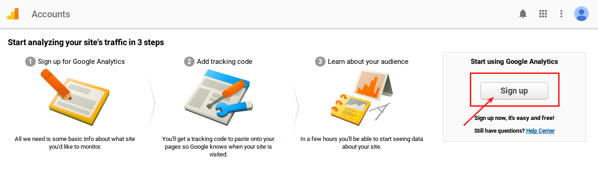
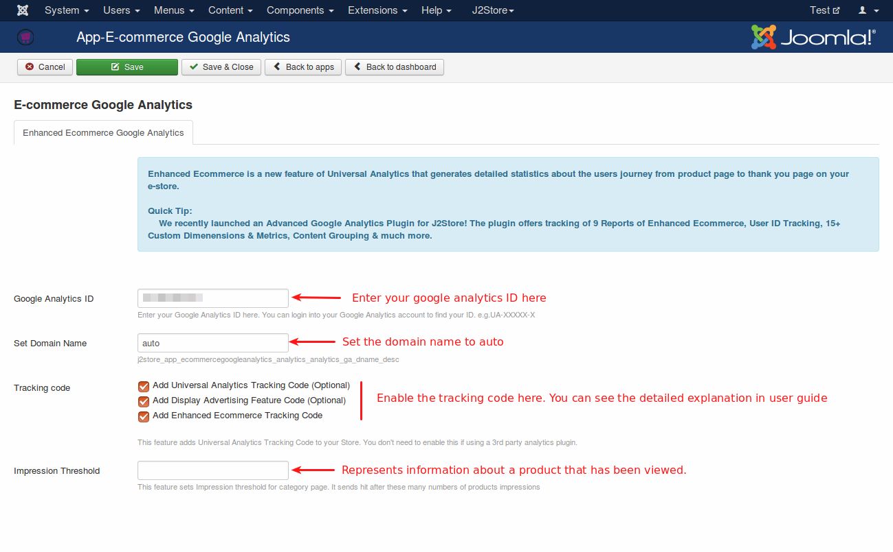
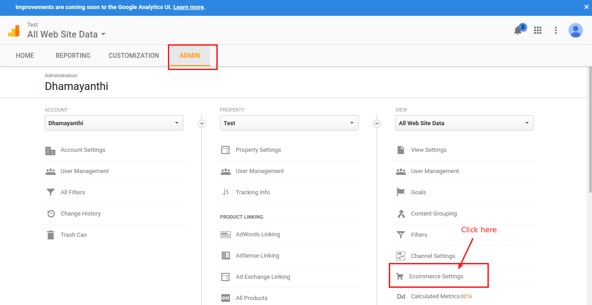
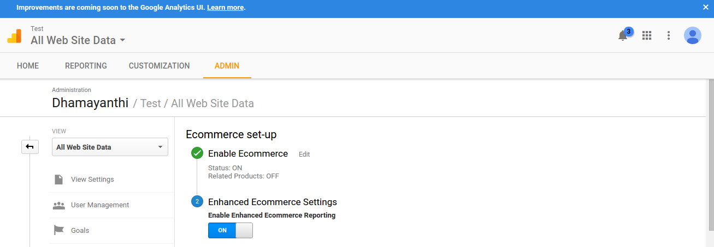
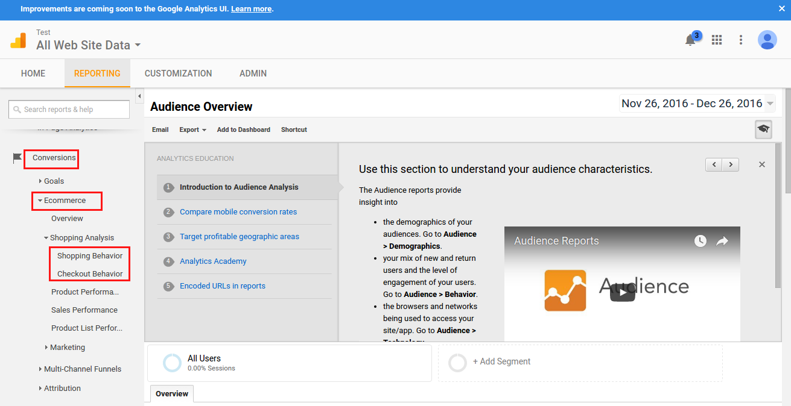
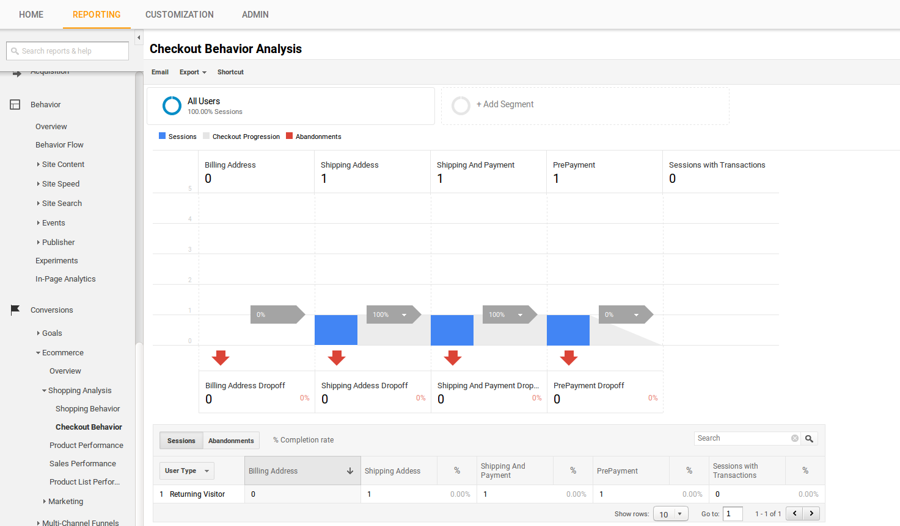

# Enhanced E-commerce Google Analytics

This app allows you to use Google Analytics – Enhanced Ecommerce feature. You can track the user behavior across your e-commerce store starting from product views to thank you page.

> YOU NEED AT LEAST J2STORE VERSION 3.2.10+ TO USE THIS APP

### Requirements

1. PHP version 5.4 or higher

2. Joomla version 3.x or higher

3. J2Store version 3.2.10 or above

### Installation

1. Download E-commerce Google Analytics app from our site's extensions section and install it using Joomla installer.

2. After installing the app, go to J2Store > Apps and click Enable on E-commerce Google Analytics to activate the app.

3. Once enabled, click on Open to configure the basic settings of the app.

### How to get Google Analytics ID ?

**Step 1 :**

Login into your google account and go to Google analytics (<https://analytics.google.com/>).

**Step 2 :**

If you have not already sign up, click Sign up button on right side of the page.

**Step 3 :**

Enter your Account Name, Website Name, Website URL and choose industry category and reporting time zone.

Finally click Get Tracking ID.

Copy your Tracking ID and paste it in our app settings.

### App Configuration

#### Enhanced Ecommerce Google Analytics

**Google Analytics ID :**

Enter your Google Analytics ID here. You can login into your Google Analytics account to find your ID.

**Set Domain Name :**

Set the domain name to auto because if your site is in sub-directory (for example, www.example.com/test), it automatically detects the absolute url. You can also enter your domain name here.

**Tracking code :**

This feature adds Universal Analytics Tracking Code to your Store. You don't need to enable this if you are using a 3rd party analytics plugin. Read the

1. **Add Universal Analytics Tracking Code** - It is nothing but page tracking which allows you to measure the number of views you had for a particular page on your website.
2. **Add Display Advertising Feature Code** - Enabling Advertising Features in Google Analytics allows you to take advantage of Remarketing, Demographics & Interests reports, and more.
3. **Add Enhanced Ecommerce Tracking Code** - It enables tracking every click events. Events are user interactions with content that can be tracked independently from a web page or a screen load.

**Impression Threshold :**

This feature sets Impression threshold for category page. It sends hit after these many numbers of products impressions.

### Behavior Analysis in Google Analytics

1. After login into Google Analytics, move to **ADMIN** tab and navigate to the Ecommerce Settings menu. 
2. In the E-commerce setup page, you have to **turn on** the Enable E-commerce.

3. Then, **Turn on** the Enable Enhanced Ecommerce Reporting. 

4. After that, it is mandatory to create following checkout lables:

  a. Cart

  b. Checkout Options
  
  c. Register Address

  d. Billing Address

  e. Shipping Address

  f. Payment method

  g. Confirm order 
  
  

5. Once finished configuring our E-commerce Google Analytics app and enabling enhanced eCommerce reporting in your Google Analytics account, go to your site frontend and place the order.

6. Now go to your Google Analytics page > move to **Reporting** tab

7. In the reporting page, click Conversions > Ecommerce > Shopping Analysis > Shopping Behavior in the left panel to see the behavior analysis of your eCommerce store. 

 

8. Click Conversions > Ecommerce > Shopping Analysis > Checkout Behavior to see the behavior analysis of checkout process. 

#### Support

Still have questions? You can post in our support forum: <http://j2store.org/forum/index.html>

Thank you for using our extension.
