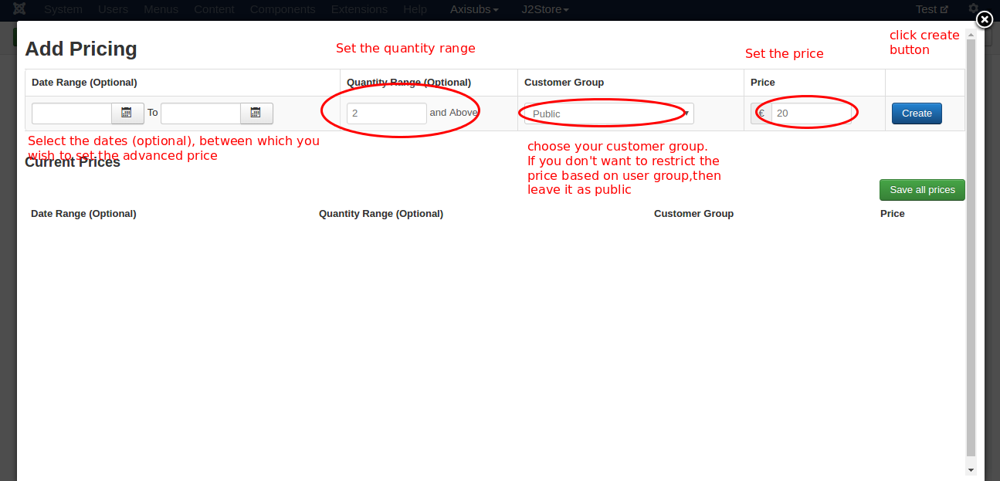
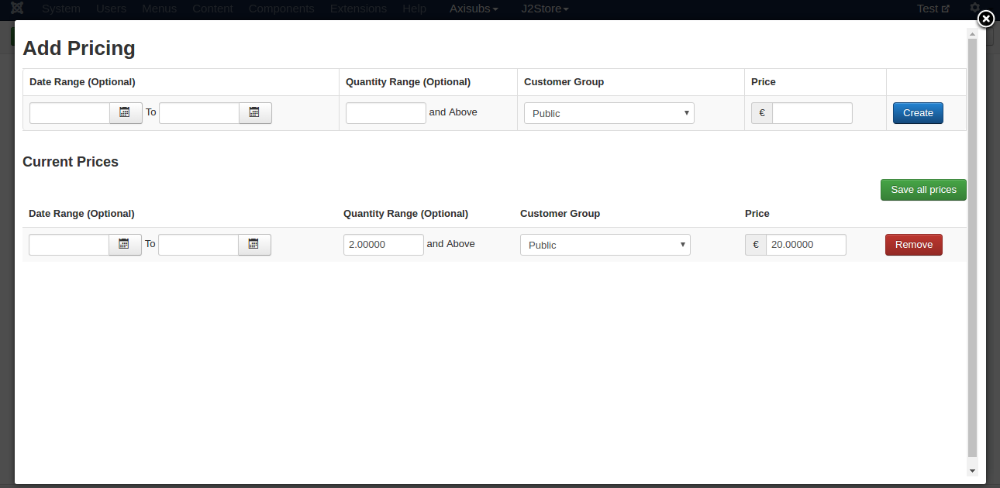
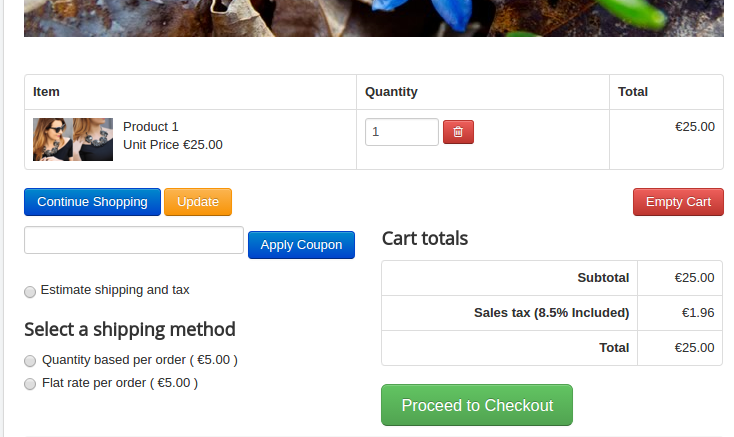
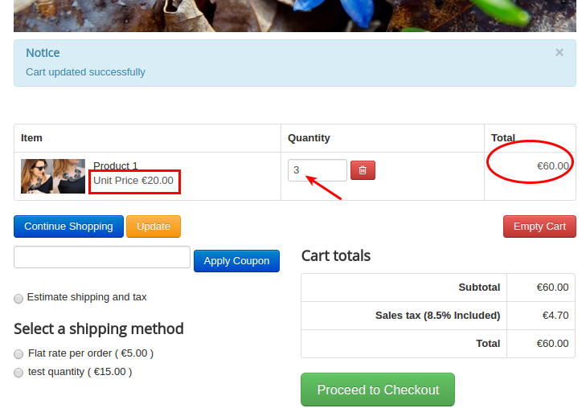

# Advanced Pricing

J2Store offers you to set advanced pricing for your product. The following steps will guide you on how to set advanced pricing for your product.

####Step 1 Set advanced pricing

* Go to article manager and create / open the article.

* Click on J2Storecart tab and navigate to the **Pricing** menu.

* Click on **Set Prices** to set advanced pricing.

 

* Clicking on set prices button will display you the pop-up screen with several options like below image

####Step 2 Configure the settings

* ***Date Range (optional)***

  With this option, you can set special price for specific period of time. Select the date range between which you wish to set the advance price.
  
* ***Quantity Range (optional)***

  This option allows you to set special price based on quantity of the product. For example, Regular price is **$25** and set advanced price **$20** for the quantity range 2 and above. So if the product quantity becomes 2 or 3 then the **unit price** of the product will become **$20**.
  
* ***Customer Group***

  Select the customer group to which you offer this special. If you don't want to offer special price to any specific group then leave the customer group as **Public**.
  
* ***Price***

  Enter your price and click create button.
  
  
  
####Frontend Demo

