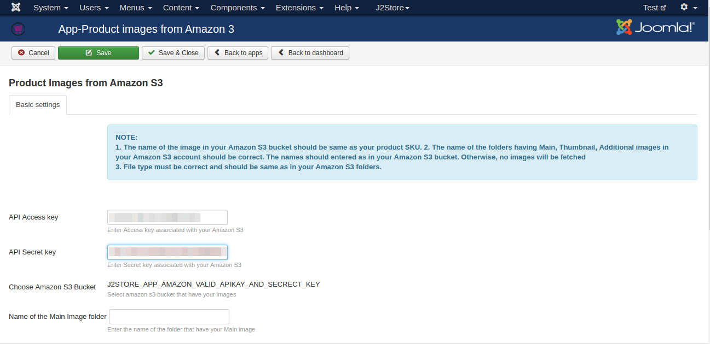
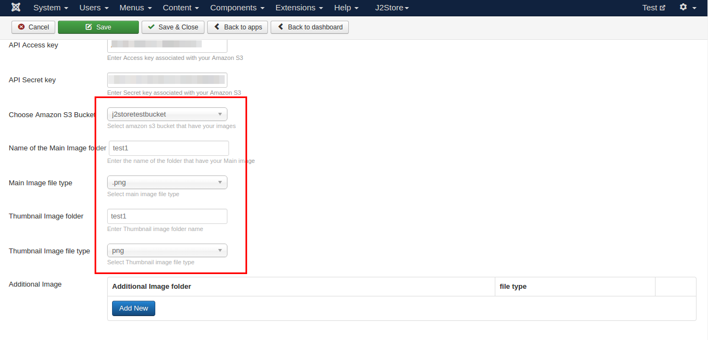

#Product Images from Amazon S3

Using this app, you can add images (Thumbnail, Main image, Additional image) to products by fetching images  from the Amazon S3.

####Requirements

1. PHP 5.4 or higher

2. Joomla 3.3 or above

3. J2Store 3.2.x or above

####Installation

1. Use the joomla installer ot install the app.

2. Go to J2Store > Apps, find the Product Images from Amazon S3 app and click enable to activate the app.

3. Once enabled, click open to setup the configuration of the app.

4. Following instructions will guide you how to use this app.

####Configuration and Parameters
```
NOTE: 
1. The name of the image in your Amazon S3 bucket should be same as your product SKU. 
2. The name of the folders having Main, Thumbnail, Additional images in your Amazon S3 account should be correct. The names should entered as in your Amazon S3 bucket. Otherwise, no images will be fetched 
3. File type must be correct and should be same as in your Amazon S3 folders.
```

* ***API Access key***

 Enter the Access key ID provided by Amazon.

* ***Access secret key***

 Enter Access secret key provided by Amazon.

 Once you entered Access key ID and Access secret key, save it. You will get your bucket list.

* ***Choose Amazon S3 Bucket***

 Bucket will be listed once you entered Access key ID and Access secret key and save it.
 
* ***Name of the main image folder***

 Enter the name of the main image folder which contains your main images. Please enter the name as in your bucket.
 
* ***Main image file type***

 Select the type of the image. Selected image type should be matched with file type of images stored in the bucket.
 
* ***Thumbnail Image folder***

 Enter the name of the thumbnail image folder which contains your thumbnail images. Please enter the name as in your bucket.
 
* ***Thumbnail Image file type***

 Choose the file type for the thumbnail images. Selected image type should be matched with file type of images stored in the bucket.

* ***Additional Image***

 Click **ADD NEW** button to add more than one folder names. Clicking add new button will ask you to enter / choose the folder name and image type.
 
####How to create / view buckets and folders in Amazon S3

* Login into your Amazon web services account.
* Click and open S3 under Storage and content delivery.


Choose the bucket from the available buckets listed or click **Create bucket** button on top left to create new bucket.


Clicking on the bucket name will display you the existing folders available in the bucket. Use **create folder** button to add new folder into the bucket.


Open the folder you have created newly or existing folder and upload the images by clicking **Upload** button.

```
Note : The name of the images you uploaded here should match with SKU of the product. Refer the below screen
```


Once configured the app, open the product and choose **YES** to enable the AmazonS3 integration.


####Frontend


####Support

Still have questions? You can post your questions in our support forum: http://j2store.org/forum/index.html

Thank you for using our extension.