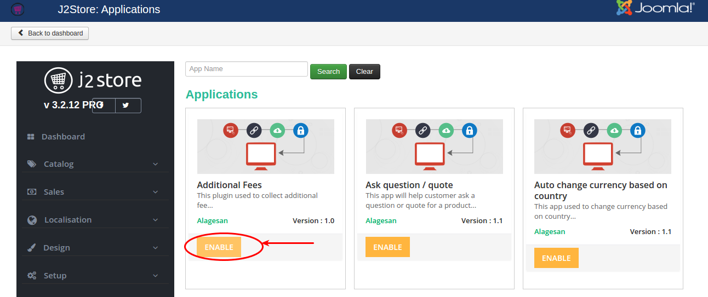
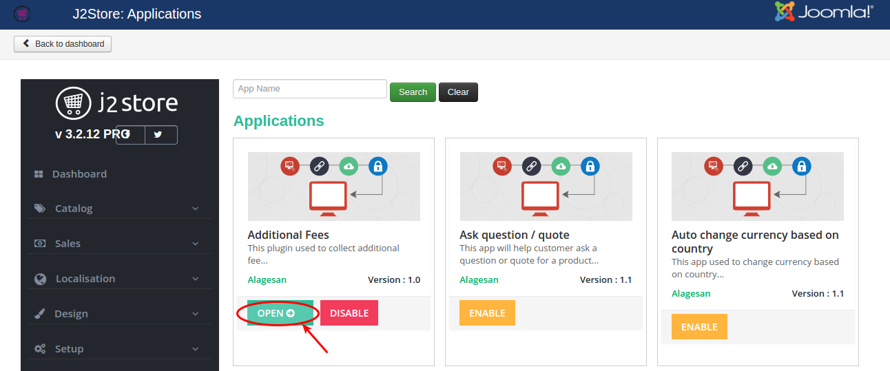
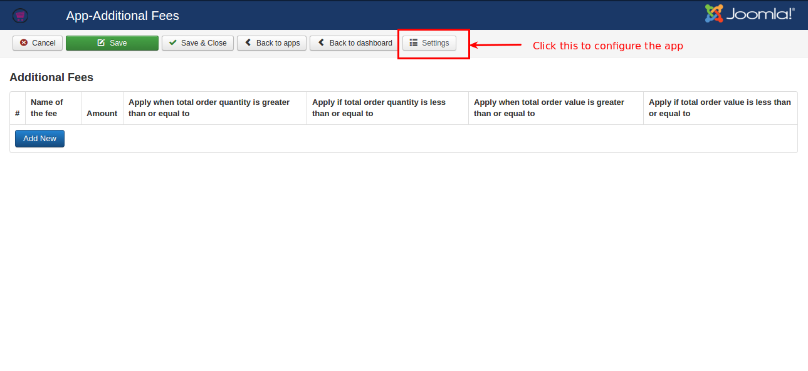
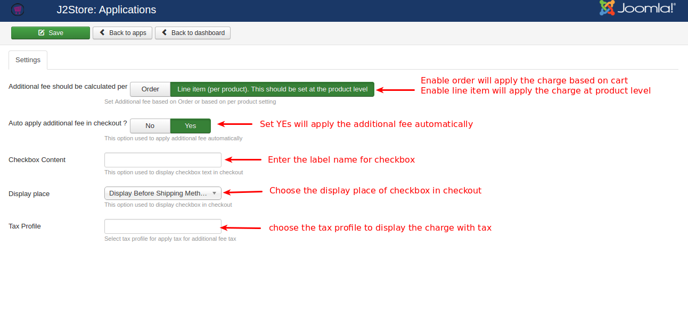
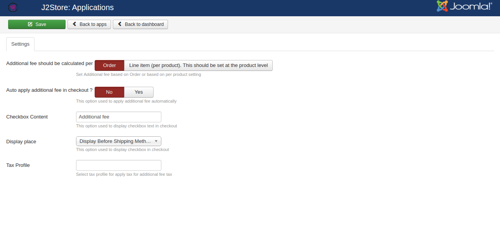
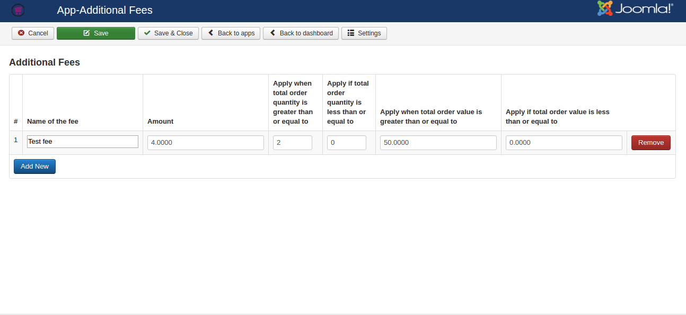
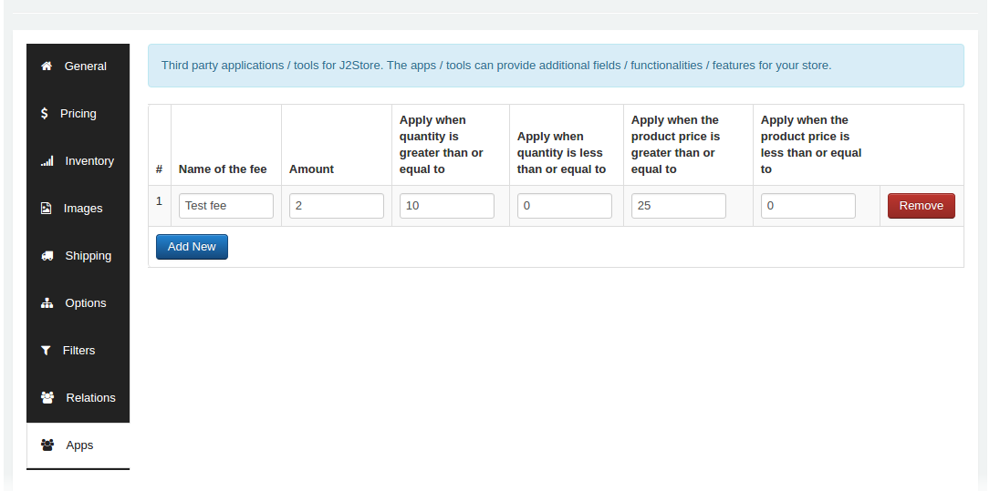
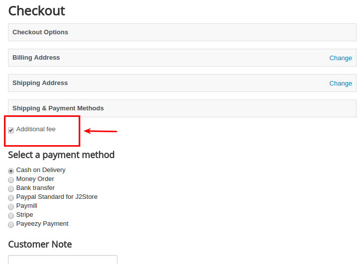
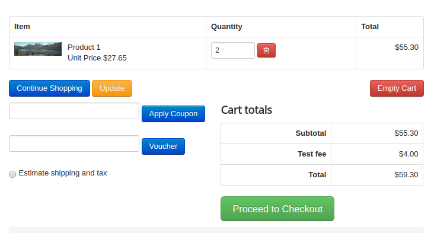

# Additional fee

This app allows you to charge an additional fee to the customer only when an item is added to the cart and during the checkout process. You can prevent the fee from being displayed on the product page. The addtional fee can be applied to both an individual product or to all the cart items as well.

#### Requirements

1. PHP 5.4 or higher

2. Joomla 3.3 or above

3. J2Store 3.2.x or above

#### Installation

1. Use the Joomla installer to install the app.

2. In the backend, go to J2Store Dashboard -> Apps as shown in the image below.

3. Click Enable in the Additional Fee app.

4. Once the app is enabled, open the app to configure the settings and to setup the additional fee.

#### Settings

Open the app and click the settings button on top to configure the app settings.

**Additional fee should be calculated per**

You can choose whether the additional fee should be applied based on cart or per product level.

* **Order:** This will apply the additional fee globally i.e. based on the cart.

* **Line item:** This will apply the additional charge based on the product. You can set additional fee to the product individually in the apps tab on j2store cart. Once you enabled Line item, the amount / charge will be applied to the individual products.

**Auto apply additional fee in checkout ?**

Set **YES** will apply the additional fee at the checkout automatically. Set **NO** will hide the additonal fee displaying in cart page and checkout and it will display the checkbox at the payment step allowing customers to choose the fees.

**Checkbox Content**

Add your checkbox content in the text box given here.

**Display place**

You can change the position of checkbox by selecting either **Display before shipping method** or **Display after payment methods**.

**Tax Profile**

Select your tax profile to display the additional fee as taxable.

#### Additional Fee Setup

Open the app and click **Add New** button to create new one.

**Name of the fee:** Enter the name for additional fee. The value given here will be displayed during checkout.

**Amount:** Enter the amount to be charged.

**Apply when total order quantity is greater than or equal to:** Enter the quantity range. For example, set quantity range **2**. So additional fee will be applied when the quantity reaches **2** or **above 2**.

**Apply if total order quantity is less than or equal to:** Additional fee will be applied when the quantity reaches the value entered here. For example, set quantity range **2**. So additional fee will be applied when the quantity reaches **2** or **less than 2**.

**Apply when total order value is greater than or equal to:** Additional fee will be applied when the total order price reaches the value entered here. For example, set value **50**. So the charge will be applied when order value becomes **50** or **above 50**.

**Apply if total order value is less than or equal to:** Additional fee will be applied when the total order price reaches the value entered here. For example, set value **40**. So the charge will be applied when order value becomes **40** or **less than 40**.

#### Additional Fee Setup at product level

* Go to Article manager.

* Open the article / product > J2Store cart tab.

* Navigate to the Apps tab and click add new button to setup the additional fee for that product. Refer the below screenshot.

#### Frontend

