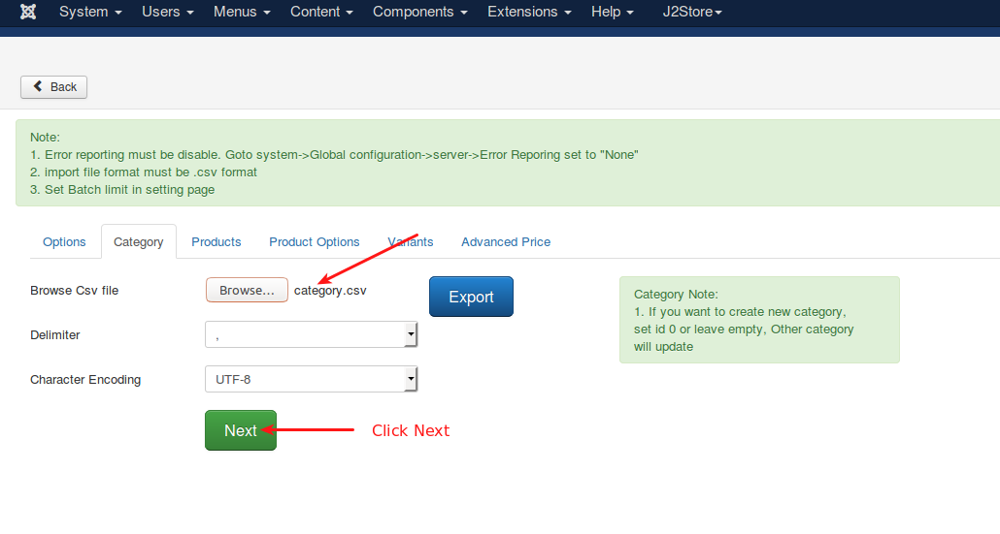
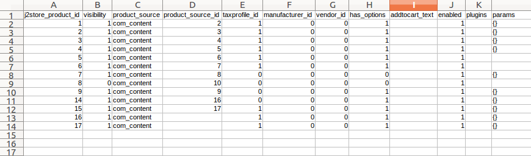

# Advanced CSV

The app comes with advanced features which allows you to import / export products and options and as well as categories into J2Store. You can import product data including options,variants,advance price etc. You can also export the products / options / categories and see the fields that are supported by the app.

## Requirements

- PHP version 5.4 or higher
- Joomla 3.x or higher
- J2Store 3.2.15 or higher

## Installation

1. Download the app from our site's extensions section and install it using Joomla installer.
2. In Joomla backend, go to J2Store > Dashboard > Apps and click **Enable** on Import J2Store Products.
3. After enabling, click **Open** to import / export the products.

### Import / Export

```
Note:
1\. Error reporting must be disable. Goto system -> Global configuration -> server-> Error Reporing set to "None"
2\. Import file format must be .csv format
3\. Set Batch limit in setting page.
4\. When you import products, you must import the options and variants too. Otherwise, the app will not work properly.
```

#### Options

**Step-1:** Click on **Export** button to export the options from J2Store > Catalog > Options in .csv format.

**Step-2:** If you would like to update/import new option via csv file, open the csv file and enter the following fields j2store_option_id, type (select, text, textarea, checkbox, etc), option_unique_name, option_name, ordering, enabled (to enable the option, enter 1) and optionvalues. Follow the instructions below when you give the option value in csv file

1. optionvalues field must be optionvalue_name:optionvalue_image:ordering, you can add multiple option value using pipe(|) symbals
2. Eg: Red::0|Yellow::0

**Step-3:** Save the .csv file. Now go inside the app > Options tab and choose the file / set the delimiter / set character encoding and click **Next**

**Step-4:** Click **Import** button.   

#### Category

**Step-1:** Click on **Export** button to export the categories from Content > Categories in .csv format.

**Step-2:** If you would like to update/import new categories, open the csv file and enter the following required fields id, parent_id, path, title, alias, published, access, langauge. NOTE : If you want to create new category, set id 0 or leave empty, Other category will update.

**Step-3:** Save the .csv file. Now go inside the app > Category tab and choose the file / set the delimiter / set character encoding and click **Next**

**Step-4:** Click **Import** button.     

#### Products

**Step-1:** Click on **Export** button to export the products from J2Store > Catalog > Products in .csv format.

**Step-2:** If you would like to import / update the products, open the csv file and enter the required fields.

NOTE : If you want to add new product, set id 0 or leave empty, Other product will update.

**Step-3:** Save the .csv file. Now go inside the app > Products tab and choose the file / set the delimiter / set character encoding and click **Next**.

**Step-4:** Click **Import** button.     

#### Product Options

**Step-1:** Click on **Export** button to export the product options from J2Store > Catalog > Products in .csv format.

**Step-2:** If you would like to import / update the products options, open the csv file and enter the required fields.

NOTE : When you enter product_optionvalue field, keep in mind that field must be optionvalue_name:price prefix:price:weight prefix:weight:default value:ordering:productoption params , you can add multiple product option value using pipe(|) symbol Example: Red:+:5.00000000:+:0.00000000:0:0:|Yellow:+:6.00000000:+:0.00000000:0:0:

**Step-3:** Save the .csv file. Now go inside the app > Products tab and choose the file / set the delimiter / set character encoding and click **Next**.

**Step-4:** Click **Import** button.   

#### Variants

**Step-1:** Click on **Export** button to export the product options from J2Store > Catalog > Products in .csv format.

**Step-2:** If you would like to import / update product variants, open the csv file and enter the required fields.

NOTE : If you want to add new variant, set id 0 or leave empty, Other variant will update.

**Step-3:** Save the .csv file. Now go inside the app > Variants tab and choose the file / set the delimiter / set character encoding and click **Next**.

**Step-4:** Click **Import** button.   

#### Advanced Price

**Step-1:** Click on **Export** button to export the advance pricing from your Products in .csv format.

**Step-2:** If you would like to import / update pricing, open the csv file and enter the required fields.

NOTE : If you want to create new advanced price, set id 0 or leave empty, Other advanced price will update.

**Step-3:** Save the .csv file. Now go inside the app > Variants tab and choose the file / set the delimiter / set character encoding and click **Next**.

**Step-4:** Click **Import** button.    
