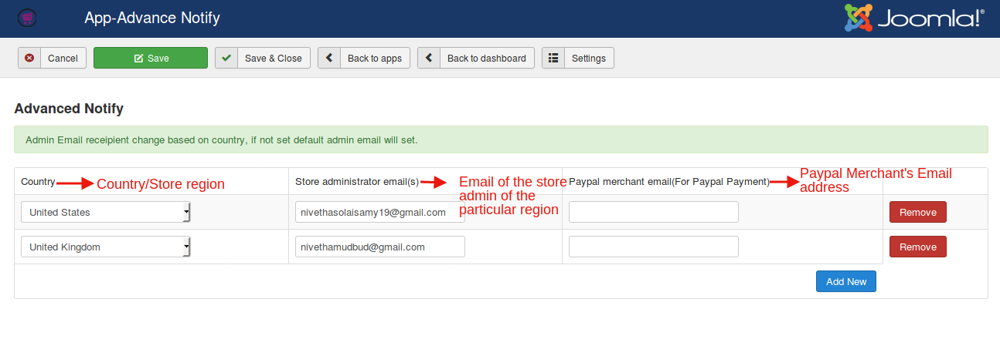
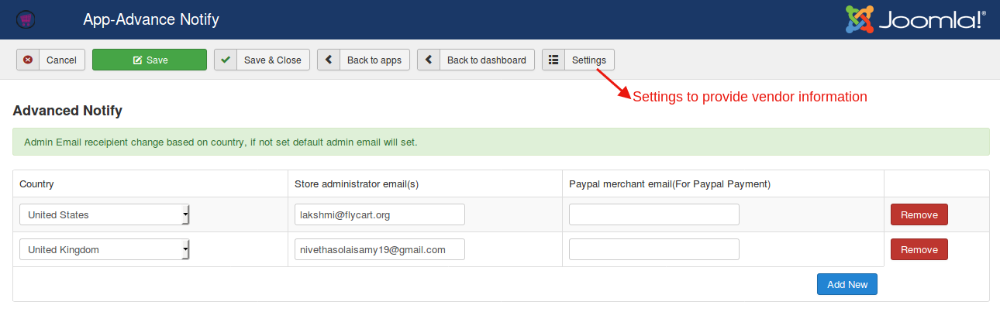

# Advanced Notify:
Serving customers across the globe?

Finding it difficult to maintain the store at different regions?

This is the right place.

This app helps to set different admin emails for different regions.There are options available in j2store to add multiple store admins but when many admin emails are added the notification will be sent to everyone when a user places an order.
With this app it is possible to set up a different administrator email for different regions.
##  Installation

This app could be downloaded from our site.

Go to Extensions Manager and install the app.

## Configuration

* Once installed go to J2store->Apps.

* Click "Enable" under "Advanced notify" app.
* Click Open to configure the settings.

* Under the country field enter the region name.
* Under the Store admin email address field enter the email address to which the order information has to be sent for that particular region.
* Specify the Paypal Merchant Email address for Paypal payment.
Click Add New if you wish to add more regions.
Click Save.

**Relevant Screenshot**

This is how the email addresses have been fed according to the zones:

## Settings

If you have lot of vendors who contribute products and if you wish to notify them when their product is being ordered, you could do it here.

You could find the settings option here:

* **Enable Vendor Notification**

  Set to Yes if you wish to notify the vendor about the order.

* **Vendor Subject**

  The subject of the email that has to be sent to the vendor.

* **Vendor Body**

  Body of the email that has to be sent to the vendor.

* Click Save.

**Relevant Screenshot**

