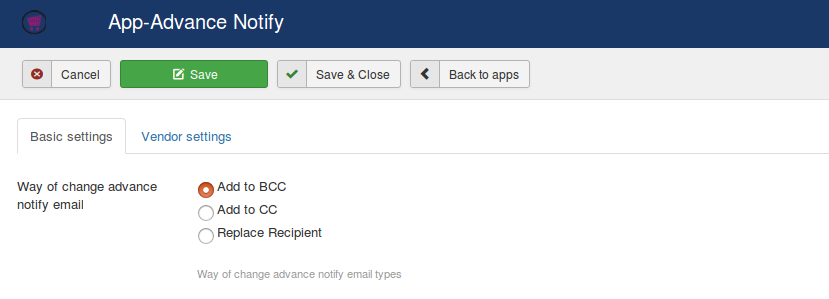
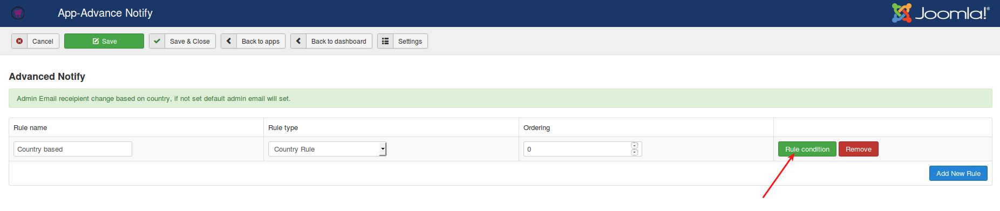

# Advanced Notify

Serving customers across the globe?

Finding it difficult to maintain the store at different regions?

This is the right place.

This app helps to set different admin emails for different regions.There are options available in j2store to add multiple store admins but when many admin emails are added the notification will be sent to everyone when a user places an order.
With this app it is possible to set up a different administrator email for different regions.

###  Installation

1. Download Advanced notify app from our site and install it using Joomla installer.

2. After installing the app, go to J2Store->Apps and click **Enable** under "Advanced notify" app.

3. Once enabled, open the app to configure the basic settings of the app.

### Settings

You could find the settings option here:

There is possible to change way of Advanced notify email. For example, if you wish to add store administrator's email as **BCC, CC**, choose the radio options **Add to BCC** or **Add to CC**.

If you wants to completely replace the recipients list, then choose the **Replace Recipient** option.

If you have lot of vendors who contribute products and if you wish to notify them when their product is being ordered, you could do it here. Navigate to **Vendor settings** tab and you will see the following options:

* **Enable Vendor Notification**

  Set to Yes if you wish to notify the vendor about the order.

* **Vendor Subject**

  The subject of the email that has to be sent to the vendor.

* **Vendor Body**

  Body of the email that has to be sent to the vendor.

* Click Save.

**Relevant Screenshot**

### Email setup

The email notification can be based on following three rules types. The store administrator email can also be changed with this app (you should specify the store administrator email while defining rule condition).

* **Country based** - If you would like to send an email notification based on customer's country, then choose Country based as your rule type.

* **Order status based** - Choosing this rule type will send the order email notification based on order status.

* **Product based** - Sometime you may want to send order email for specific products. In this case, choose this rule type.

#### Creating Rules and Rule condition

Once you opened the app, you will see the **Add new rule** button on the table like below image:

1. Clicking on this button will create a new row.

2. On the new row created, enter the rule name and choose the rule type from the available rule types.

3. Click save.

4. After saving, you will get an another button **Rule condition**.

5. Click on Rule condition and setup the parameters as per the rule type you have chosen.

#### Country based rule

Sometimes you may have different stores at different regions and wants to send an order email to different store admins based on the region.

To do this, you will have to create country based rule inside the app's settings.

Click on Add new rule button and give the name of the rule and then choose the rule type **Country Rule** and save.

After saving, you will get a button to add rule condition. Click on Rule condition button to setup the store admin email based on the country.

Click on Add new condition and choose the country from the list of countries.

Under the Store admin email address field enter the email address to which the order information has to be sent for that particular region.

Specify the Paypal Merchant Email address for Paypal payment and save.

#### Order status rule

If you would like to send an order email notification to different store admin based on order status, it will be possible by creating **Order status rule**.

While creating email rule, choose Order status rule as your Rule type and create a rule condition for it.

When creating Rule condition, under the status field, choose the order status and enter the email address in the store admin email address field to which the order information should be sent for the specific order status.

#### Product Rule

Would you like to send an order notification by specific product ? All you have to do is create a Product based email rule.

In this feature, you will also be able to create a email template for individual product. Lets see how to create an email by product wise.

1. Choose **Product rule** as your email rule type and name your rule and then save.

2. After saving you will be having an option to create a **Rule condition**.

3. Click on Rule condition button to setup the email for your products. Enter the store admin email address and save once.

4. Then, search for the product by adding two or three characters of your product name in the Search by product field given.

5. Now click on **Edit Template** to add your email content and click Save Template.

