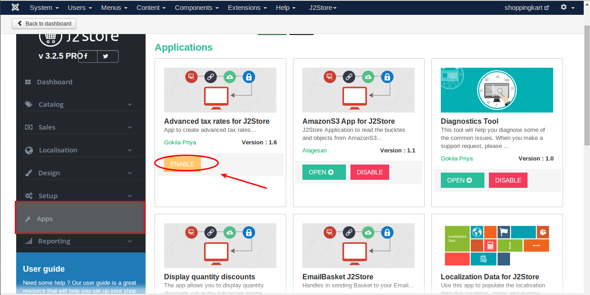

#Advanced Tax Rate

####Requirements
 * PHP 5.4 or higher
 * Joomla 3.3 or above
 * J2store 3.2.x or above

####Installation Instructions

1. Use the joomla installer to install tha app.

2. In tha backend, go to **J2store Dashboard -> Apps**.

3. Click enable in the Advanced tax rate app.

4. Once the app is enabled, click an open to set the configuration for the app.

####Configuration