# Advanced Variable

This app extends the variable product type. With this app you can treat the options as variants and can maintain the stock level.

#### Requirements

* PHP 5.4 or higher
* Joomla 3.x or higher
* J2Store 3.2.15 or higher

#### Installation

* Download the package from our site and install it in your site using Joomla Installer.
* After installing the app, in the Joomla backend go to J2Store > Dashboard > Apps and enable it.
* There is no major settings to be configured inside the app. Go to article manager and create new article with product type **Advanced Variable**.

#### Advanced Variable Product

**STEP-1**

* Go to article manager > Create a new article
* Move to J2Store cart tab
* Choose Treat as a Product **YES**
* Choose product type **Advanced variable**
* Click Save and Proceed.

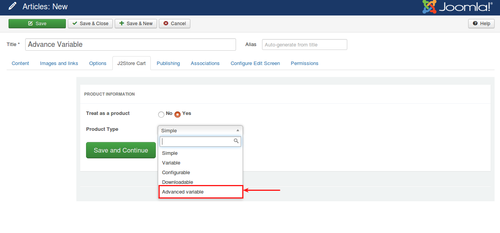
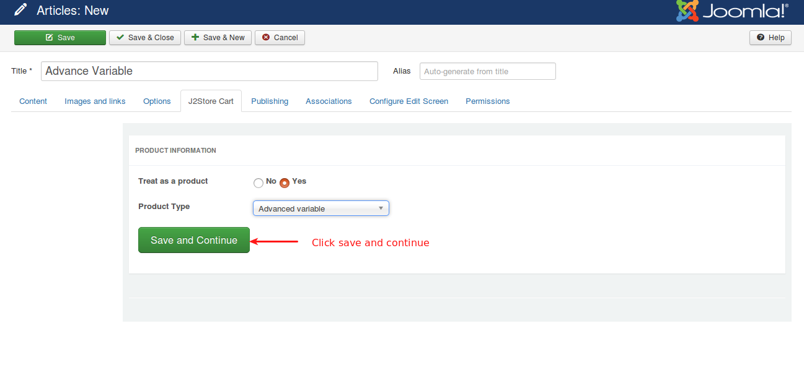
**STEP-2**

* **2.1 Navigate to the General tab**
 * Set **YES** to visible in storefront
* **2.2 Navigate to Images tab**
 * Add Thumbnail image, Main image and Additional image.

**STEP-3:**

* Navigate to **Variants** tab and type the first few letters of the unique name of the product options in the search box.
* Choose the option from the dropdown and click save.
* Set the values for option and then save again.

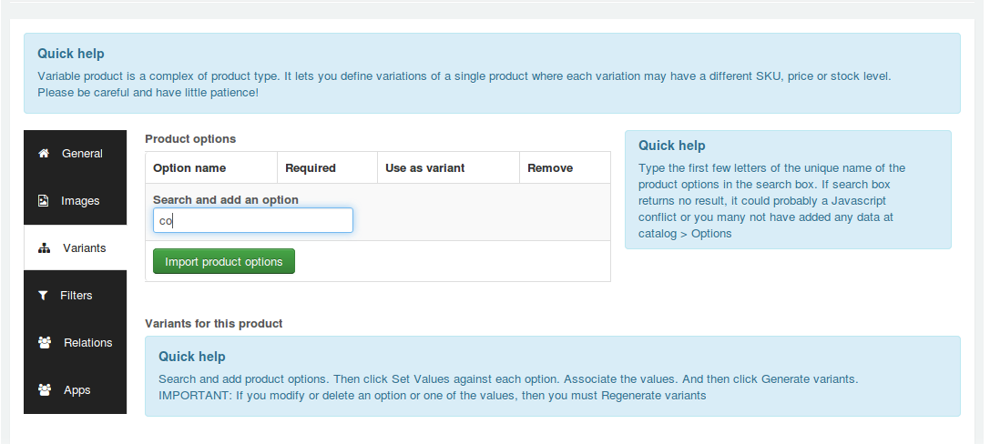
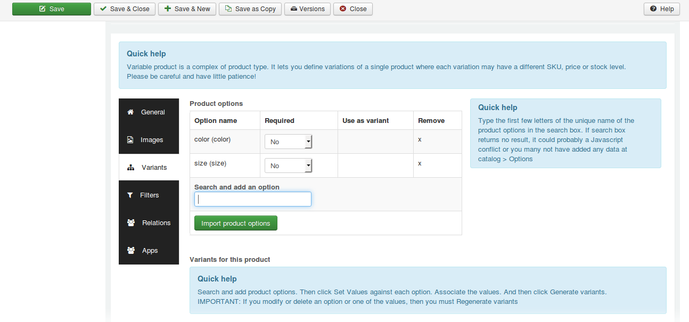
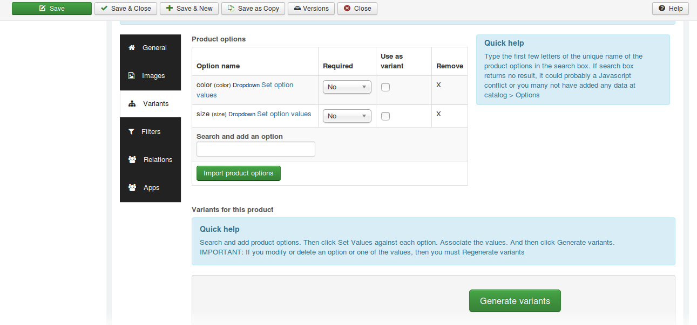
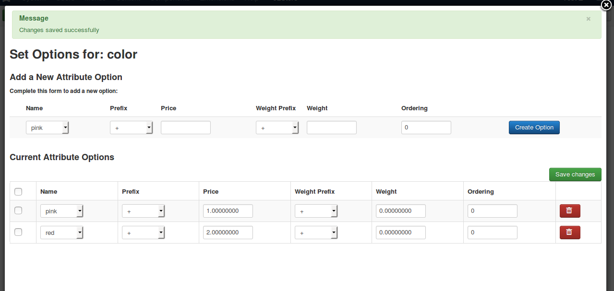
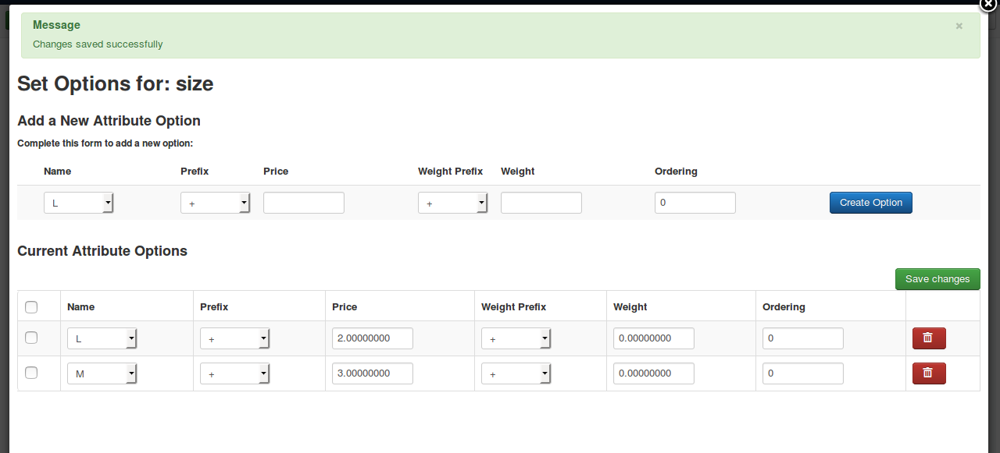

```
Its no matter you are using options as variants or not. Whatever it is you must generate the varaints once. Otherwise the error will be notified.
```

#### How to use options as variants?

On saving the article, you will be having checkbox at the **Use as variant** column. Check this checkbox to use the options you added as variants.

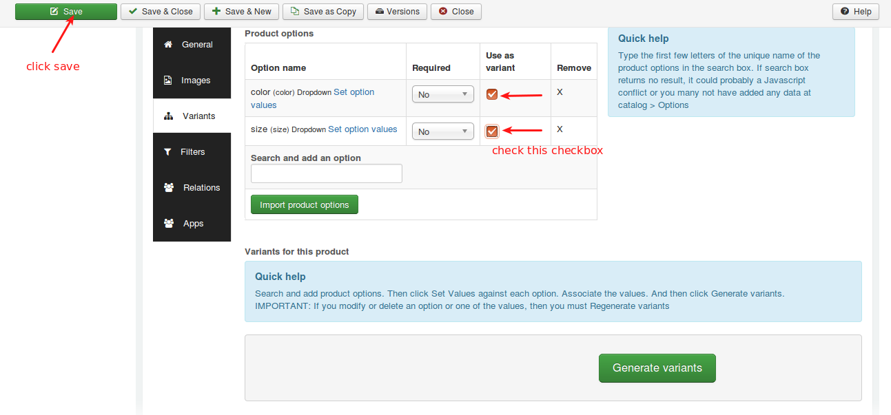

Before generating variants, check the checkbox next to the Required column and click save. Once saved, click **Generate Variants** button.

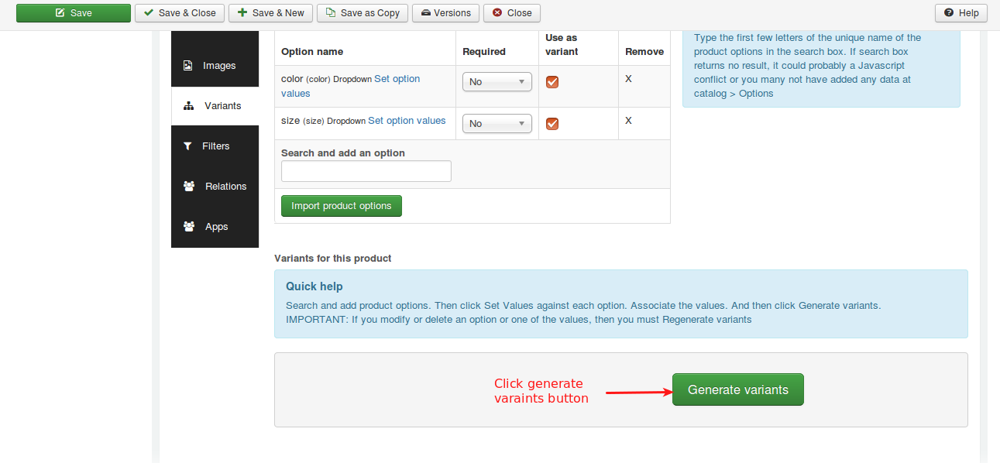
After generating variants, click **Open all** button to set all the product requirements such as price, shipping dimensions, stock and press save button.

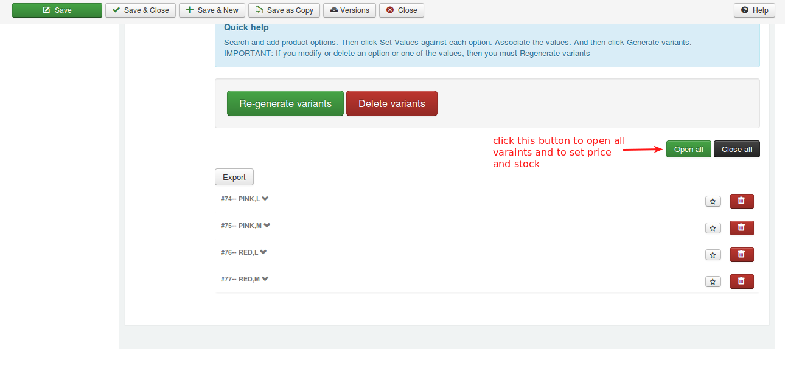
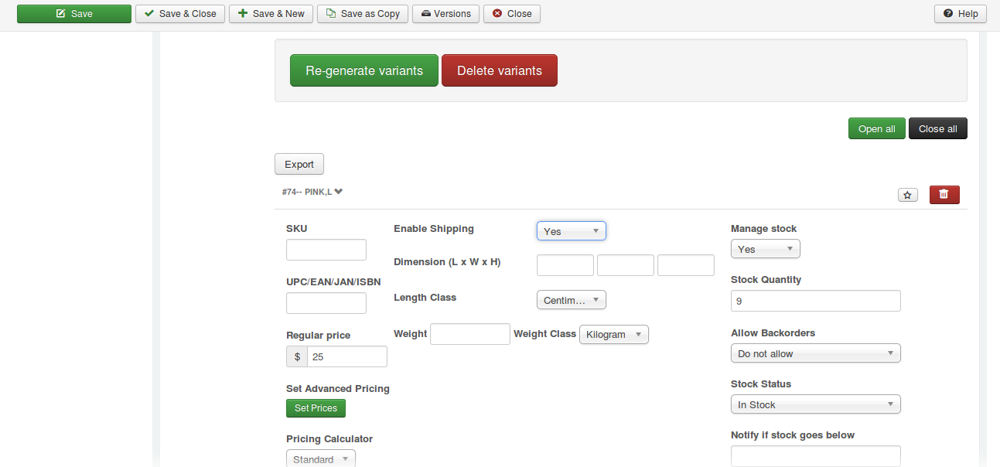
**Now check the product in frontend.**

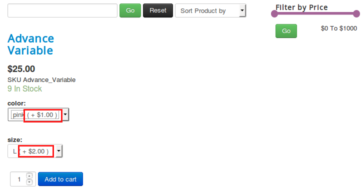

When using options as variants, at frontend you could see the option with price prefix. This should not be shown when displaying options as variants. To avoid this, you just open the option value and save once. Please refer the image below,
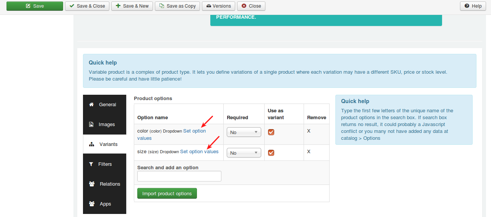
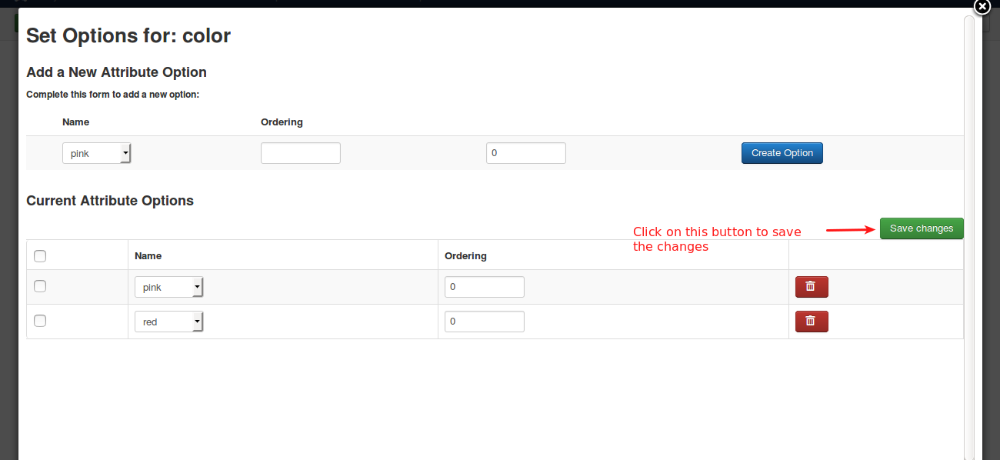
Now check the product in frontend
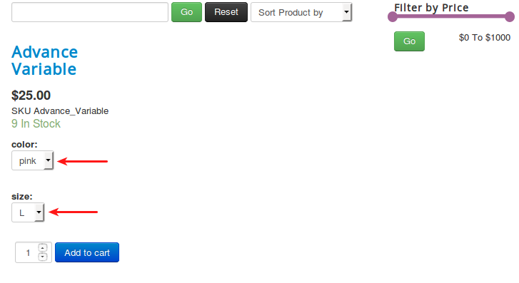

#### Using as Options

If you would like not to use options as variants, do the instructions given below,

* Go to article manager and move to J2Store cart tab.
* Navigate to Variants tab
* Uncheck the **Use as variants** checkbox (Don't delete the varaints) and click save.
* After saving, move to variants tab and click on **Set option values** to set the price prefix for option values. Refer the image below,

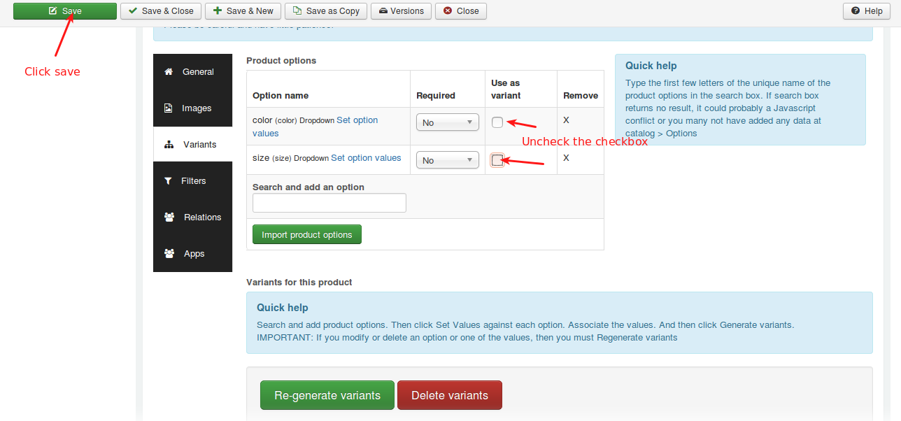
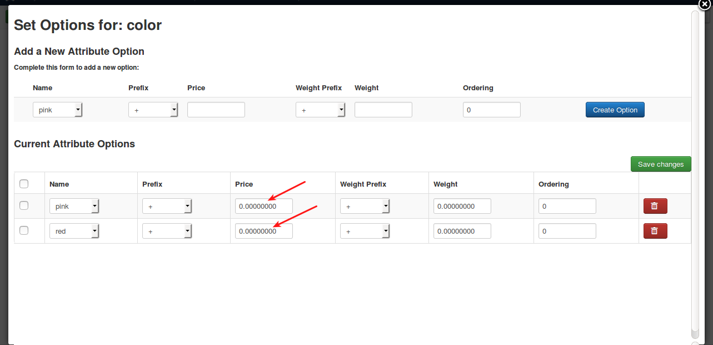

Now check the product in frontend
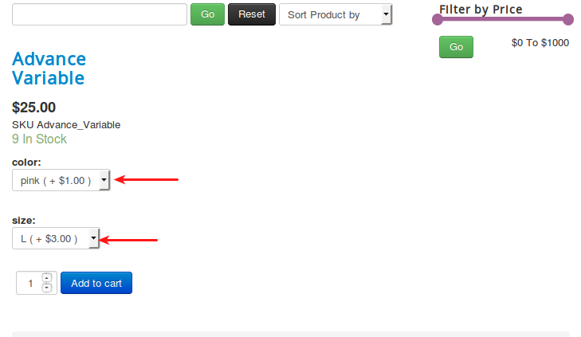

#### Support

Still have questions? You can post in our support forum: http://j2store.org/forum/index.html

Thank you for using our extension.