# Booking and Reservations

Want to use your store as a ticket booking system?

Have been wanting a solution to achieve this for a long time?

The wait is over. Here comes the app "Bookings and reservations" to meet your needs.

Transform your shopping cart into  a ticket booking system by creating bookable products.

Sell date or time based bookings and reservations, sell tickets and more. Manage availability by date or time and what not?

Want to offer price differences based on person types? Now that is also possible.

Offer appointments, services, bookings or rentals in your Joomla website with J2Store.

* **[Introduction](#introduction)**
   * **[Features](#features)**
* **[Requirements and Installation](#installation)**
* **[Basic settings](#basicsettings)**
* **[Manage bookings](#managebookings)**
* **[Creating a bookable product](#creatingabookableproduct)**
   * **[General tab](#general)**
   * **[Pricing tab](#pricing)**
   * **[Persons](#persons)**
   * **[Availability](#availability)**
* **[Use cases](#use-cases)**

<a name="introduction"></a>
## Introduction
Our bookable product type allows you to set up bookable products for reservations, services and rentals/hires. Bookings can be given customizable dates, costs and duration, and can be purchased.

<a name="features"></a>
### Here are the features that come handy with the app:

* **Flexible Booking slots**

  Create fixed or customer defined booking slots. You can offer a block of dates or time slots for booking or the customer can decide when to book your offerings.

* **Bookable types**

  You can create bookable products based on date, time, a combination of date and time, or by month, customer-defined.

* **Multi-person bookings**

  Customer can book for multiple persons. Example 2 Adults and 3 Children. The pricing could be defined accordingly. You could offer per-person discount as well.

* **Availability**

 You can make only certain days or time slots available for booking. Example: A room could be booked only on August 24 and 25. The rest of the days or time slots would be unavailable for booking.

* **Manage inventory**

  You can manage the bookable inventory in days or time slots. As soon as a bookable slot is full, it will not be available for the customers to book.

* **Booking multiple days**

 Let customers choose multiple days for booking a resource. Example: A car could be rented on September 20,21,22,23. Customer could choose all the four days and book.
 The pricing could reflect his selection.

* **Custom-tailored booking costs**

 You can define thoking made.

* **Calendar views**

  Display the availability, booking slots in a calendar format to the customers. Highlight the availability.

* **Seamless management of bookings**

  Manage the bookings in your site on the go with the app.

<a name="installation"></a>
## Requirements and Installation

### Requirements

1. Joomla 3.4.x and above

2. J2Store 3.2.25 and above

3. PHP 5.6.4 or higher.

### Installation

 * The app could be downloaded from our site and installed using the default Joomla installer.

 * After installing the app, go to J2Store > Apps and activate the app by clicking on enable button.
 

 * Once it is enabled, click on open button to complete the basic configuration of the app.

 * Installing and configuring this app in your site would allow you to create a product of the type "Booking".

<a name="basicsettings"></a>
## Basic Settings

 There are no much settings that have to be done to use this app.Here are the few parameters that are essential to start off with:

 * **Date format**

   Since you will be offering bookings and reservations, it is necessary that you specify the date format that you wish to use.

 * ** Time format**

 Reservations and bookings will be based on time frames. Hence it becomes mandatory to set the time format.

* **Cart expire time**

 This option would help manage the abandoned bookings. There might be situations where a user adds a booking to the cart but exceeds a specific time period without proceeding to the checkout process. Since the booking process is dynamic, this option would be of great help to avoid conflicts.

 Setting the cart expire minutes would make the items in the cart disappear after the specified time limit if the user does not proceed to the checkout process.

 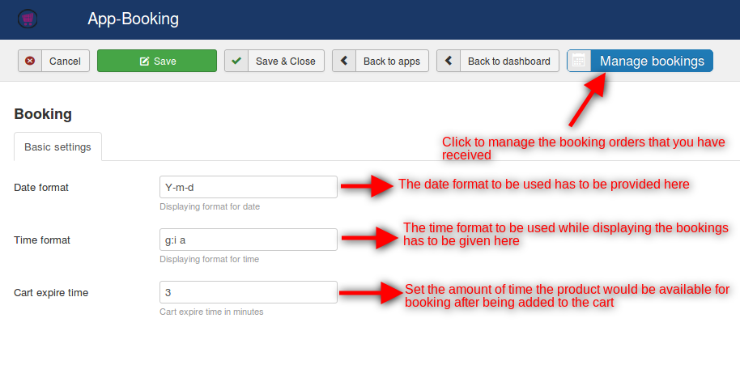

<a name="managebookings"></a>
## Manage bookings

 Clicking on the manage bookings option will allow you to manage the bookings that have been made by the users.

 Here is a screenshot that depicts the booking management:

 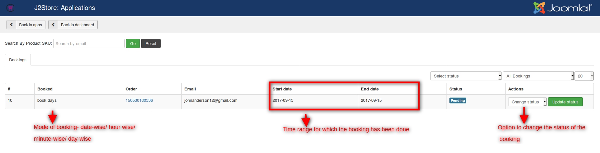

<a name="creatingabookableproduct"></a>
## Creating a bookable product

Once the global settings have been completed, we are all set to create a bookable product. To create a bookable product, go to Article Manager and create a new article.

While creating new product, choose **Booking** as a product type.
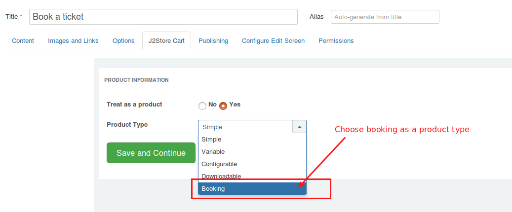

Apart form the default options that are available for all the product types, these are the various parameters that distinguish the  booking type product from the other product types:

<a name="general"></a>
### General Tab

#### Booking duration

The duration can be defined by admin or by customer.

**Fixed blocks**  You can define a fixed block of dates that are to be allowed for booking while the others are being disabled in the frontend. For example: If you set up the booking duration parameter to be Fixed block of 1 days, then the user will be allowed to choose a single date for booking.

**Customer-defined blocks** you can allow the user to choose the start dates and end dates by themselves. You can also set up the minimum and maximum number of blocks that can be chosen when you choose the Booking duration as customer-defined blocks. 

If you select the booking duration to Customer-defined blocks of 1 days, you would be prompted to choose the minimum and maximum duration allowed. If you choose 2 and 4 respectively, then the users will get a message if they choose dates that are more than 4 days or less than 2 days.

 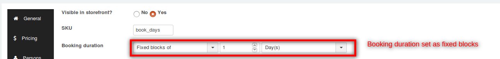

 The frontend will be like this:

 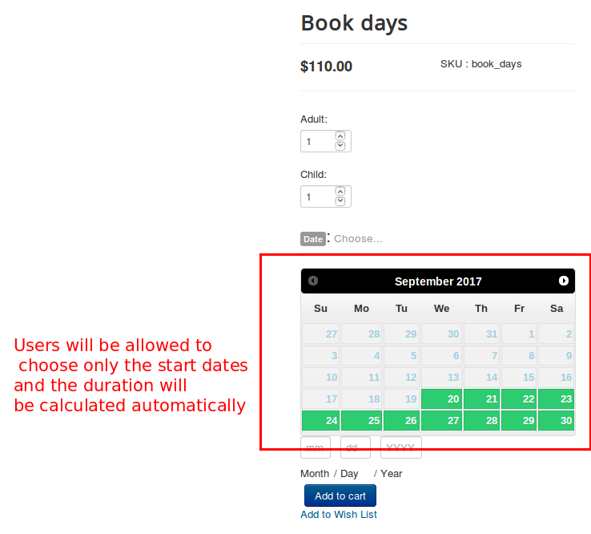

 When the booking duration is chosen to be Customer-defined blocks of 1 days, the following options pop up:

 * Minimum duration- To set the minimum number of blocks that have to be selected.

 * Maximum duration- To set the maximum number of blocks that have to be selected.

 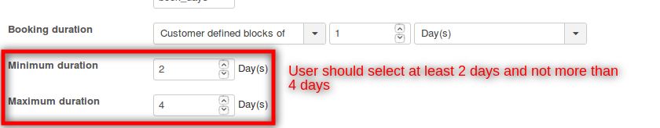

 The frontend will be like this:

 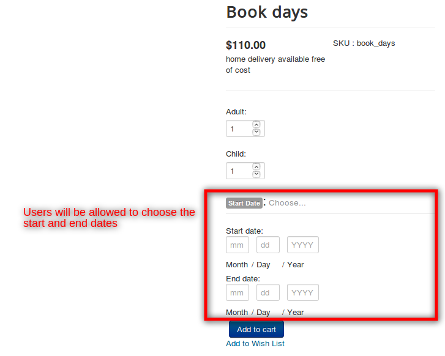

 When the user chooses more blocks than the specified limit, error occurs as follows:

 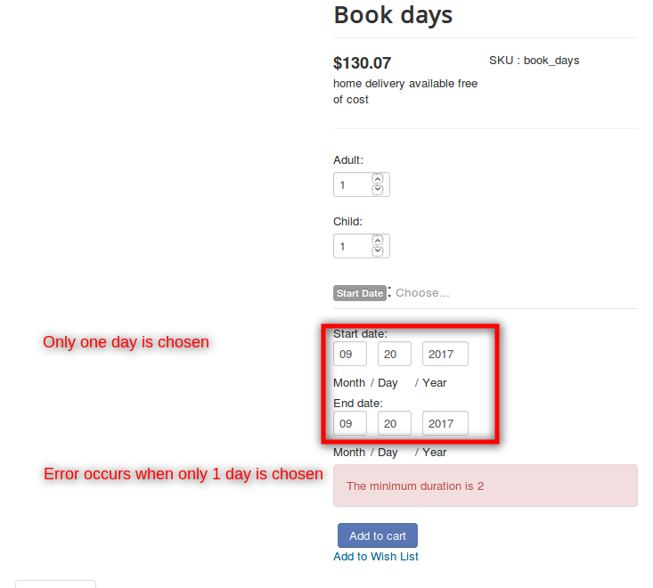

 When the maximum duration is exceeded, the following error occurs:

 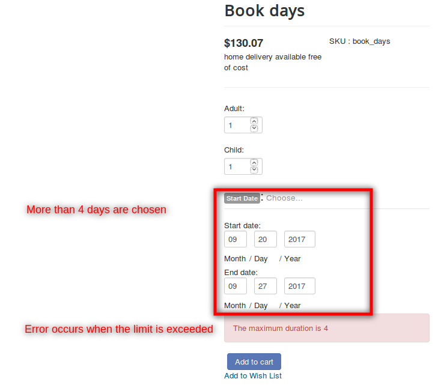

#### Calendar display mode

 Choose when to display the calendar. You can choose to display the calendar by default or only after clicking.

 The following video demonstrates the use of the calendar display mode option:

 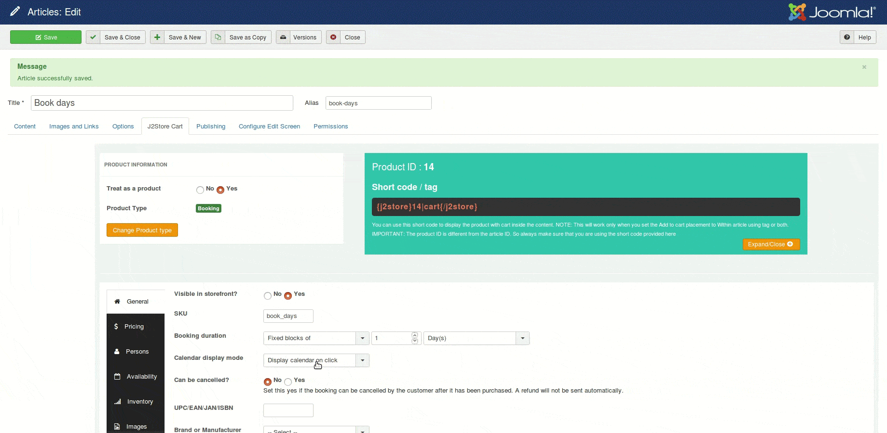
 
#### Allowing booking cancellation

It is possible to choose whether the store admin want his/her user to have the option to cancel their booking. Setting **YES** to **Can be cancelled?** will allow customer to cancel the booking after it has been purchased.

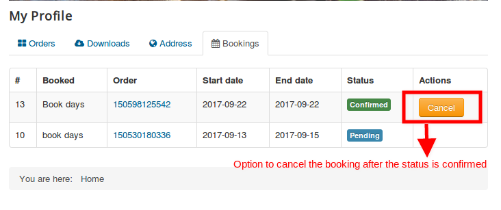

<a name="pricing"></a>
### Pricing tab

 The pricing tab for a booking type product has one extra option in addition to the default options as follows:

 **Block pricing**

 While you are able to set a price to the product, the booking type product allows block-wise price charging in addition to the regular pricing which is now an added advantage.

 Here is a screenshot to showcase the use of the block pricing option:

  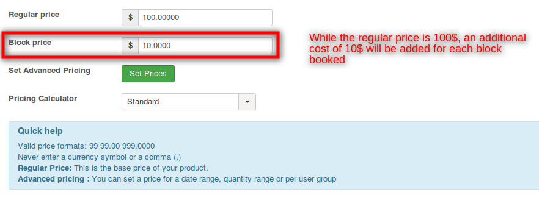

 Now that we have set up block pricing, the users will be charged in this way:

  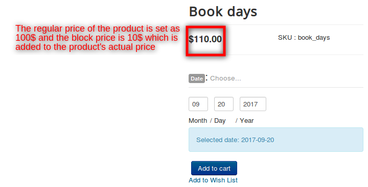

<a name="persons"></a>
## Persons

This tab allows you to make the booking for multiple persons. To enable this feature, select **YES**. It is also possible to set a minimum and maximum number of persons.

For example, A car could be rented and maximum 4 persons can only travel. So if you set **Minimum person : 1** and **Maximum persons: 4**, then booking will not be taken for more than 5 persons.

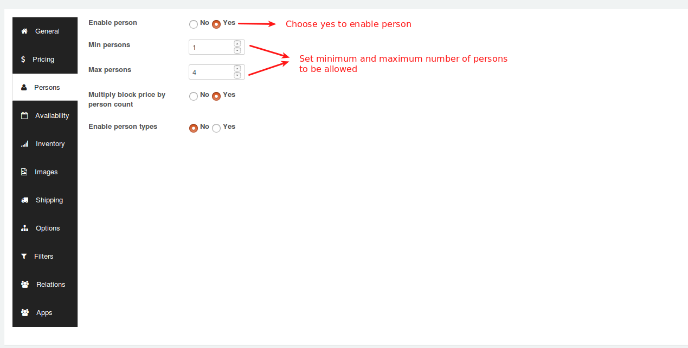

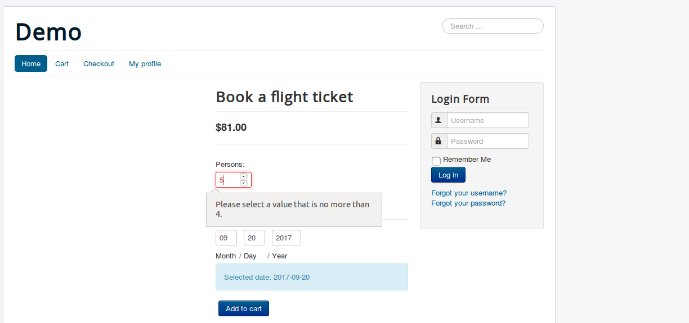

### Persons will also come into the following cost options:

**Multiply block price by person count**: If this option is enabled, all costs are multiplied by the number of persons the customer defines. It is also possible to enable person types. For example, Booking ticket for the journey might be having following restriction **Only 2 Adults and 3 Children allowed**. In this case, you could add person types and the pricing could be defined accordingly.

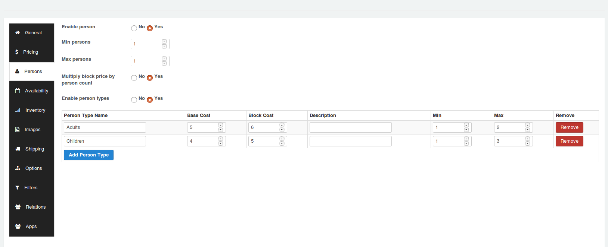

Once you enabled person types, you have the option to add multiple types.

Give your Person type a name (for example: Adult, Children) and define the cost (Base cost and Block cost) for the type. Adding a description is optional.

You can define a minimum and a maximum number for each person type. For example, you could require upto 2 adults and maximum 3 children for each booking. If you leave Max blank, there are no other restrictions than those of the bookable product itself.

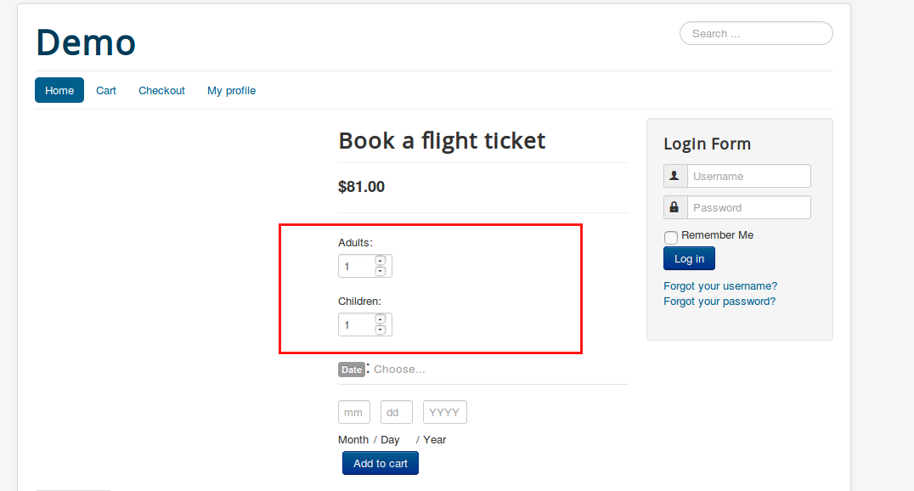

<a name="availability"></a>
## Availability

This tab controls the availability of blocks (i.e.) what blocks can be booked. Availability of blocks can be defined based on following time frame:

1. Day(s)
2. Month(s)
3. Hour(s)
4. Minute(s)

**Max bookings per block** : By using this option, you could define the number of bookings per block. For example, if you enter 2, more than 2 bookings on individual blocks are not allowed.

**Minimum block bookable and maximum block bookable** : If today is March 1 and you set minimum block bookable to 1 day into the future, then the first date a customer could book would be March 2. The same applies to the maximum date bookable. If you set maximum block bookable to 2 day into the future, then blocks avalaiable for booking are March 2, March 3.

**All dates are** : This option allows you to define specific date range to be availble or not available by default. The date range can be defined based on following time frames Months, Days, Hours, Minutes.

### Add date range

To add a custom date range, click the **Add Range** button:

On the new row created, choose a range type, From / to range and choose whether it is bookable or not and a priority number. The following are the several date ranges:

1. Date range – from and to will show a datepicker field
2. Range of days – from and to will show a dropdown of days of the week (Monday to Sunday)
3. Range of months – from and to will show a dropdown of months (January to December)
4. Range of weeks – from and to will show a dropdown of weeks (1 to 52)
5. Time ranges – from and to will show time inputs
6. Date Range with time – a time range can be set based on a custom date range

For example, if you would like to make the days from March 20 to March 22 to be non bookable, then you will have to choose **Available by default** to the All dates option and the date range should be set like below:

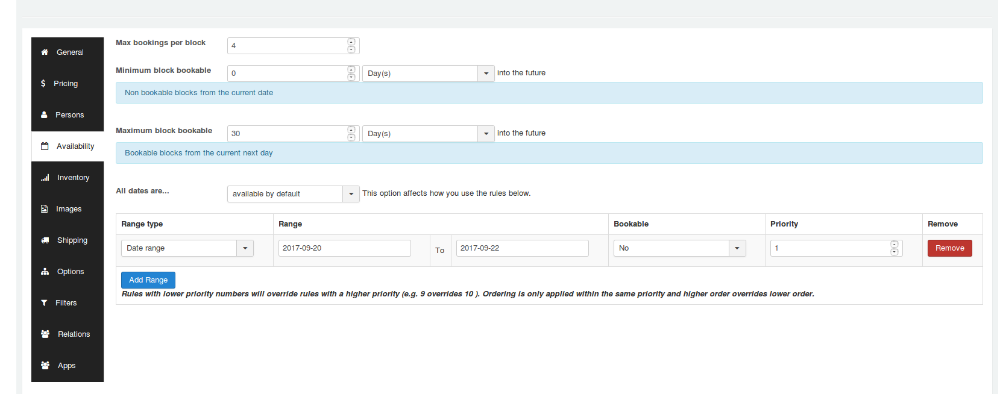

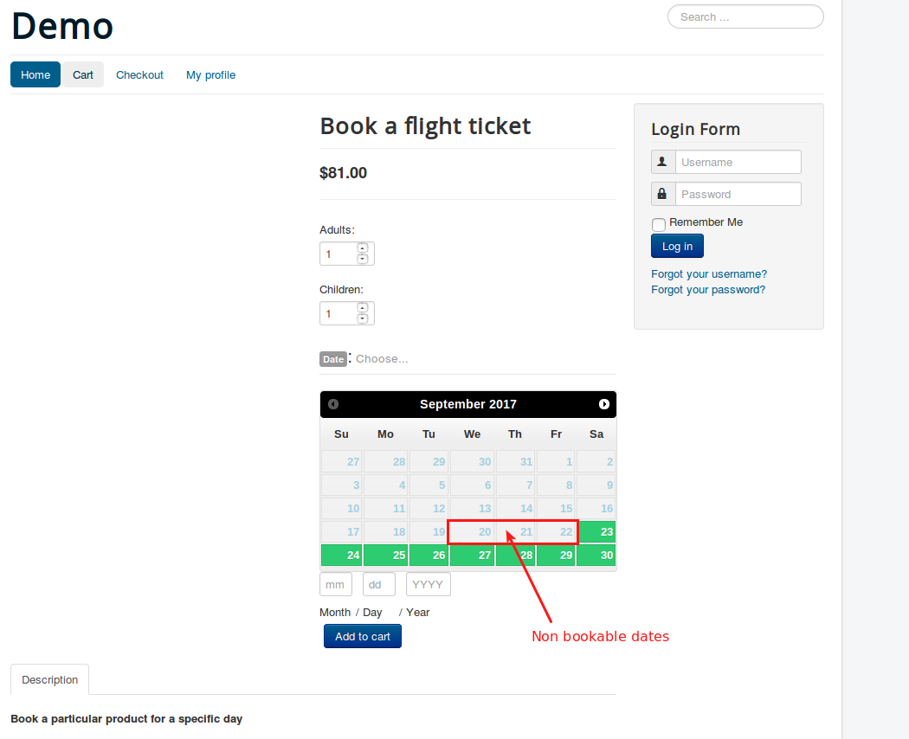

<a name="use-cases"></a>
## Use cases

### 1. Rent a party hall

A person owns a party hall that people can rent for a Birthday parties. 

##### Instance

1. The hall will be available for only 30 days.
1. It can accommodate upto 75 people.
2. The party hall owner wants customers to not book a party hall on specific set of date range. 
3. The party hall owner wants to restrict multiple bookings per block.
4. The hall can be booked for only one day.

### Booking Configuration

#### Creating product

1. Go to Article manager and create a new article.
2. Move to J2Store cart tab and choose **YES** to treat as a product.
3. Choose product type as **Booking** and save.

#### General tab

After creating the product, navigate to general tab.

**Booking duration**

To allow customers to book the party hall only for one day, set this parameter to **Fixed blocks of 1 day(s)**.

**Calendar display mode**

Choose whether the calendar must be opened by default or should be displayed when customer click on choose button. Setting **Display calendar on click** will hide the calendar until customer clicks on choose date.

#### Pricing tab

After defining booking duration, navigate to pricing tab and set the product's regular price and block price.

#### Persons tab

In our example, the maximum persons we allowed is 75. So set **YES** to enable person and then set

```
Min persons = 1

Max persons = 75
```

If you would like to multiply the block price with person count then set **YES** to **Mutiply block price by person count**.

#### Availability

1. To restrict customers from multiple booking per block, give **1** (one) to the text box named **Max bookings per block**.

2. **To make the hall unavailable after 30 days, set**

   ```
   Minimum block bookable = 0 or 1 day(s)

   Maximum block bookable = 30 day(s)
   ```

3. **Restrict booking on specific date range**

 To make specific date range to be unavailable for booking, set **All dates** parameter to **available by default** and click on **Add range** button to define specific date range.

 After clicking on Add range, on the new row created, define the date range like below:
 
 **Range type** - Date range
 **Range** - 27-09-2017 to 29-09-2017
 **Bookable** - No
 **Priority** - 1