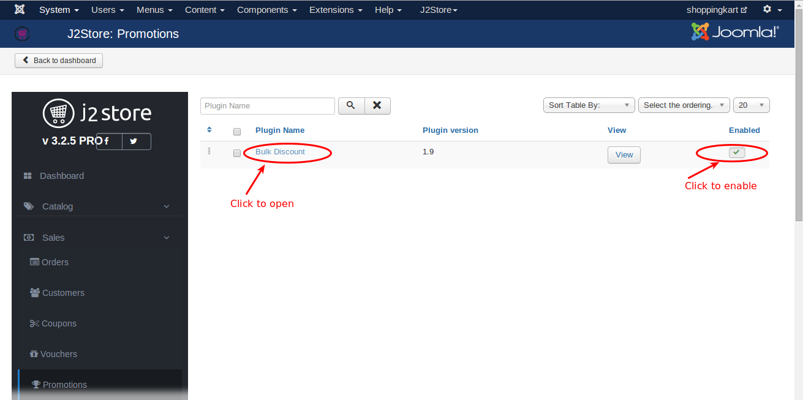
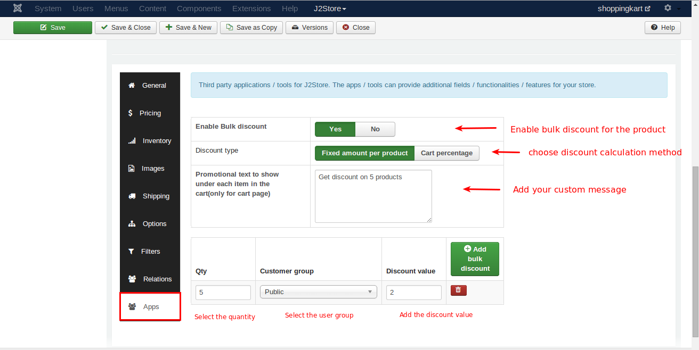
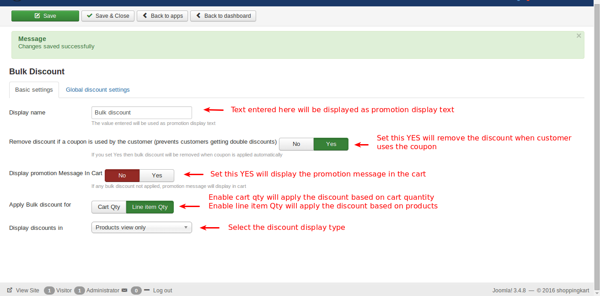
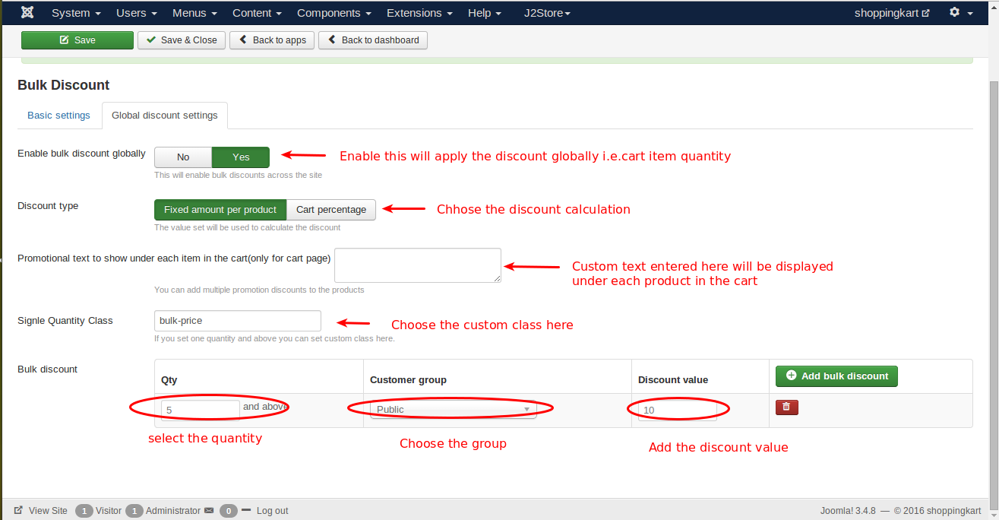

#Bulk discounts

Encourage customers to purchase more by providing bulk discounts depending on the ordered quantity and on the specific product.

Bulk discounts can be defined at site-wide (globally), category wise or per product wise. Provide a fixed per product discount or percentage of the total purchase. The plugin implements a greater flexibility in providing discounts without requiring the customers to apply a coupon.

You can also restrict the application of the discount depending on the customer groups.

####Requirements

* PHP 5.4 or higher
* Joomla 3.3 or above
* J2Store 3.2.x or above

####Installation Instructions

1. Use the Joomla installer to install the app.

2. Go to J2store -> Sales -> Promotions and enable app.

3. Open the Plugin Bulk Discount.

 

####Parameters

**Basic Settings**

* ***Display name***

     Text entered here will be displayed as promotion display text.

* ***Remove discount if a coupon is used by the customer (prevents customers getting double discounts)***

     Set this to **Yes** will remove the discount when customer used the coupon.

* ***Display promotion Message In Cart***

     Set this **YES** display the promotion message in the cart if any bulk discount not applied.

* ***Apply Bulk discount for***

  **Cart Qty :**This will apply the discount globally i.e. based on the cart quantity. This will work only when you enable the bulk discount globally in Global discount settings.
  
  **Line item Qty :**This will apply the discount based on the product. You can set discount to the product individually in the apps tab on j2store cart. Once you enabled Line item Quantity, the discount will be applied to the individual products.
   Refer the below image for setting discount for the product individually
   

* ***Display discounts in Products view only***

     Display the discount information in any one of the three options(Products view only, Category view only, Both product and category view).
     
 
     
**Global discount settings**

* ***Enable bulk discount globally***

     Set this **YES** will enable the global discount function.
     
* ***Discount type***

     **Fixed amount per product : **Enable this will calculate the discount on fixed price.
     **Cart Percentage : **Enable this will calculate the discount based on percentage.
     
* ***Promotional text to show under each item in the cart(only for cart page)***

     Custom text entered here will be displayed under each product in the cart.
     
* ***Single Quantity Class***

     Here you can set the custom class, if you set the quantity for one and above.
     
 