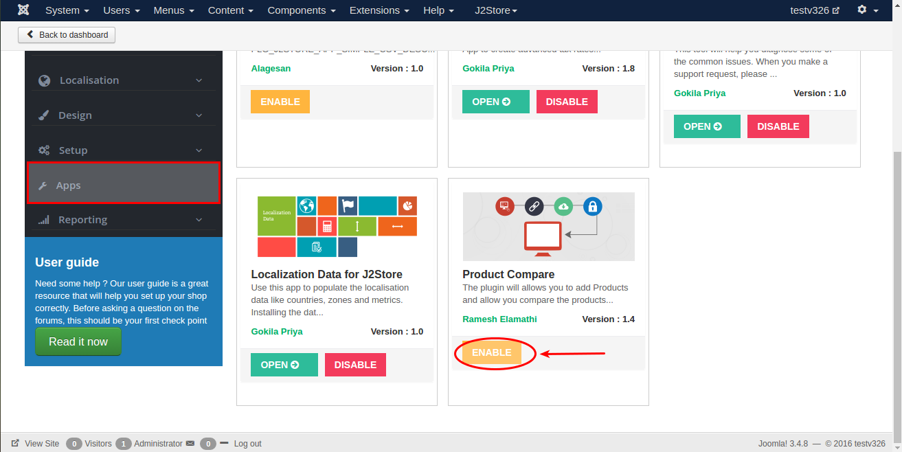
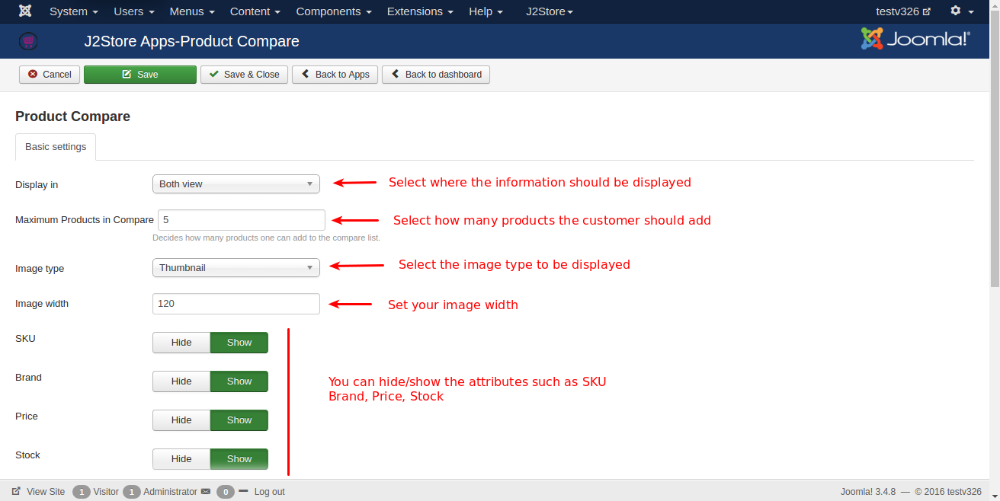
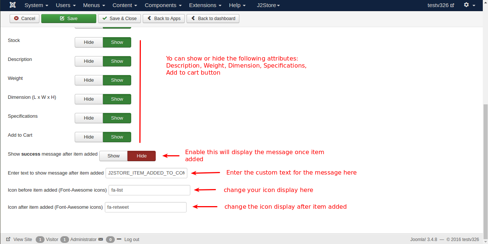

#Compare Product

This app will add a product compare feature to your online store. It allows customers to add products to a list for comparison. Customers can view the products and compare their features in a neat table.

####Requirements

* PHP 5.4 or higher
* Joomla 3.3 or above
* J2Store 3.2.x or above

####Installation Instructions

1. Use the joomla installer to install the app.

2. In the backend, go to J2Store Dashboard -> Apps as shown in the image below.

3. Click Enable in the Product Compare app.

4. Once the app is enabled, click an open to setup the configuration.

####Configuration

* **Display in**

  Select where the **Add to compare** should display. You can select any one of the three options available(Product view only, category view only, Both view).
  
* **Maximum Products in Compare**

  Select how many products the customer should add into the compare list.
  
* **Image type**

  Select image type here will be displayed in the frontend comparision view.
  
* **Image width**

  Set your image width in pixel. By default we have set to 120px.
  
Please refer the below image. You can hide/show the following attributes.

* Brand
* Price
* Stock
* Description
* Weight
* Dimension (L x W x H)
* Specifications
* Add to cart

* **Show success message after item added**

  Set **SHOW** will display the message once the item added into the compare list.
  
* **Enter text to show message after item added**

  You can enter the custom text for the message to be displayed. You can enter a language constant as a value here if you are using a multi-lingual site and then write a language override.
  
* **Icon before item added (Font-Awesome icons)**

  You can change the icon to be displayed before item added to compare.
  
* **Icon after item added (Font-Awesome icons)**

  You can change the icon to be displayed after item added to compare.
  
####Support

Still have questions? You can post in our support forum: http://j2store.org/forum/index.html

Thank you for using our extension.
