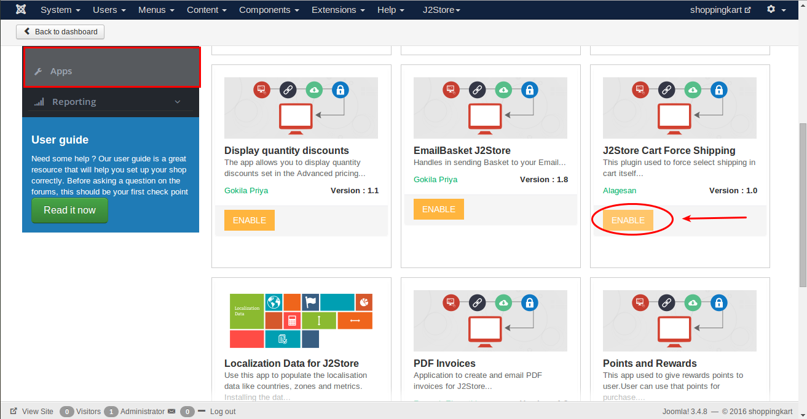
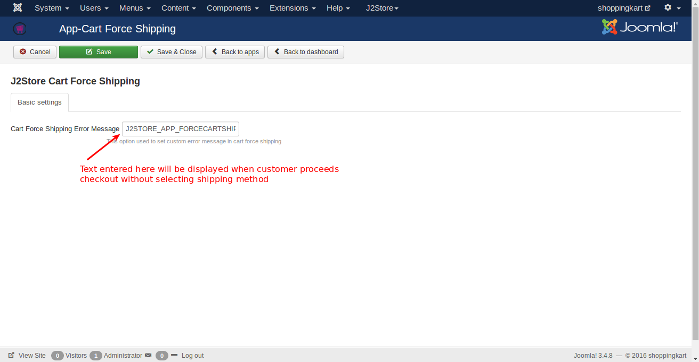
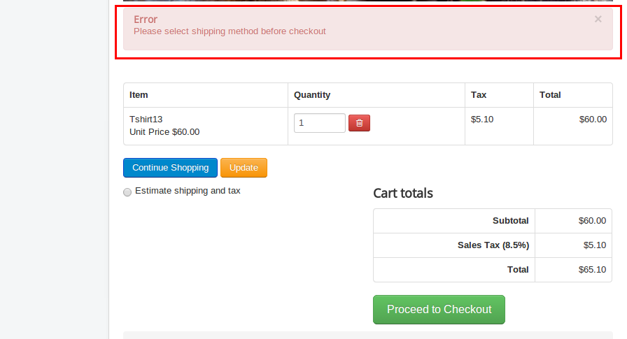

#Cart Force Shipping

The purpose of this application is used to force the customer to select shipping when customer selects the proceed checkout without selecting shipping.

####Requirements
* PHP 5.4 or greater
* Joomla 3.x
* J2Store 3.2.x or greater

####Installation Instructions

1. Use the Joomla installer to install the plugin.

2. In the backend, go to J2store Dashboard -> Apps and find the J2Store Cart Force Shipping and enable it.

3. Once enabled the plugin, open it.

####Basic Settings
**Cart Force Shipping Error Message**

The custom text entered here will be displayed as error message when customer proceeds checkout without selecting shipping method.
You can enter a language constant as a value here if you are using a multi-lingual site and then write a language override.

####Frontend

