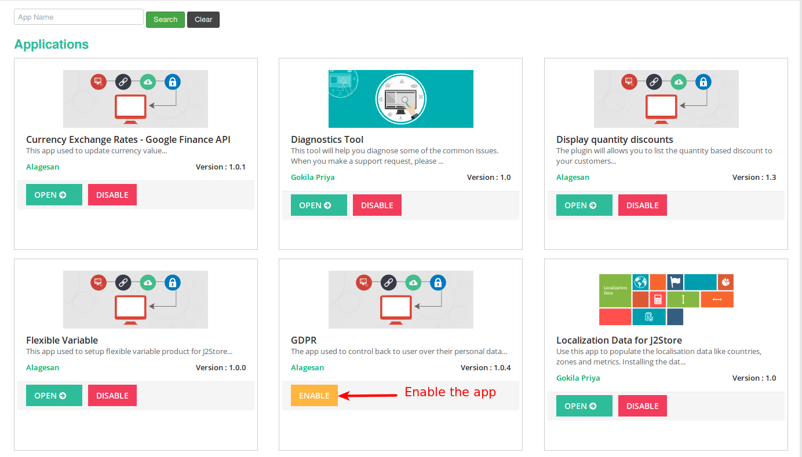
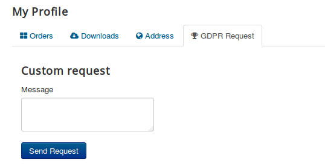
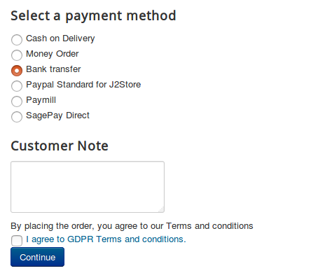
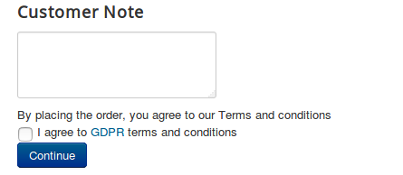
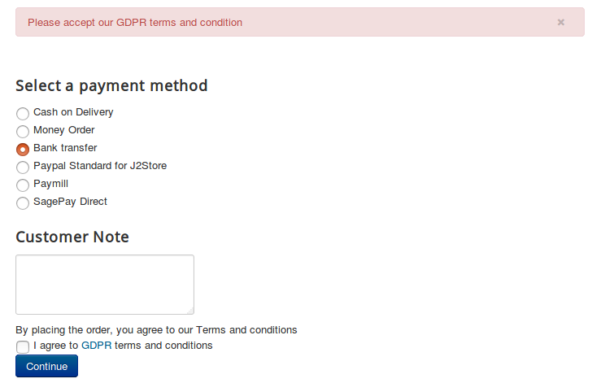
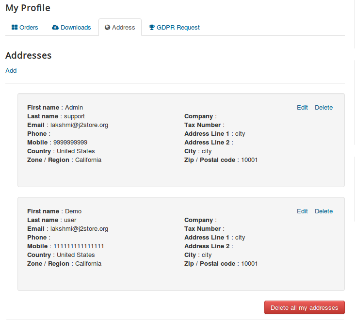

#GDPR Compliance

The GDRP Compliance plugin of J2Store makes it feasible for online merchants to comply with the recent GDPR regulations on your store developed with J2Store.

This plugin now provides users the privilege to have control over their information which they have used on the online store at the time of placing orders or purchasing products.

#### Requirements
* PHP 5.6 or higher
* J2Store 3.3.1

#### Installation Instructions
1. Use the Joomla installer to install the app.
2. In the backend, go to **J2Store Dashboard -> Apps** as shown in the image below.

3. Click **Enable** in the GDPR app.
4. Once the app is enabled, click on **Open** to set the configuration for the app.

#### Parameters

**Notify store administrators about the changes made by the customer to their data??**

When this parameter is set to Yes, the store administrators will be intimated when the users make any changes to their data stored on the store. You can enable this if you wish to be notified of the changes done by the users.

**Store administrator emails**

The email address(es) of the store administrator(s) could be specified here, separated by commas.

**Notify the customer about the change he made to his addresses?**

Enabling this parameter would notify the users about the changes made to their data.

**Log the activities like edit or delete by customers?**

 When this option is turned on, the changes made by the user would be maintained as a log and the store administrators could access this log under the  "Activity log" tab.

#### General Requirements

**Show GDPR myprofile tab ?**

 This option would allow the display of a GDPR Request tab on the My Profile tab like this:

 

 Thus this paves way for the users to send a custom request to the store administrators.

**GDPR terms and condition**
 When you switch this option to Yes, the customer would see a statement on the checkout page that would request for the customer's consent for the GDPR terms and conditions like this:

 

**Terms display type**

 You could choose how the terms and conditions would be displayed on the checkout, either as a link or as a checkout.

**Select the Article that has your GDPR Terms and Privacy content**

With this option you could associate the terms and conditions article for GDPR regulations. All you have to do is create an article specifying GDPR terms and regulations and link that article here.

**Prefix**

 If you wish to add a prefix to the terms and conditions label for GDPR. For example: If you specify "I agree to" here, then that would be displayed as the screenshot specified here:

 

 For a multi-lingual site, a  language constant could be entered here and a [language override](https://www.j2store.org/support/user-guide/language-override-in-joomla.html) could be created.
 Instance: If you specify the language constant, J2STORE_GDPR_PREFIX here, then you could create override for the above constant. Or you could just create an override for the one that is already there.

**Terms and condition label**

Here you could mention the  label of the terms and conditions statement.
For example: If we have specified "GDPR", then it would be displayed on the frontend like this:

For a multi-lingual site, a language constant(apart from the one inserted here already) could be entered here and a [language override](https://www.j2store.org/support/user-guide/language-override-in-joomla.html) could be created.
Instance: If you specify the language constant, J2STORE_GDPR_TERMS_LABEL here, then you could create override for the above constant. Or you could just create an override for the one that is already there.

**Suffix**

The text you specify here will be the one that is displayed on the terms and conditions consent statement at the end.
For example: If you have set this text as "terms and conditions", then it would be displayed as follows:

For a multi-lingual site, a  language constant could be entered here and a [language override](https://www.j2store.org/support/user-guide/language-override-in-joomla.html) could be created.
Instance: If you specify the language constant, J2STORE_GDPR_SUFFIX here, then you could create override for the above constant. Or you could just create an override for the one that is already there.

**Validation message**

You could enter the error message that has to be displayed if the user doesn't agree to the terms and conditions for GDPR.

For a multi-lingual site, a  language constant could be entered here and a [language override](https://www.j2store.org/support/user-guide/language-override-in-joomla.html) could be created.
Instance: If you specify the language constant, J2STORE_GDPR_VALIDATION here, then you could create override for the above constant. Or you could just create an override for the one that is already there.

####Buttons for customers

**Delete All Addresses**

This would display a button at the My Profile page allowing the users to delete all their addresses with a single click. The button would be displayed as follows:

