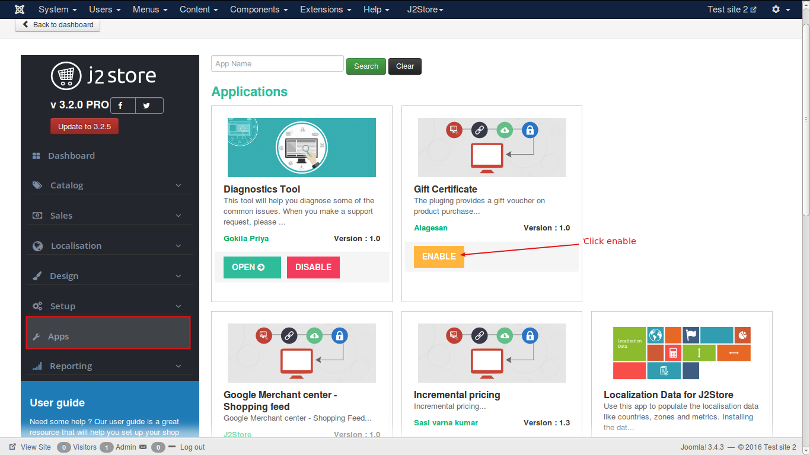
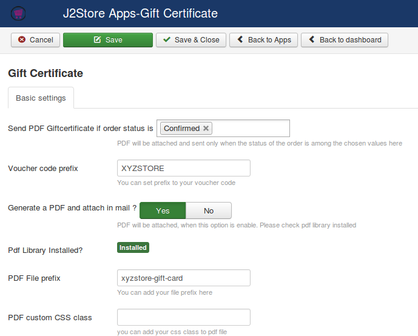
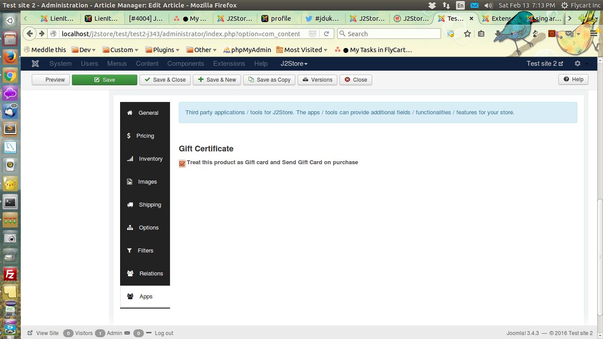
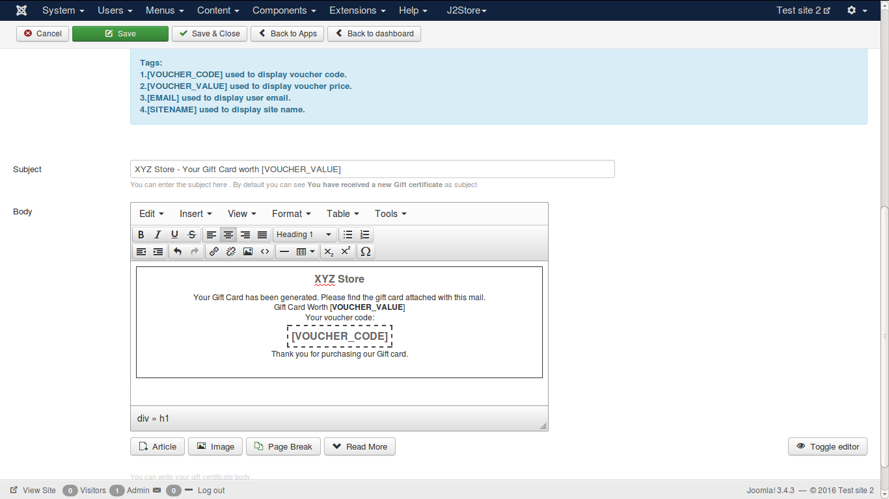

#Gift Cards

Offer Gift Card purchase to your customers. Providing Gift cards widens your window of sales. With this plugin, Store Owners will be able to create and sell Gift cards. A gift card or cashcard is aumatically generated and sent as email.

Gift Card app generates PDF and attached to the order email notification. This app requires DOMPDF library to generate and send PDF. You can download the DOMPDF library plugin and install it from here: https://bitbucket.org/j2store/plg_lib_dompdf/downloads/plg_library_dompdf.zip

#### Requirements

* PHP 5.4 or higher
* Joomla 3.3 or above
* J2Store 3.2.x or above

#### Installation Instructions
1. Use the Joomla installer to install the app. 
2. In the backend, go to **J2Store Dashboard -> Apps** as shown in the image below. 

3. Click **Enable** in the Gift certificate app.
4. Once the app is enabled, click on **Open** to set the configuration for the app.

#### Parameters

1. **Send PDF Giftcertificate if order status is**:
 Filter the order statuses for which a gift voucher should be selected. PDF will be attached and sent only when the status of the order is among the chosen values here. Recommended setting: Confirmed status. When a payment is successfull the order is changed to Confirmed status, so choosing confirmed status here will make sure that the voucher is generated only if the payment is successful.

2. **Voucher code prefix**
A prefix can be added to the voucher code to make it more relevant. A voucher code might be a random code of numbers and alphabets that is generated by the system and cannot be predicted manually.

3. **Generate a PDF and attach in mail ?**
If set to YES it generates a PDF of the below voucher Body and sends an email to the customer.

4. **Pdf Library Installed?**
For PDF generation and attachment this app uses a third party pdf library known as DOM pdf. This setting will show if Dom pdf library is installed or not. If it shows "Installed" then everything is alright. If no, then please install the dom pdf library and check the plugin again.

5. **PDF File prefix**
Name of the file that is attached with the email.

6. **PDF custom CSS class**
Add CSS class name. If not sure about it, please leave it blank.

7. **Subject and Body**
This is the Email Subject and Body which is sent to the cusomer upon. The voucher code and voucher value is dynamically generated by the system, therefore to use the voucher code and voucher value you may use the below tags 

[VOUCHER_CODE] - Random generated voucher code
[VOUCHER_VALUE] - Voucher value, this is the value of the product.
[EMAIL] - Customer Email.

#### How to sell gift card or cash card in my online shop ?
Most of the online shops / ecommerce stores have the option to buy a 
[Gift Card](https://en.wikipedia.org/wiki/Gift_card). It is one of the opputunities for store owners to widen their chance of sales.

- Create a cash card product and start selling 
[Create a J2Store product](http://j2store.org/support/user-guide/simple-product.html) with product type as "Simple product". Configure all basic options such as price and navigate to the **apps** tab.

You could find an option that says "Treat this product as Gift card and Send a Gift Card on purchase"
Tick the checkbox as shown in below screenshot.

If you wanted to provide a gift card or cash card in different rates, you can create an option add it in the options section. Click this link to [Check how to create and add options to a product](http://j2store.org/support/user-guide/options.html)

#### Configure the Subject and Body of Gift Card 
As Shown in the below screenshot you could design your own Gift card format and use the below tags to place the voucher code.

#### How the customer can use this Gift card ?
A Customer purchases this gift card. A voucher is created for this order placed with the value of the product. For example if the gift card product price is $100, then a voucher of value $100 is generated and an email is sent to the customer. That email subject and body could be configured in above section.

The Store admin should  Enable Gift Vouchers under J2Store Setup > Configurations > Discount tab > Enable Gift Vouchers, set this to Yes. Save the configurations. Store starts accepting vouchers in the cart section. The customer can enter the voucher code in the cart section to redeem the gift card value. 

####Video Tutorial

**[Here is the link](https://www.youtube.com/watch?v=g7epaBKOOuE)** to Gift certificate video tutorial.