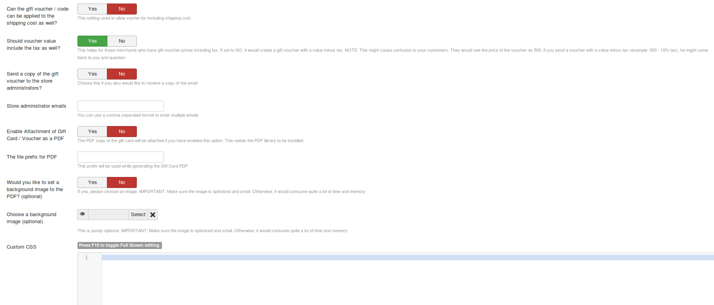
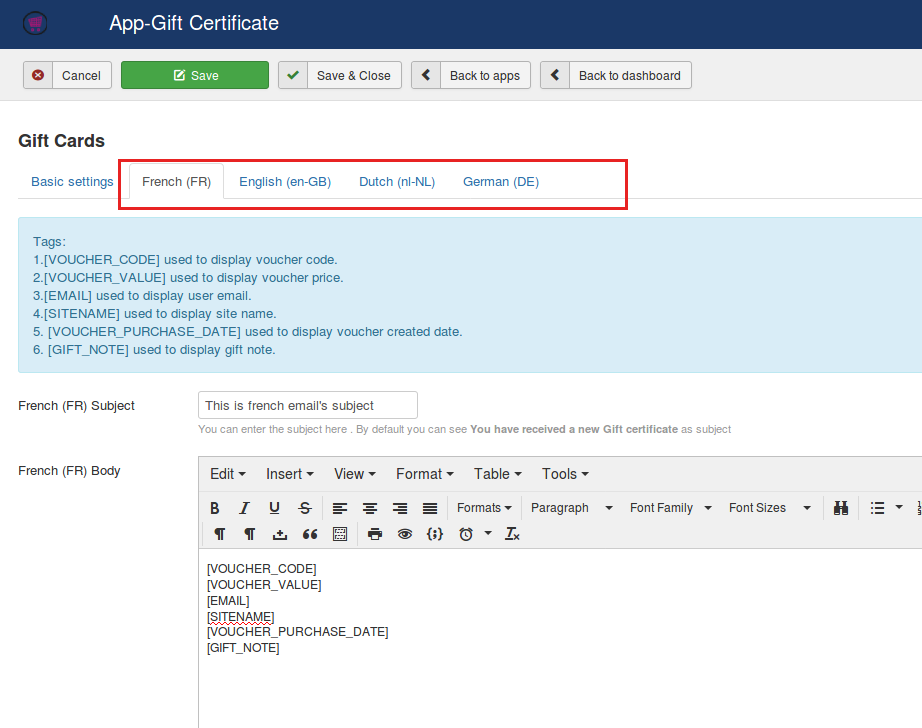
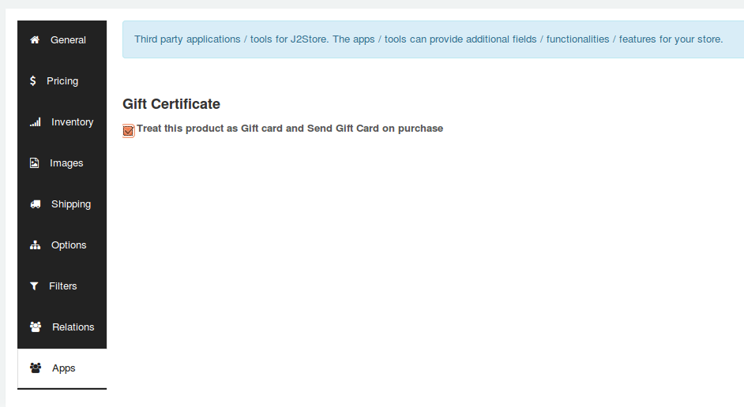

# Gift Cards

Offer Gift Card purchase to your customers. Providing Gift cards widens your window of sales. With this plugin, Store Owners will be able to create and sell Gift cards. A gift card or cashcard is aumatically generated and sent as email.

Gift Card app generates PDF and attached to the order email notification. This app requires DOMPDF library to generate and send PDF. You can download the DOMPDF library plugin and install it from here: https://bitbucket.org/j2store/plg_lib_dompdf/downloads/plg_library_dompdf.zip

#### Requirements

* PHP 5.4 or higher
* Joomla 3.3 or above
* J2Store 3.2.x or above

#### Installation Instructions
1. Use the Joomla installer to install the app. 
2. In the backend, go to **J2Store Dashboard -> Apps** as shown in the image below. 

3. Click **Enable** in the Gift certificate app.
4. Once the app is enabled, click on **Open** to set the configuration for the app.

#### Parameters

**Pdf Library Installed?**

For PDF generation and attachment this app uses a third party pdf library known as DOM pdf. This setting will show if Dom pdf library is installed or not. If it shows "Installed" then everything is alright. If no, then please install the dom pdf library and check the plugin again.

**Show confirm gift receiver email**

If you would like to validate the receiver email address, set this option to YES to show confirm email address field.

**Make receiver email mandatory**

If you want your customers to enter the receiver email always, set this option to YES to make this field as required field.

**Make receiver note mandatory**

Setting this option to YES will make the receiver note field as required field.

**Allow purchasing multiple gift certificates with different receivers**

If wants to allow customers to purchase multiple gift certificates, set this option to YES. Setting YES will allow customers to bue multiple gift cards with different receivers.

**Send PDF Giftcertificate if order status is**:

 Filter the order statuses for which a gift voucher should be selected. PDF will be attached and sent only when the status of the order is among the chosen values here. Recommended setting: Confirmed status. When a payment is successfull the order is changed to Confirmed status, so choosing confirmed status here will make sure that the voucher is generated only if the payment is successful.

**Voucher code prefix**
A prefix can be added to the voucher code to make it more relevant. A voucher code might be a random code of numbers and alphabets that is generated by the system and cannot be predicted manually.

**Round gift card / voucher value by**

Would you like to round the voucher value ? Then, enter the value by which the voucher value should be rounded.
For example, if point is in decimal(0.60), it will change the decimal to whole number.

**Can the gift voucher / code can be applied to the shipping cost as well?**

THis setting is used to allow voucher for including shipping cost

**Should voucher value include the tax as well?**

This helps for those merchants who have gift voucher prices including tax. If set to NO, it would create a gift voucher with a value minus tax. NOTE: This might cause confusion to your customers. They would see the price of the voucher as 500. If you send a voucher with a value minus tax (example: 500 - 10% tax), he might come back to you and question.

**Send a copy of the gift voucher to the store administrators?**

As a store admin, if you would like to receive a copy of gift certficte email, set this option to YES.

**Store administrator emails** 

If you have enabled above option, you will have to give the administrator email here. You could also enter multiple emails separated with comma (,).

**Generate a PDF and attach in mail ?**

If set to YES it generates a PDF of the below voucher Body and sends an email to the customer.

**PDF File prefix**

Name of the file that is attached with the email.

**Would you like to set a background image to the PDF? (optional)**

Choose YES to this option, if you would like to add background image to the PDF voucher.

**Choose a background image (optional)**

If you set YES to above parameter, choose the background image here. Make sure the image you have uploaded is optimized and small.

**Custom CSS**
Add CSS class name. If not sure about it, please leave it blank.

#### How to add subject and body of the email ?

The subject and body of the email could be added by navigating to the tab next to basic settings tab. If you are having multiple languages in your site, you could also add different content for different languages.

**Subject and Body**
This is the Email Subject and Body which is sent to the cusomer upon. The voucher code and voucher value is dynamically generated by the system, therefore to use the voucher code and voucher value you may use the below tags 

**Tags:**

1. [VOUCHER_CODE] - used to display voucher code.
2. [VOUCHER_VALUE] - used to display voucher price.
3. [EMAIL] - used to display user email.
4. [SITENAME] - used to display site name.
5. [VOUCHER_PURCHASE_DATE] - used to display voucher created date.
6. [GIFT_NOTE] - used to display gift note. 

#### How to sell gift card or cash card in my online shop ?
Most of the online shops / ecommerce stores have the option to buy a 
[Gift Card](https://en.wikipedia.org/wiki/Gift_card). It is one of the opputunities for store owners to widen their chance of sales.

- Create a cash card product and start selling 
[Create a J2Store product](http://j2store.org/support/user-guide/simple-product.html) with product type as "Simple product". Configure all basic options such as price and navigate to the **apps** tab.

You could find an option that says "Treat this product as Gift card and Send a Gift Card on purchase"
Tick the checkbox as shown in below screenshot.

If you wanted to provide a gift card or cash card in different rates, you can create an option add it in the options section. Click this link to [Check how to create and add options to a product](http://j2store.org/support/user-guide/options.html)

#### How the customer can use this Gift card ?
A Customer purchases this gift card. A voucher is created for this order placed with the value of the product. For example if the gift card product price is $100, then a voucher of value $100 is generated and an email is sent to the customer. That email subject and body could be configured in above section.

The Store admin should  Enable Gift Vouchers under J2Store Setup > Configurations > Discount tab > Enable Gift Vouchers, set this to Yes. Save the configurations. Store starts accepting vouchers in the cart section. The customer can enter the voucher code in the cart section to redeem the gift card value. 

#### Video Tutorial

**[Here is the link](https://www.youtube.com/watch?v=g7epaBKOOuE)** to Gift certificate video tutorial.