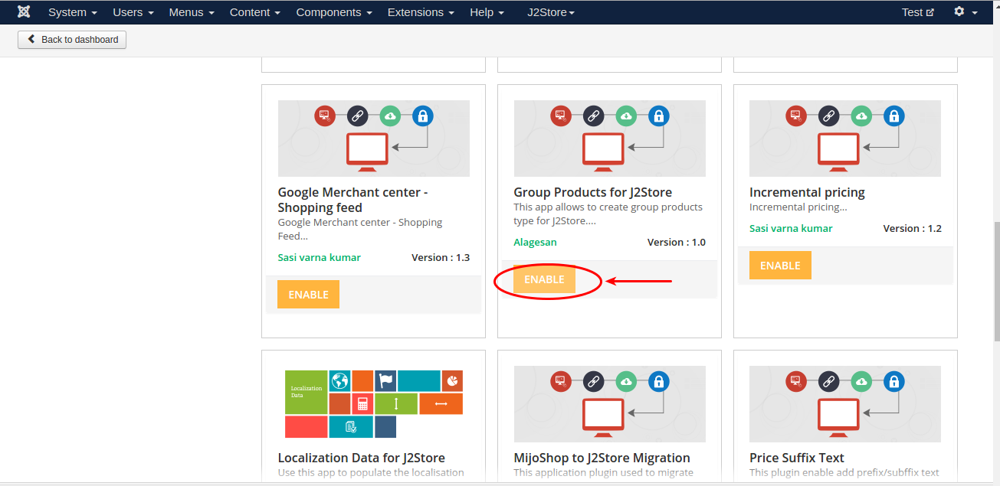
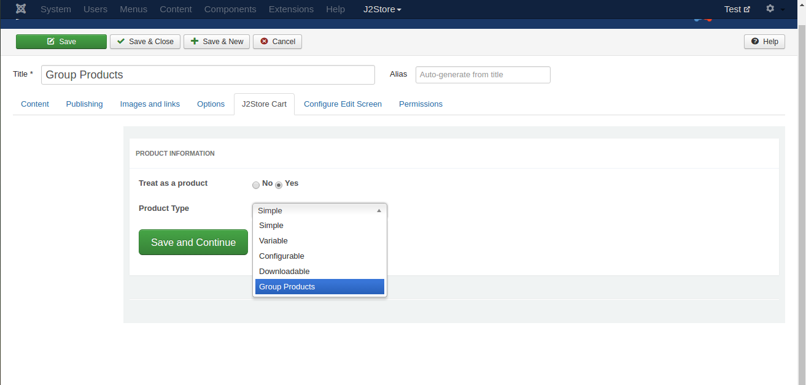
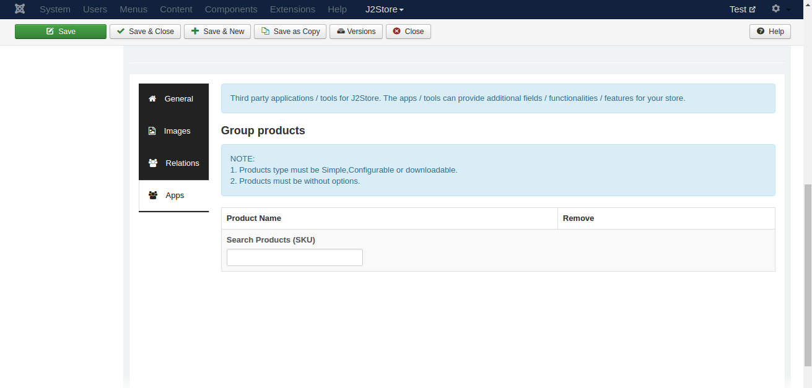
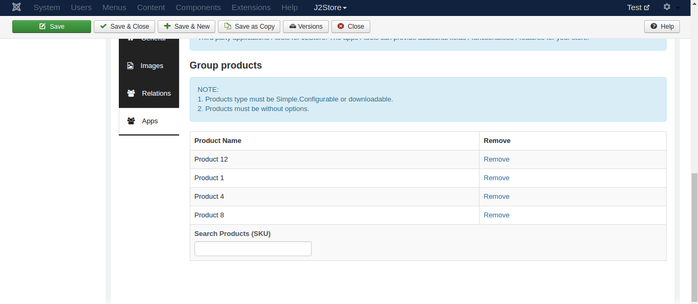
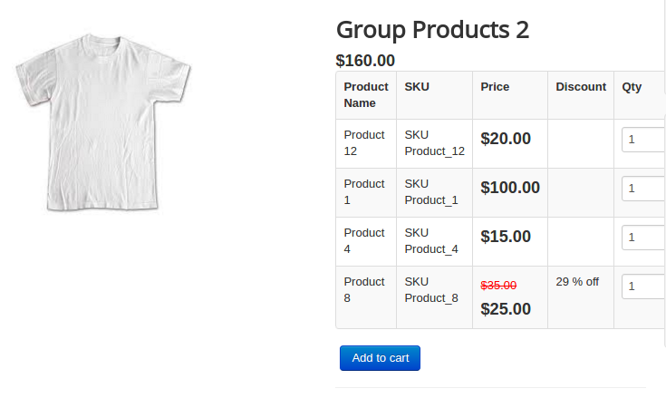

#Group Products

This app allows store owner to combine the products and sell it as one group product. When grouping product, the app will allow only simple, configurable and downloadable product types without options. Product which are having options can't be added into the group.

#### Requirements

* PHP 5.4 or higher

* Joomla 3.3 or above

* J2Store 3.2.x or above

####Installation

1. Use the joomla installer ot install the app.

2. Go to J2Store > Apps, find the Group Products app and click enable to activate the app.

3. Once enabled, you dont need to configure anything in the app. Just go to article manager and click new article.

####Group Products

* Once you enabled the app, you can see **Group Products** as one of the product types listed in the product type dropdown. Refer the picture below
 

* Select the product type Group Products and click save.

* Go to J2Store cart and scroll down where you can see the navigation menus (General, images,Relations,apps)

* In general tab, choose **YES** to visible in storefront and navigate to apps.

* Go to apps tab where you can see the search box to search for the products.
 

* Type two or three characters of your product.
 

* If the product you are searching for is not listed, the reason is that the product might have options. Since this app allows only the product without options, the product with options cannot be added into the group.

* Once the products are added, save article and check in the frontend.

