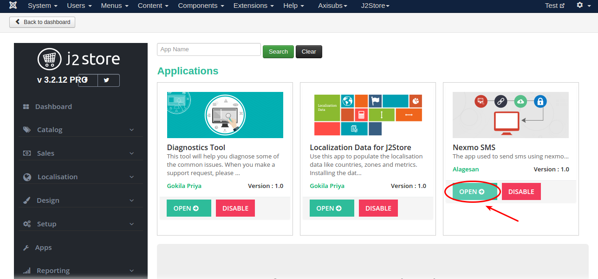
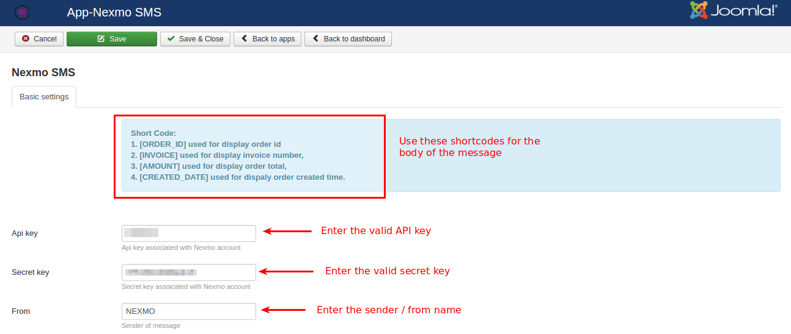
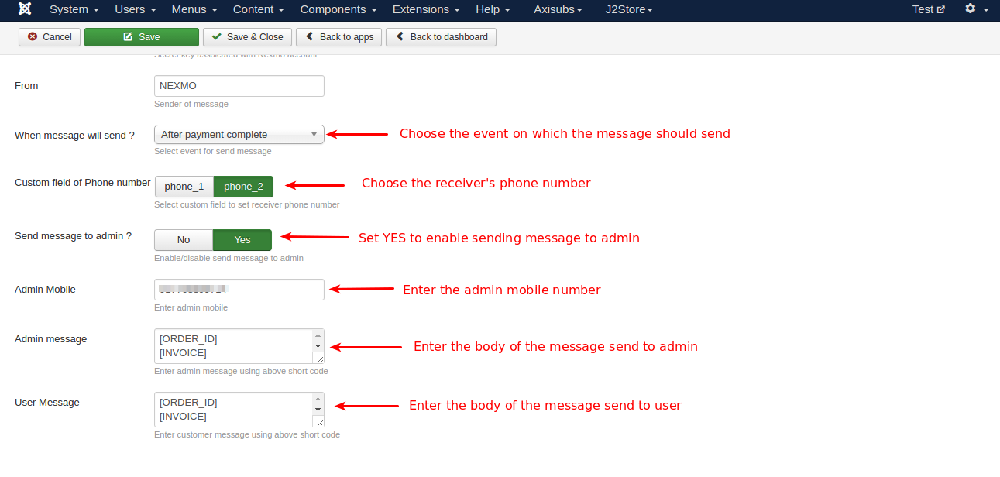

# Nexmo SMS

Now you can integrate Nexmo in your online store. With Nexmo app you can send SMS alerts to mobile regarding the status of orders to your customers. You can also enable the app to send notifications store owner when a new order is made.

#### Requirements

1. PHP 5.4 or higher

2. Joomla 3.3 or above

3. J2Store 3.2.x or above

#### Installation

1. Use the joomla installer to install the app.

2. In the backend, go to J2Store > Dashboard > Apps.

3. Click **Enable** in the Nexmo SMS app as shown in the image below.

4. Once app is enabled, click **open** to setup the Basic settings of the app.

#### Basic Settings

**API key:** Enter the valid API key provided by the Nexmo.

**Secret key:** Enter the valid secret key provided by the Nexmo.

**From:** The value entered here will be displayed as sender name (from name) when customer receives the notification in his mobile phone.

**When message will send:** Choose when the message should send. Select either **After payment complete** or **After status update**.

**Custom field of Phone number:** Select the receiver's phone number. If you choose phone_2, then the SMS will be sent to the customer's number entered in the field **Mobile** in the checkout.

**Send message to admin:** Select **YES** will enable sending SMS to admin.

**Admin Mobile:** Enter the valid mobile number of admin.

**Admin message:** The value entered here will be displayed as body of the message when admin receives. You can use the shortcodes mention in the top of the backend app settings.

**User Message:** The value entered here will be displayed as body of the message when user / customer receives. You can use the shortcodes mention in the top of the backend app settings.

