# Partial payments

This app can help you and the users in case of products with higher costs.As the name goes,partial payments allows users to pay in installments.In this case, to meet your customers’ needs you might offer them the possibility to leave a deposit and make the full payment later. This kind of feature is now possible with our **Partial payments** app.There is an added advantage since the users get to choose if they want to pay the full amount or in segments.

 Customers pay by either a fixed price or by percentage up front.You could also set up plans defining how the user can pay the amount.Sounds Great?

 Here are the numerous features that come handy with this app:

* Store admin can enable partial payment globally or at per product level.

* Three types of partial payment types : Fixed price, percentage, plans.

* Different types of partial payment plans can be created and added to the products.

* Force customers to pay remaining amount after specific days from the day on which the initial payment has made.

* Schedule future payments based on order status.

* Send an email to customer when scheduled order is ready for payment.

* Notify about payment pending to customer through mail on days after payment date.

### Installation

* This app can be downloaded from our site and installed using the default joomla installer.

* Once installed, the app can be configured under J2Store-Apps.

* Click Enable to enable the app.

* Click Open to Open and configure the settings for the app.

### Basic Settings

* ** Enable partial payment**

     Three options are available as follows:

    * **No** - If you would like to enable partial payment for specific product, set this option to **NO**. It will disable the partial payment mode globally. You should have to enable the partial payment at product level.

    * **Yes-optional partial payment** - This allows partial payment mode as an option against normal full payment method.

    * **Yes-required partial payment** - This makes partial payment as the only option.

* **Select by default**

   Choose if the default payment mode is partial or full.

* **Partial payment type**

   Select if you wish to set up a fixed amount as the default amount to be paid or a plan or a % of the total amount.

* **Amount/Plan**

    * This option depends on the value chosen on the previous parameter.

    * If you wish to collect a % of the total amount or a fixed amount the amount has to be specified here.

    * If plan is chosen as the partial payment mode,the plan that has been created should be selected here.

* **Order Status**

 Scheduled order status for the future payments must be specified here.

* **Cron URL**

 The Cron URL should be mentioned here.

#### Relevant Screenshot

  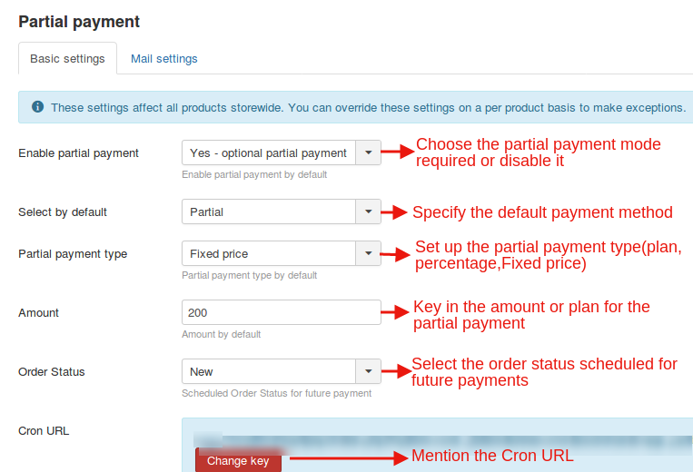

### Mail Settings

* **Send email on enable pay**

  Choose Yes to send emails to the users when the payment due date approaches.

* **Notify payment pending on**

 Send reminder mails to customers through the days specified here after the payment date.

* Click Save.

#### Relevant Screenshot

 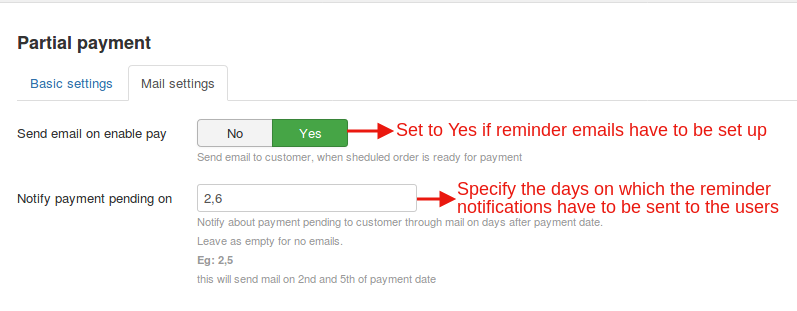

### Creating plans for partial payments:

* Click on the Plans tab (Refer the screenshot attached).

* Click on the New button to create a new plan.

* Give the plan a name,description and set up a plan schedule(the installments the payment is to be paid within).

* Click Save.

* Click Back to Apps to set up partial payments.

**Relevant Screenshot**

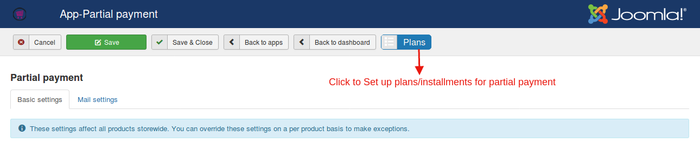

### Partial payments at product level

When using partial payment at product level, you will have to disable partial payment globally at app's settings.

1. Go to Article manager > Edit your product

2. Move to J2Store cart tab and navigate to Apps tab

3. Set YES to Enable partial payment

4. Choose if the default payment mode is partial or full.

5. Select your partial payment type (Fixed price, percentage, plan)

6. If plan is chosen as the partial payment mode,the plan that has been created should be selected here.

**Relevant Screenshot**
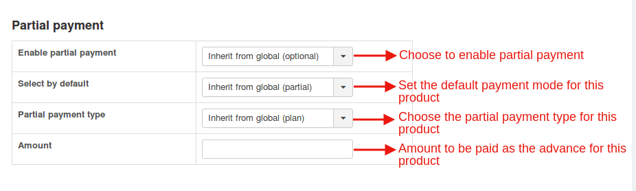

## Instances

Have you set up a plan as the  partial payment type?

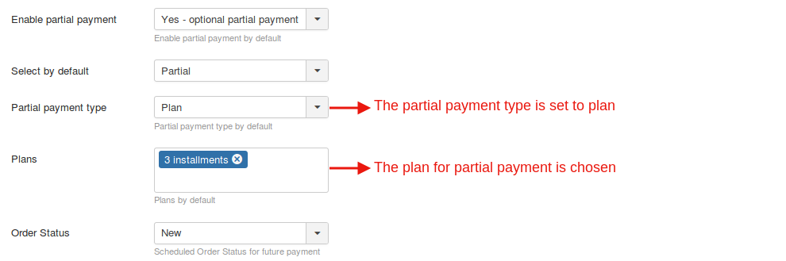

Then this is how the products will be displayed:

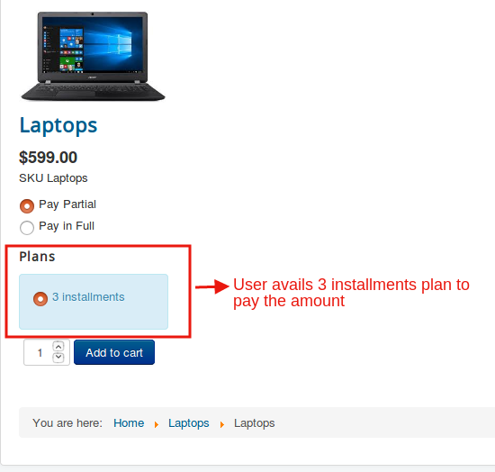

If percentage is chosen as the partial payment mode:

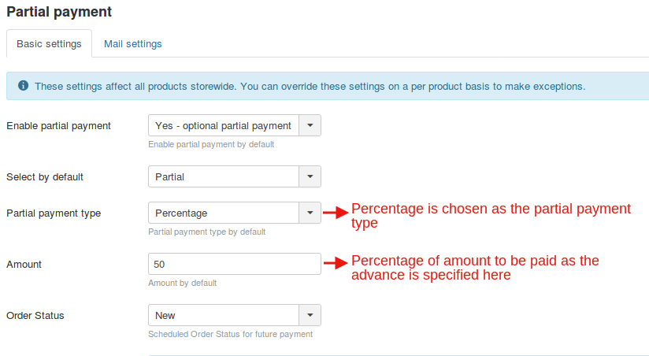

The products page will be like this:

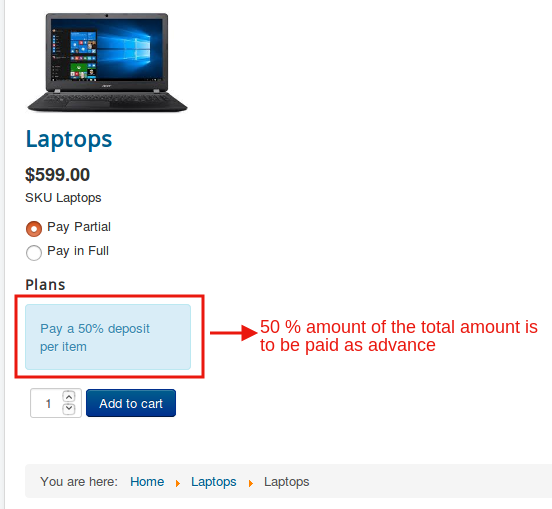

If Fixed price is chosen as the partial payment type:

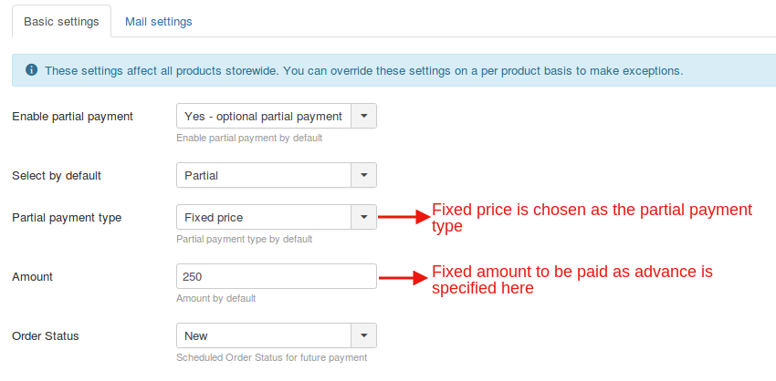

The products will appear like this:

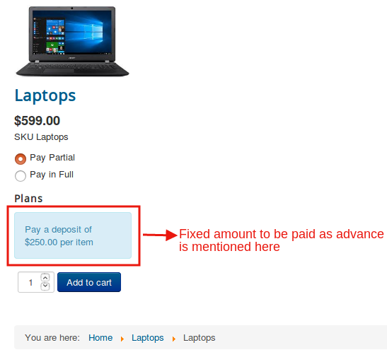

The cart page is depicted below:

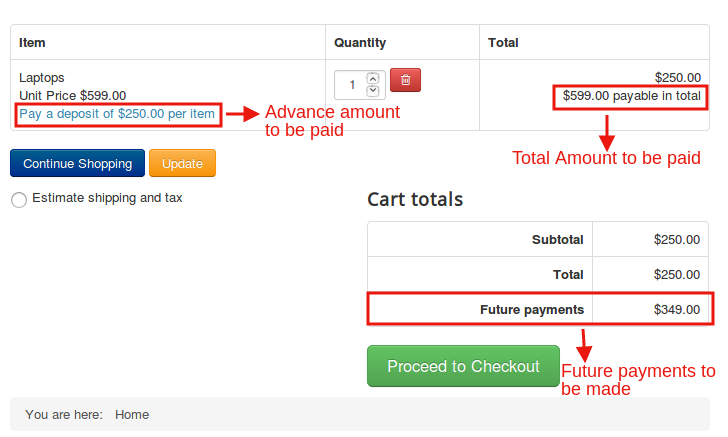

## Backend Orders

In the back end, the store owner can keep track of the orders and payment dues.The following screenshot pictures how the order will be shown:

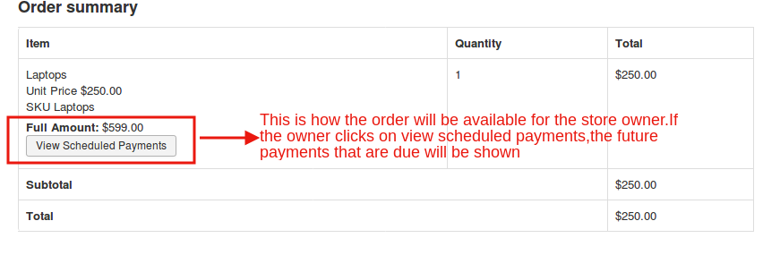

Payments that are due can be found like this:

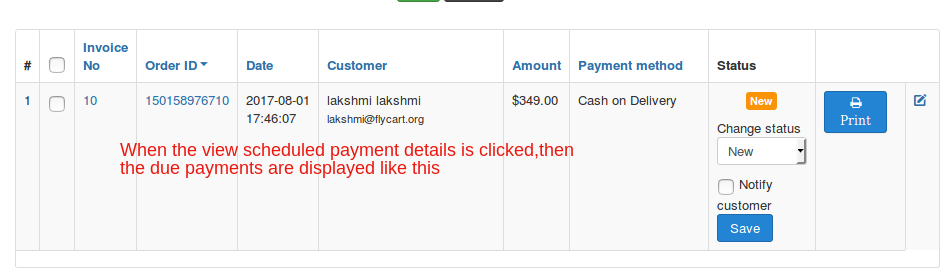
