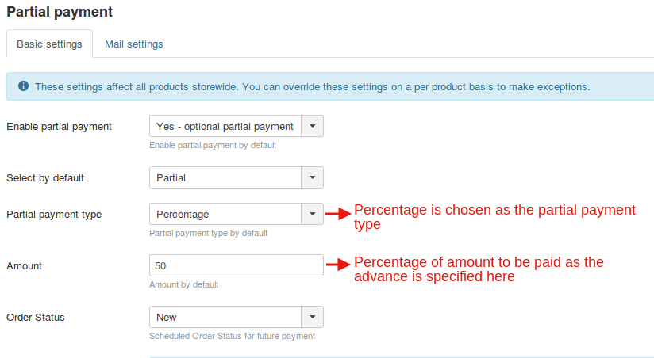
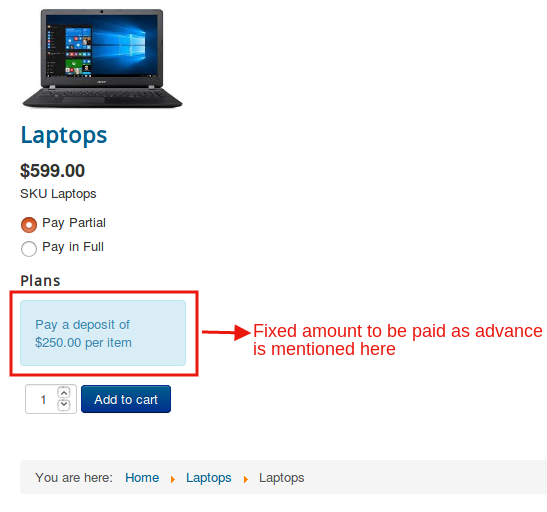
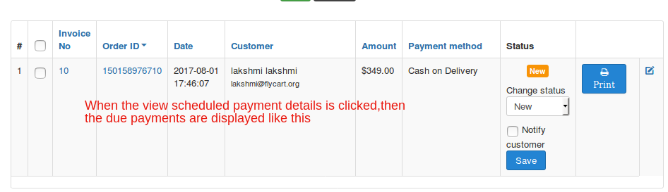

## Instances

**Partial Payment type-Plan:**

Perhaps, you might wish to collect the payment from the users based on plans,then you could choose this as the option in the partial payment type.

If you choose this type you shoould set up a plan first.For example if you are going to receive the payment in 3 segments, create a plan called three installments:

Then this is how the users will be provided payment options when a **plan** is chosen as the partial payment type.

And there is an advantage too.You could add more than one plans using partial payments app and let the user choose on which plan he would like to pay.

In short,if you want a more organised way of receiving deposits, then you could opt for this option.

Uers can choose from the plans available:

**Partial payment type-Percentage:**

Sometimes,there might be situations where you would like to have a percentage of the total amount as the advance amount and the rest to be paid later.

This can be achieved by choosing the percentage as the partial payment mode:

This being the case, the user would be paying 50% of the total amount as the initial  payment and the rest later.

Here with this type of partial payment too, you have the liberty to specify the percentage of amount that the user has to pay.

As the above screenshot suggests,the user would be paying half the total amount as advance:

**Partial payment-Fixed Price:**

If you want to keep it as simple as that, you might select the fixed price option where the user will be charged a fixed amount as the initial deposit.

The cart page is depicted below:

## Backend Orders

In the back end, the store owner can keep track of the orders and payment dues.The following screenshot pictures how the order will be shown:

Payments that are due can be found like the one shown below:

