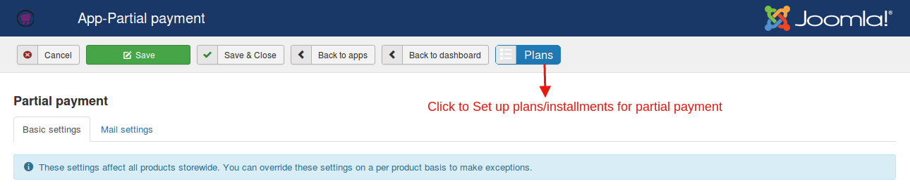
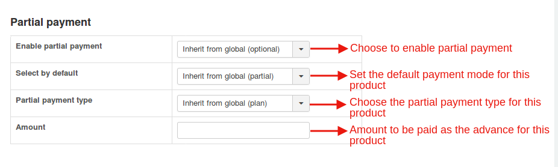

### Setting up plans for partial payments:

If you like to set plan as the partial payment type,it is necessary to define one first.

To do so,follow the steps given below:

* Click on the Plans tab (Refer the screenshot attached).

* Click on the New button to create a new plan.

* Give the plan a name,description and set up a plan schedule(the installments the payment is to be paid within).

* Click Save.

* Click Back to Apps to set up partial payments.

**Relevant Screenshot**

###Creating plans- an example:

You could wish to receive payment in 2 fragments for instance,you could set it up like this:

Here as the screenshot explains, the payment is split into two parts,the first one being 25 % of the total amount and the second half being the remaining amount.

Likewise,the entire liberty of splitting the payment into as many parts as you want lies in your hands.

### Partial payments at product level

When using partial payment at product level, you will have to disable partial payment globally at app's settings.

Supposing that your site has hundreds of products and you wish to allow one product's payments in segments then this would be an ideal method to  do so.

With product-level partial payment settings, you could allow the users to buy all the products in normal full payment and a specific product in segments.

1. Go to Article manager > Edit your product

2. Move to J2Store cart tab and navigate to Apps tab

3. Set YES to Enable partial payment

4. Choose if the default payment mode is partial or full.

5. Select your partial payment type (Fixed price, percentage, plan)

6. If plan is chosen as the partial payment mode,the plan that has been created should be selected here.

**Relevant Screenshot**

