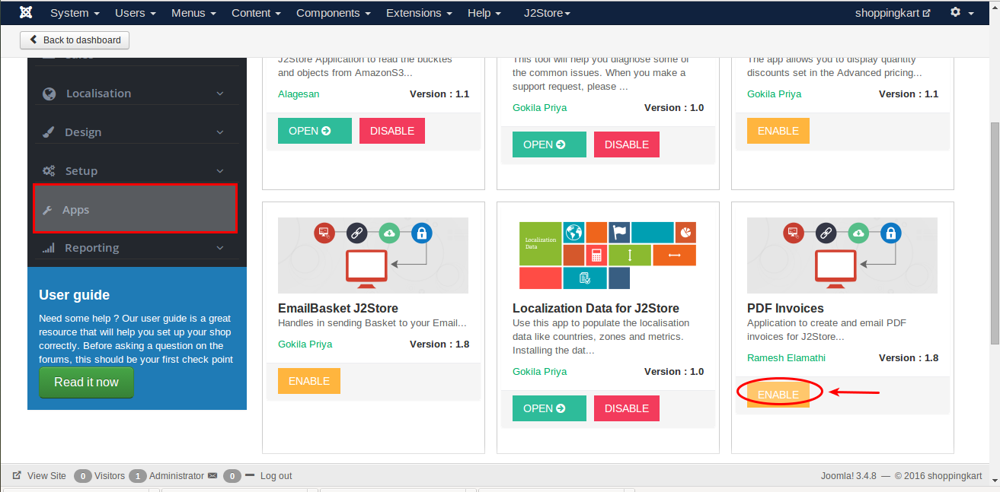
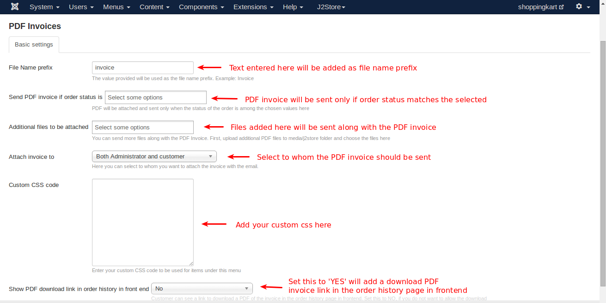

#PDF Invoices
Send a PDF invoice attached to the order notification email that is sent to the customer. The app dynamically generates PDF invoices and attaches it to the email. It uses the Invoice Templates feature for the PDF layout and content.

The app uses DOMPDF library.

You can download the DOMPDF library plugin and install it from here: https://bitbucket.org/j2store/plg_lib_dompdf/downloads/plg_library_dompdf.zip

####App Requirements
1. J2Store 3.1.2 or later

2. Joomla 3.3.x or later

####DomPDF Requirements

1. PHP 5.0+ (5.3+ recommended)

2. DOM extension

3. GD extension

####DomPDF Recommendations

MBString extension: provides internationalization support. This extension is not enabled by default. Dompdf has limited internationalization support when this extension is not enabled. opcache (OPcache, XCache, APC, etc.): improves performance.

####Installation
1. Download the DomPDF and install it using joomla installer.

2. After installing DomPDF, download the PDF invoice app and install it using joomla installer.

3. In the backend, go to J2Store Dashboard -> Apps

4. Click Enable in the PDF Invoices.

5. Once the app is enabled, click on Open to set the configuration for the app.

####Parameters

* ***File Name prefix***

    Text entered here will be added as file name prefix. For example invoice.
    
* ***Send PDF invoice if order status is***

    PDF invoice will be sent only if order status(All, Confirmed, Processed, New, Pending, Failed, Cancelled) matches the selected.
    
* ***Additional files to be attached***

    Attached files here will be sent along with the PDF invoice.
    **Note:** You will have to upload additional files to media/j2store folder and then choose files here.
    
* ***Attach invoice to***

    Select to whom the PDF invoice should be sent.
    
* ***Show PDF download link in order history in front end***

    Set this **YES** will display the download PDF invoice link in order history page in frontend.
    
