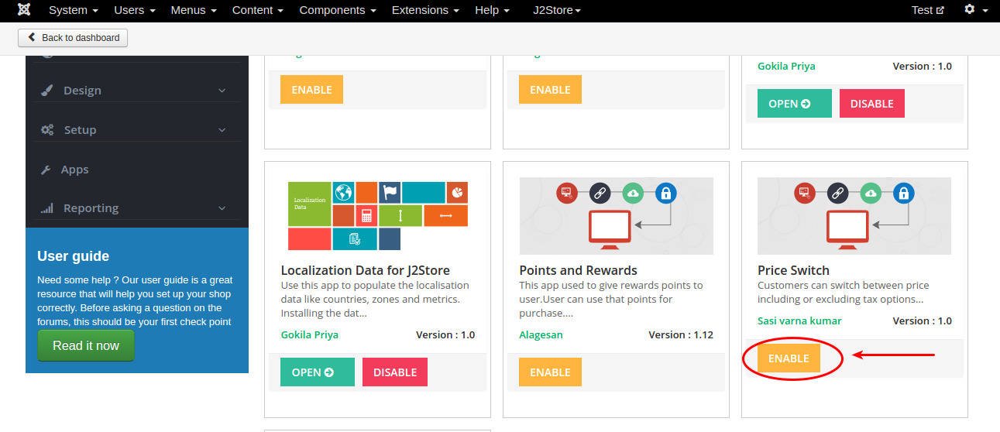
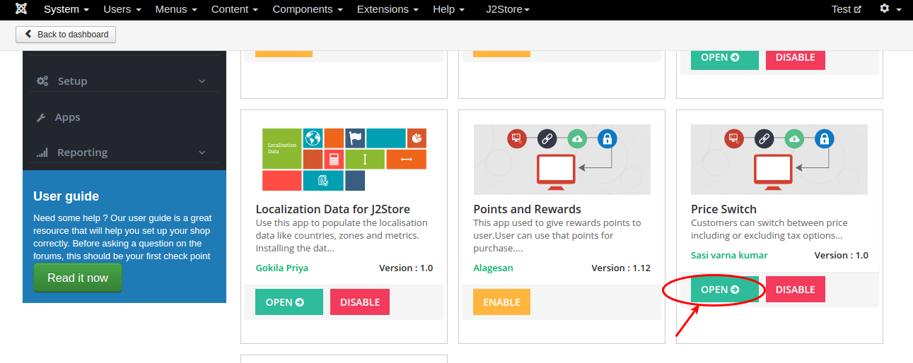
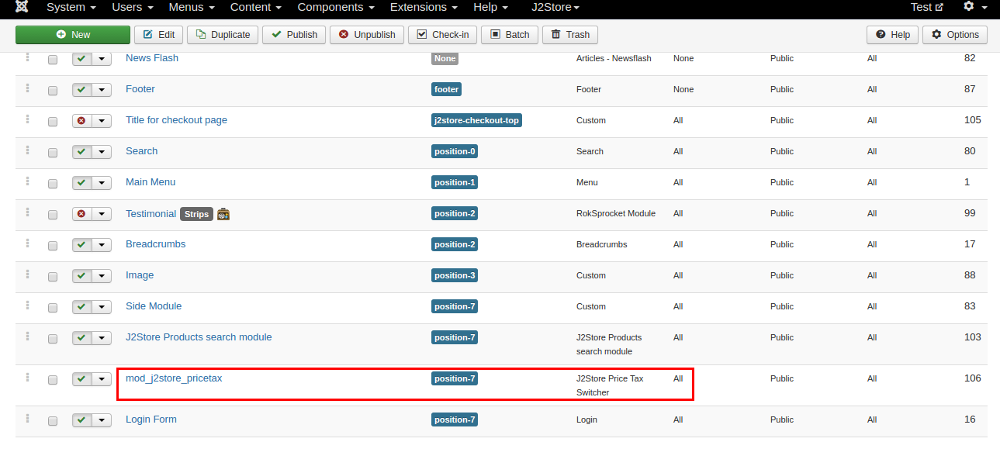
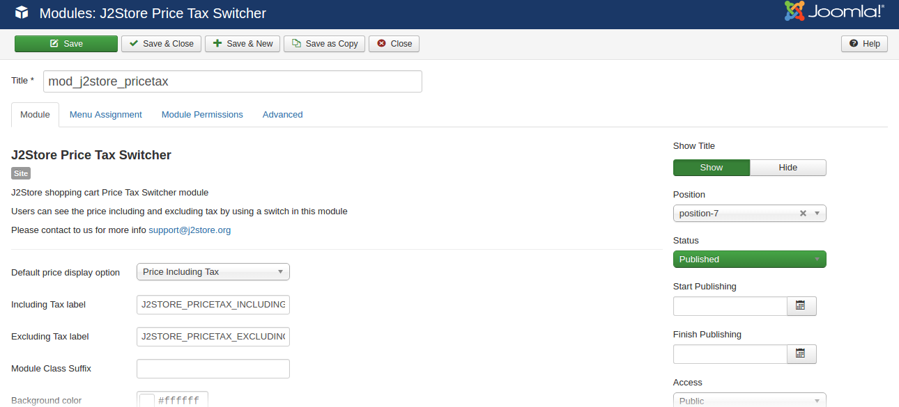
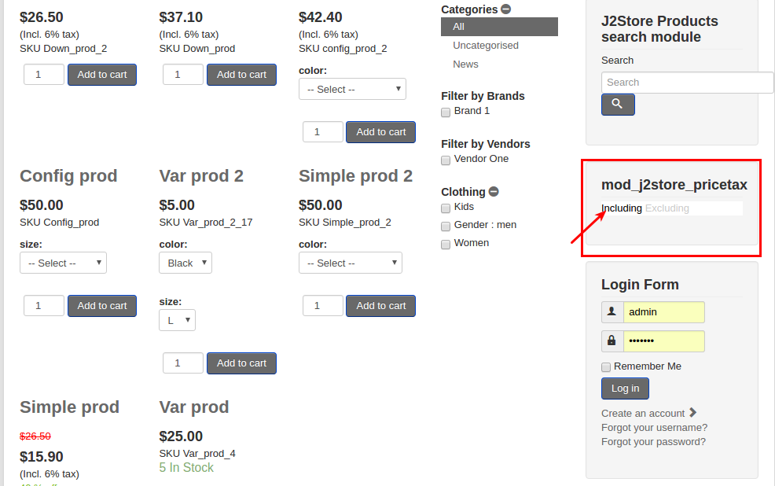

# Price Switch

Price switch app allows customers to switch between price including or excluding tax options. It is very simpler app. There is no complex settings inside it. All you have to do is install the app and price tax module (which comes with app) and publish it in your site.

#### Requirements

* PHP version 5.4 or higher

* J2Store version 3.2.14 or higher

* Joomla 3.3 or above

#### Installation

* Install the package using Joomla Installer.

* Go to J2Store Dashboard > Apps and enable the Price switch app.

 
 

* Install the price tax module and publish it in your template's position.

#### Module Configuration

1. Go to Extensions -> Modules
2. Enable and open the mod_j2store_pricetax.
3. Enter the name of the module and set the status to Publish.
4. Set the module position and assign it to the menu and save.

#### Frontend
**After switching to including tax,**

**After switching to excluding tax,**
