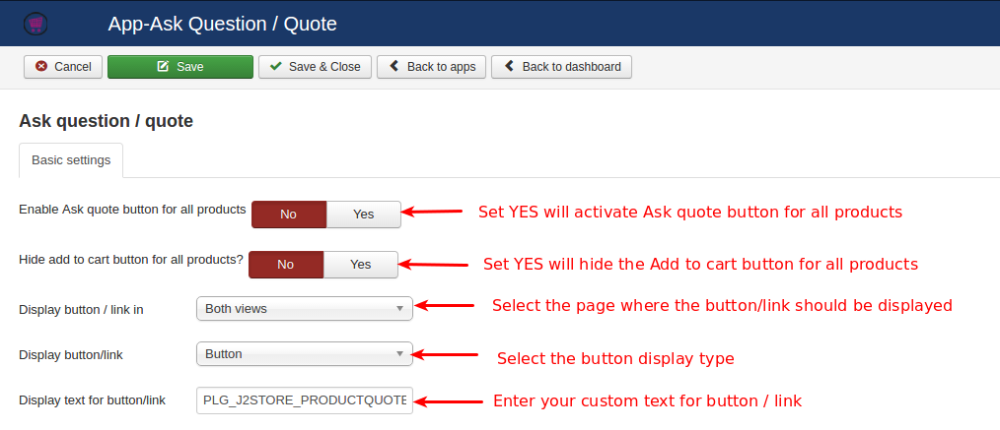
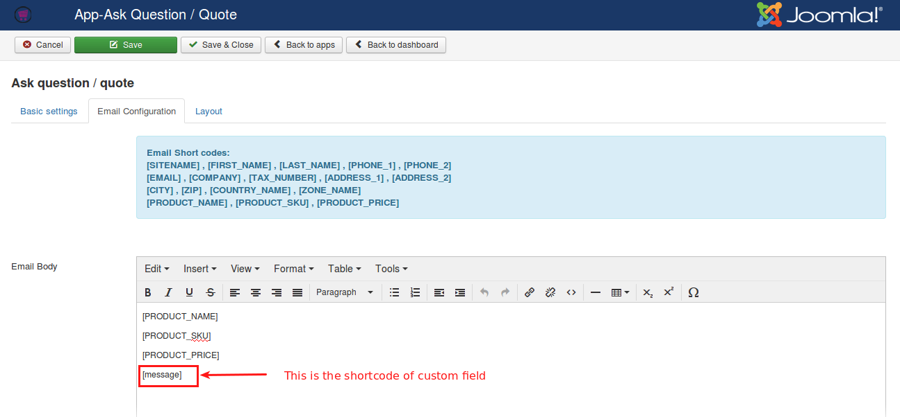
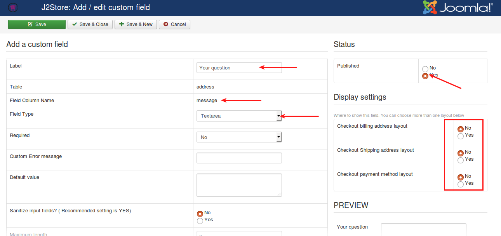
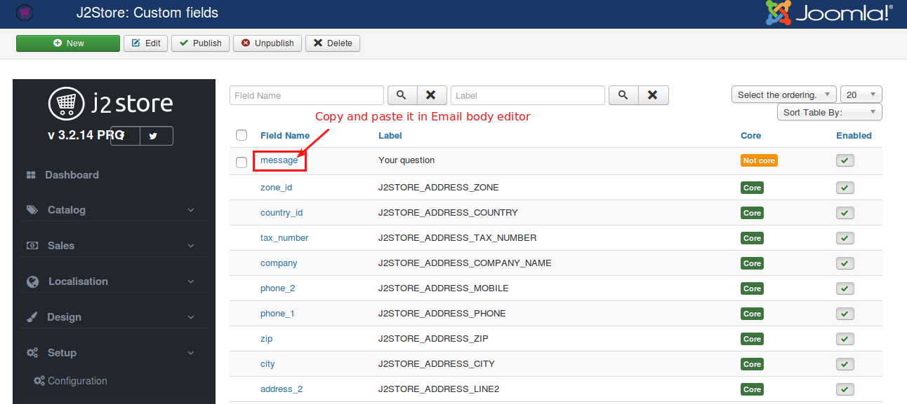
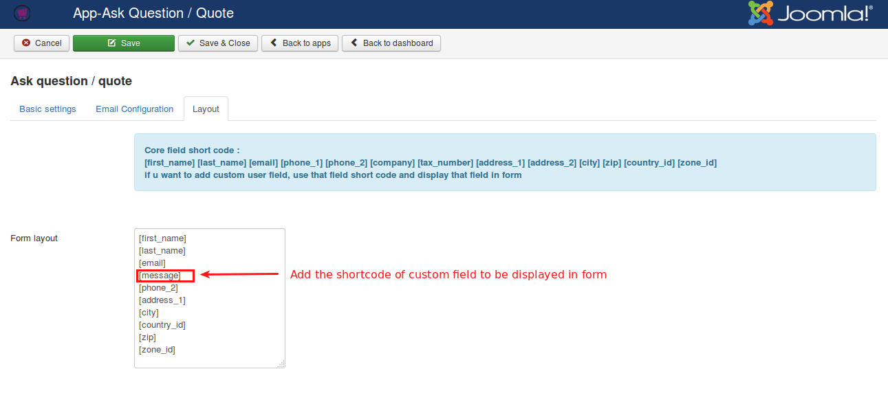
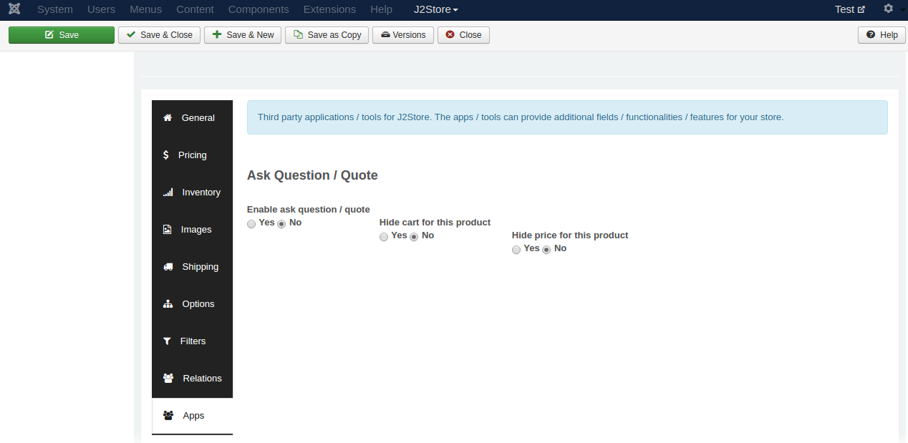
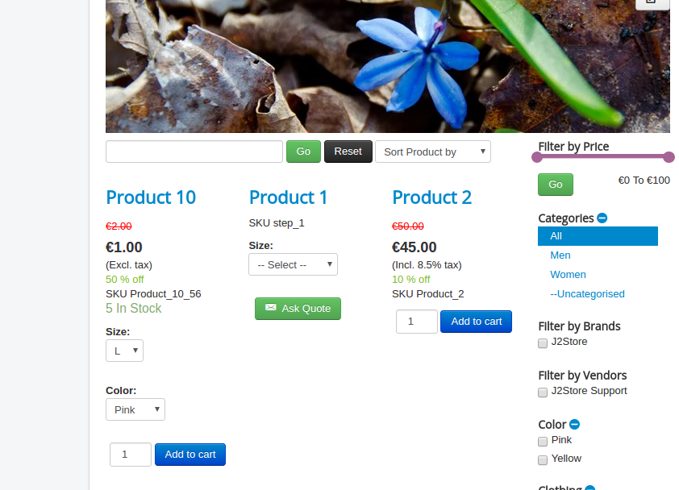
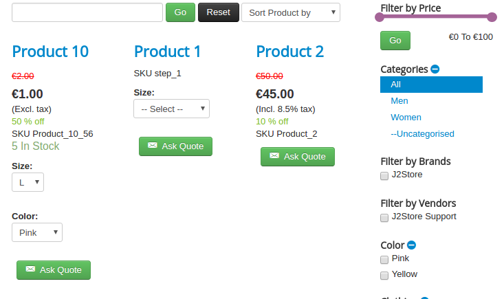
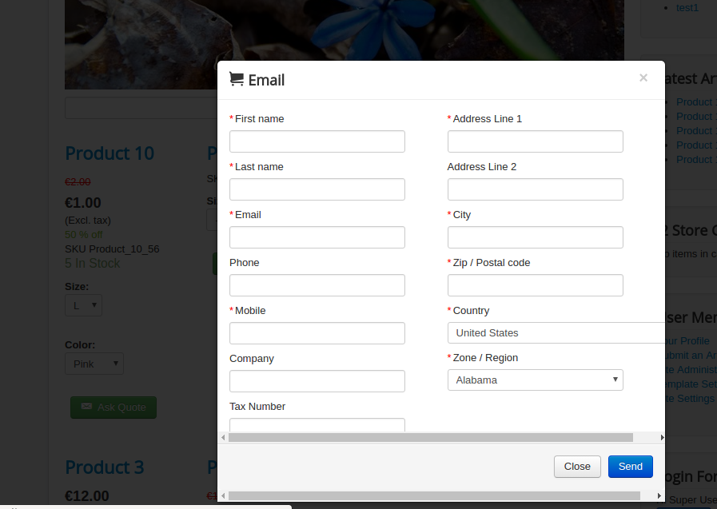

#Ask question / quote

This app allows customer to enquire a product or to ask quote for a product through mail. Using this app itself you can use your store as catalog mode since this app has an option to hide the add to cart button. Clicking on single button will enable the communication between store owner and customer.

####Requirements

* PHP 5.4 or higher
* Joomla 3.3 or above
* J2Store 3.2.x or above

####Installation

1. Use the Joomla installer to install the app.

2. In the backend, go to J2Store Dashboard -> Apps as shown in the image below.

3. Click Enable in the Ask question / quote app.
   

4. Once the app is enabled, open the app to configure the settings.

#### Basic Settings

* ***Enable Ask quote button for all products***

  Select **YES or NO** to enable and disable the Ask quote button for all products.

* ***Display add to cart button ?***

  Select **YES or NO** to hide the Add to cart button.
  
* ***Display button / link in***

  Select the location (Product view, category view, Both views) where the **Ask Quote** button should be displayed.
  
* ***Display button/link***

  Selecting display type here will make the text to be displayed in button / link.
  
  
* ***Display text for button/link***

  Change the button text / link text by entering custom text here.
  Use the language constant **PLG_J2STORE_PRODUCTQUOTE_LINK_TEXT** to translate the text when you are using multilingual site.
  
#### Email Configuration

* ***Email Body & Email Subject***

  Enter the body of the email and subject of the email here. You can use the below shortcodes in the text editor.
  
  [SITENAME]
  [FIRST_NAME]
  [LAST_NAME]
  [PHONE_1]
  [PHONE_2]
  [EMAIL]
  [COMPANY]
  [TAX_NUMBER]
  [ADDRESS_1]
  [ADDRESS_2]
  [CITY]
  [ZIP]
  [COUNTRY_NAME] 
  [ZONE_NAME] 
  [PRODUCT_NAME]
  [PRODUCT_SKU]
  [PRODUCT_PRICE]
  
To display the custom field information enterd by the user when filling form in an email the customer and admin receive, it is possible by adding the shortcode of respective custom field in the Email body editor. For example, if you are having text area as a custom field in your product quote form, then copy the field name(you can get it in custom field section J2Store > Setup > Custom fields) and paste it in Email body editor. The custom field shortcode should be enclosed with square braces. For example, [message]. Refer the image below,

#### Layout

If you would like to add / remove the fields in product quote form without affecting checkout form fields, it is possible in this section.

In this section, you can create the custom form by adding field shortcode given in the top of the layout tab page and display that field in the form.

To add any new fields, go to J2Store > Setup > Custom fields. Click NEW to create new field.

Enter the label name, field name, choose field type and set the status to **Published**.

If you don't want to display this new field in checkout and wants to display it only in product quote form, then in custom field display settings, set **NO** to all layouts (Checkout billing address layout, Checkout shipping address layout, Checkout payment method layout).

Now, in form layout add the shortcodes of fields you want to display in product quote form. To add the custom field shortcode, copy the field name in J2Store > Setup > Custom fields section and paste it in the form. The field name should be enclosed with square braces. For example, [message].

  
#### Enable quote for per product

1. This app allows you to enable Ask quote button for specific product.
2. Go to Article manager and open the article.
3. Under the J2Store cart tab, navigate to the Apps menu.
4. Enable the Ask quote button by setting **YES** to Enable ask question / quote. Refer the image below.

####Frontend

**SINGLE PRODUCT**

**ALL PRODUCTS**

####Support

Still have questions? You can post your questions in our support forum: http://j2store.org/forum/index.html