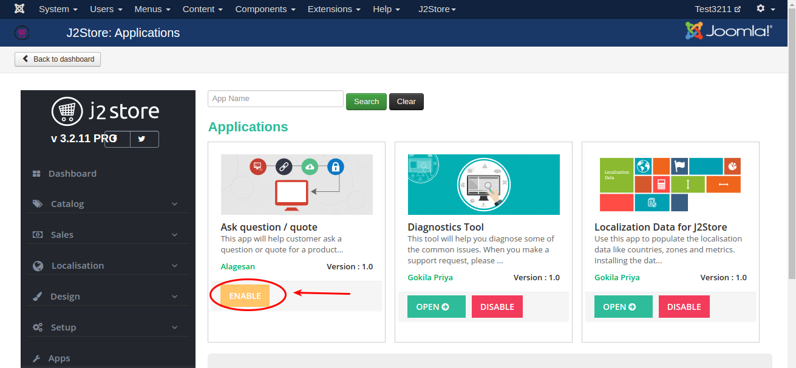
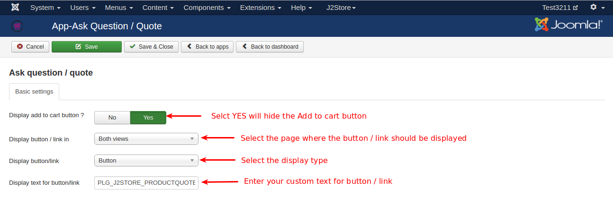
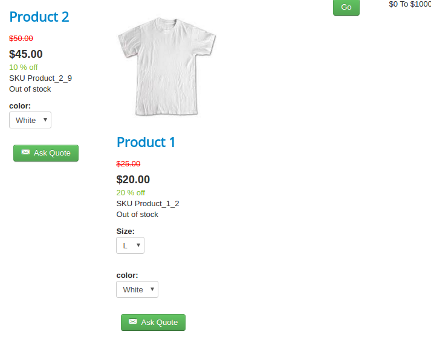

#Ask question / quote

This app allows customer to enquire a product or to ask quote for a product through mail. Using this app itself you can use your store as catalog mode since this app has an option to hide the add to cart button. Clicking on single button will enable the communication between store owner and customer.

####Requirements

* PHP 5.4 or higher
* Joomla 3.3 or above
* J2Store 3.2.x or above

####Installation

1. Use the Joomla installer to install the app.

2. In the backend, go to J2Store Dashboard -> Apps as shown in the image below.

3. Click Enable in the Ask question / quote app.
   

4. Once the app is enabled, open the app to configure the settings.

####Configuration

* ***Display add to cart button ?***

  Select **YES or NO** to hide the Add to cart button.
  
* ***Display button / link in***

  Select the location (Product view, category view, Both views) where the **Ask Quote** button should be displayed.
  
* ***Display button/link***

  Selecting display type here will make the text to be displayed in button / link.
  
  
* ***Display text for button/link***

  Change the button text / link text by entering custom text here.
  Use the language constant **PLG_J2STORE_PRODUCTQUOTE_LINK_TEXT** to translate the text when you are using multilingual site.
  
* ***Email Body & Email Subject***

  Enter the body of the email and subject of the email here. You can use the below shortcodes in the text editor.
  
  [SITENAME]
  [FIRST_NAME]
  [LAST_NAME]
  [PHONE_1]
  [PHONE_2]
  [EMAIL]
  [COMPANY]
  [TAX_NUMBER]
  [ADDRESS_1]
  [ADDRESS_2]
  [CITY]
  [ZIP]
  [COUNTRY_NAME] 
  [ZONE_NAME] 
  [PRODUCT_NAME]
  [PRODUCT_SKU]
  [PRODUCT_PRICE]
  
####Frontend

####Support

Still have questions? You can post your questions in our support forum: http://j2store.org/forum/index.html