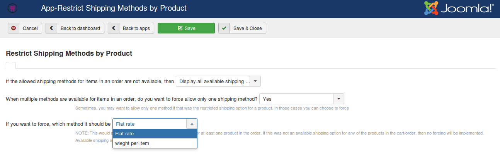
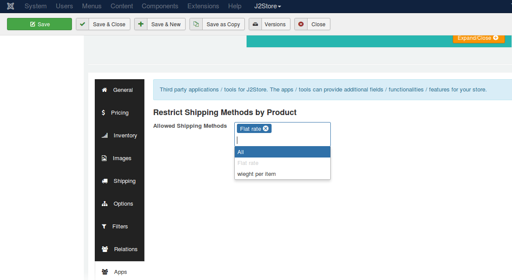

# Restrict shipping

This app allows you to restrict shipping methods by products. You can select shipping options to be applied based on individual products.

For example, if you are having 3 shipping methods and would like to show only one specific shipping option for specific product, it is possible with this app.

### Installation

1. Download Restrict shipping package from our site and install it using Joomla installer.

2. After installing the app, go to J2Store > Apps and enable Restrict Shipping app.

3. Once enabled, click on open to configure the basic settings of the app.

### Configuration

1. Choose whether the system should display all shipping methods or not, if allowed shipping methods for an item is not available.

    **Don't display any shipping method** - Choosing this option will not display the shipping methods when allowed shipping is not available.

    **Display all available shipping methods** - Choosing this option will display all existing shipping methods if allowed shipping method is not available.

2. Sometimes there will be multiple shipping methods for an order. In this case, if you would like to allow only one shipping method, choose **YES**.

3. If you choose YES for above option, then you should select the shipping method here. The system will display the shipping method selected here when multiple shipping methods are available.
> This would apply only if the selected method is available for at least one product in the order. If this was not an available shipping option for any of the products in the cart/order, then no forcing will be implemented. Available shipping options would be shown.

### How to choose allowed shipping methods for items?

1. Open / edit your product by going to J2Store > Catalog > Products or Article Manager.

2. J2Store cart tab > General > Apps, where you will see the option "Allowed Shipping Methods". Choose your shipping method and save.

