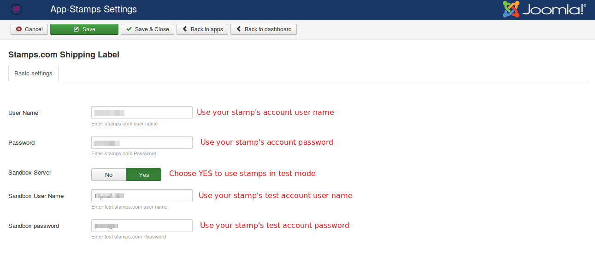
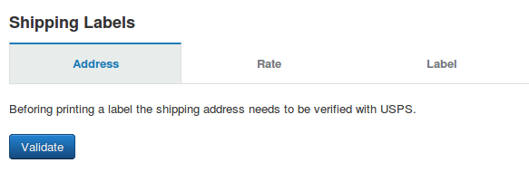
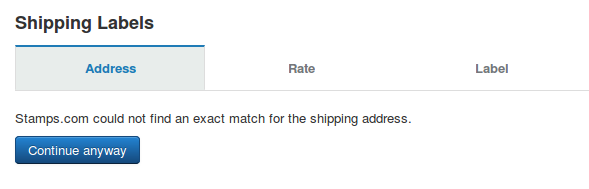
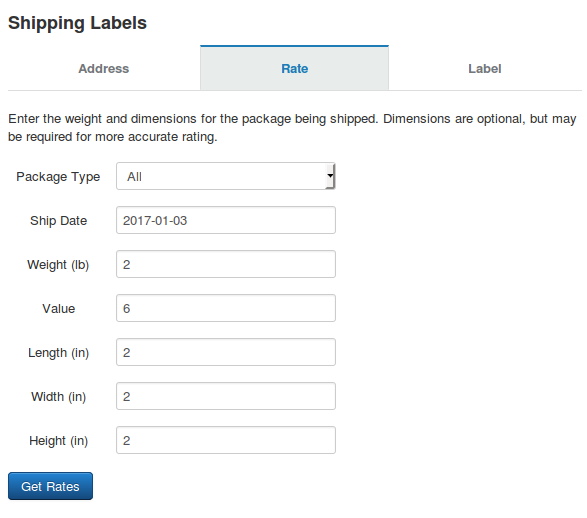
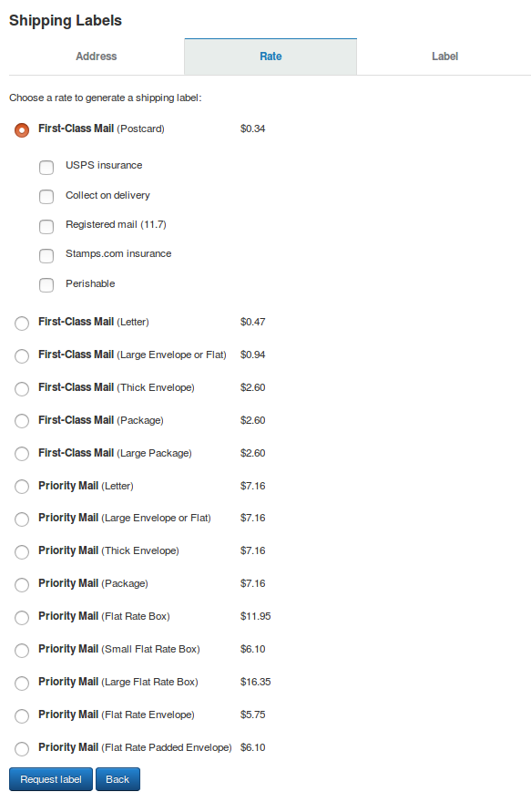

# Stamps

This app integrates Stamps.com API with Joomla J2Store eCommerce solution. With this app, you can automatically create shipping labels for USPS, based on ordered items. Our Stamps.com API Integration extension allows you to generate and print shipping labels for USPS via the backend order history page.

* **[Requirements](#requirements)**
* **[Installation](#installation)**
* **[Configuration](#configuration)**
    * **[Basic Settings](#basic-settings)**
    * **[Label Settings](#label-settings)**
    * **[Common Settings](#common-settings)**
* **[How to Print shipping labels](#print-labels)**
    * **[Validate shipping addresses](#validate)**
    * **[Request for rates](#request-rates)**

## Requirements

1. PHP version 5.4 or higher

2. Joomla 3.x or above

3. J2Store 3.2.5 and above.

### Installation

1. Download Stamps shipping label from our site and install it using Joomla installer.

2. Once installed, go to J2Store > Apps and enable **Stamps shipping label**.

3. After enabling the app, click Open to configure the basic settings of the app.

> NOTE: This extension does not display shipping rates to your customers during the checkout process. If you want USPS rates shown on the cart/checkout pages of your site, you need to purchase the USPS Shipping plugin as well.

### Configuration

Before you can make API calls you need to configure basic settings of the app.

#### Basic settings

In the basic settings of the app, you need to enter your Stamps.com account credentials. This allows API integration to make requests for printing shipping labels.

**User Name**

Enter the username associated with your stamps's account.

**Password**

Enter the password associated with your stamps's account.

**Sandbox Server**

Stamps.com also offers Sandbox feature to test your store using test account. Choose YES to use Stamps in test mode.

**Sandbox User Name**

Enter the username associated with your Stamps.com test account.

**Sandbox password**

Enter the password associated with your Stamps.com test account.

#### Label settings

If you would like to create sample labels for testing purposes, you need to configure this section. Sample labels created cannot be used for posting items.

**From Zip**

Enter the zip code of the area from where you are going to ship the items (source zip code).

**Sample Only**

Choose YES will create sample labels which cannot used for posting items.

**Image Format**

It specifies the image type for the returned label.

**Paper Size**

It specifies the page size for PDF labels. The value entered here will be applied to only PDF.

**Print Layout**

It specifies the print layout for label.

#### Common settings

This address is used as 'return address' on your printed labels. Enter your origin address (source addess), which is used as the store location for calculating shipping rates. The address and details you given here should be valid.

**Full name**

Enter the full name of store owner.

**Company**

Enter the name of your store or company.

**Addresses, City**

Enter the valid addresses and city of your store location.

**Zip code**

Enter the valid zip code here.

**Zone**

Choose the zone / state where your store actually locates.

**Phone**

Enter your contact number here.

**Weight and Length unit**

Choose weight and Length unit here.

### How to Print shipping labels ?

Requesting and printing shipping labels is done from the backend order history page. To get started, you first need to view/edit an order in the backend. From Joomla backend, go to J2Store > Sales > Orders and view/edit an order.

#### Validate shipping addresses

Before printing a label the shipping address needs to be verified with USPS.

Click on the button "**Validate**" validates the given shipping address (customer's shipping address) with USPS. If the shipping address is valid, the stamps.com attempts to match the given address and provides you with a formatted address that you can Accept (order is updated).

If Stamps.com could not match address, you can click **continue Anyway** button.

#### Request for rates

After address verification, you need to submit the rate request form.

Here you choose package type, planned ship date, weight and dimensions for the package being shipped. Dimensions are optional, but may be required for more accurate rating.

Fill your required fields and click on **Get Rates** button. A list of matching shipping rates appears:

Select a rate you require, then click Request label button. The next step you will receive your label.

