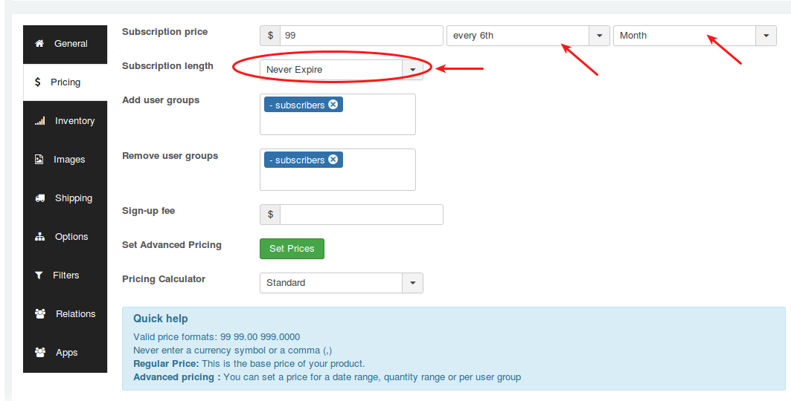
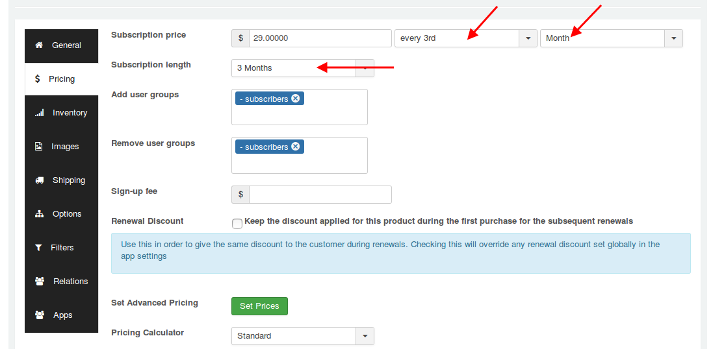
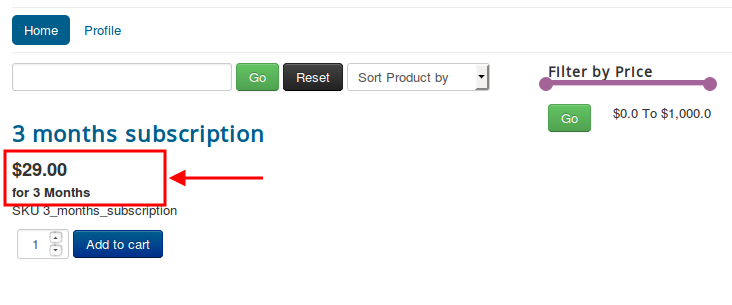
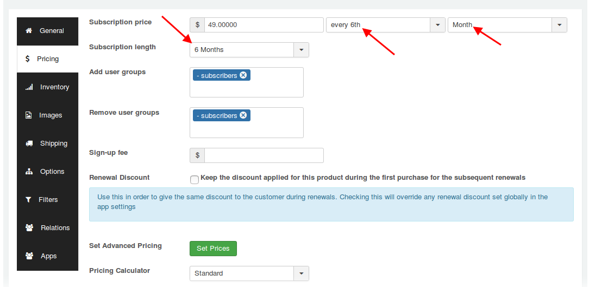
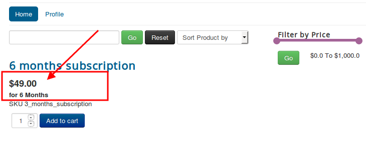
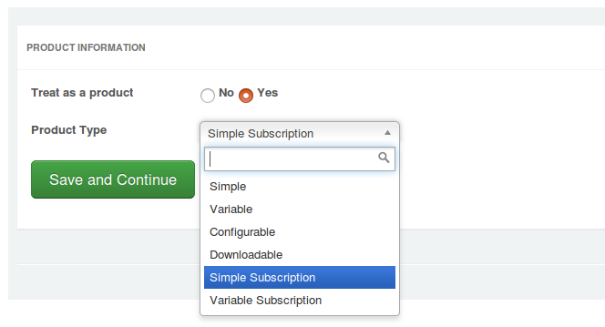
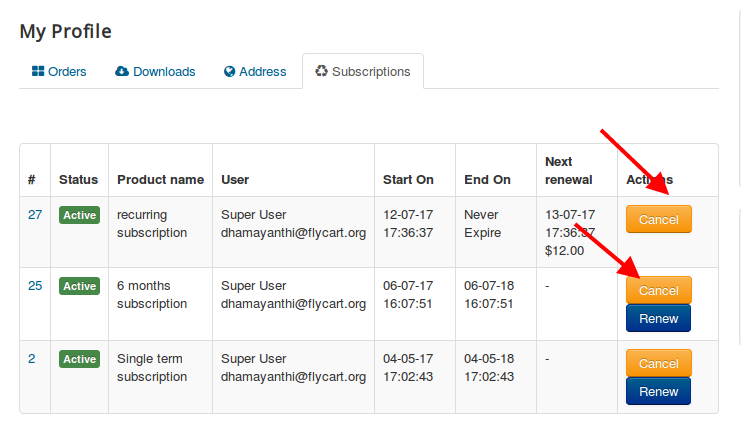

# Subscriptions and Memberships

If you are using **PayPal as your payment method** for your subscription products, you should enable Reference Transaction on your paypal account. **[Read More](https://www.j2store.org/support/user-guide/paypal-reference-transactions-for-subscriptions.html)**

* **[Introduction](#introduction)**
    * **[Features](#features)**
    * **[Suported Payment Gateways](#supported-payments)**
    * **[Known limitations](#known-limitations)**
* **[Requirements](#requirements)**
* **[Installation](#installation)**
* **[Quickstart](#quickstart)**
    * **[How to create a recurring subscription plan ?](#recurring)**
    * **[How to create a non-recurring (single term) subscription plan?](#non-recurring)**
    * **[Creating 3 months subscription plan](#three-months-plan)**
    * **[Creating 6 months subscription plan](#six-months-plan)**
* **[Basic Settings](#basic-settings)**
* **[Creating simple subscription product](#simple-subscription)**
* **[Creating variable subscription product](#variable-subscription)**
* **[Pricing](#pricing)**
* **[Frontend Demo](#demo)**
* **[PayPal Reference Transactions for Subscriptions](#payment-susbcription)**
* **[Troubelshooting](#troubleshooting)**
   * **[How to write template override for subscription emails](#tpl-override-emails)**
   * **[How to edit subscription from backend?](#edit-subscription)**
   * **[How to cancel subscription ?](#cancel-subscription)**

<a name="introduction"></a>
### Introduction
If you would like to sell subscription-based products, you could do just that with our Subscriptions and Membership app. This app allows you to sell products and services with recurring payments.The following features are possible with Subscription Products app :

<a name="features"></a>
##### Features

**1. Billing schedules**

Create any type of billing schedules. You can have memberships for days, weeks, months and years. Example: 3 months, 6 months, 1 year

**2. Automatic renewals and payments**

It is very convenient for the customers to have their membership auto-renewed with automatic payments (Current supported in 3 payment gates : PayPal, Stripe, Mollie. More gateway support is coming up)

**3. Sign up Fees**

You can now collect one-time sign -up fees or set -up fees along with the subscription. If it is a recurring subscription, the customer will only billing for the membership plan cost in the next billing automatically.

**4. Variable subscription**

Allow your customers to choose a membership plan that suits their needs. So you can create one subscription product with multiple variants.

**5. Expiry management**

The app automatically manages the expiration of the membership. You can set the system to notify the customers before the expiry of their subscription.

**6. Subscriptions management**

Manage all the subscriptions in one place. You can cancel the subscription, view the relavant orders and more

**7. Multiple subscriptions**

Customers can purchase any number of subscriptions in the same order / transaction.

**8. Notification emails**

Send automatic emails to the customers when the subscription is created, when a renewal payment is processed or when a subscription is cancelled or expired. You can customise the email messages as well using language overrides.

<a name="supported-payments"></a>
##### Supported Payment Gateways

1. Paypal Standard for J2Store (Available on request)

2. Stripe (Available on request)

3. Mollie payment plugin

4. Authorize.net CIM

5. BrainTree

6. Squareup Payments

<a name="known-limitations"></a>
##### Known limitations

1. Subscription Products app does not support for guest checkout.

2. Variable subscription product type allows you to add only one option with multiple values.

<a name="Requirements"></a>
### Requirements

1. PHP 5.4+

2. J2Store 3.2.20 or above

3. Joomla 3.4.x or above

<a name="installation"></a>
### Installation

1. Download Subscription and Memberships package from our site and install it using Joomla installer.

2. After installing the app, go to J2Store > Apps and enable Subscription Products app.

3. Once enabled, open the app and configure the basic settings of the app.

<a name="quickstart"></a>
### Quickstart
<a name="recurring"></a>
#### How to create a recurring subscription plan ?

Recurring subscription is nothing but auto-renewal. J2Store's Subscriptions and Memberships app allows you to create recurring subscription. If you create  recurring subscription, the customers can auto renewal his subscription plan.

The example given below, assumes you have a store and selling hosting service and wants to collect **$99 at the end of every 6th months**.

##### Step - 1 Creating product

1. Go to Article manager and create a new article

2. Move to J2Store cart tab

3. Select YES to Treat as product

4. Choose product type either Simple Subscription or Variable Subscription.

##### Step-2 Setting up price based on recurring

1. Now navigate to **Pricing** section

2. Enter the price **$99** in the price text box.

3. Next to price text box, you can see two dropdowns. In the first dropdown, choose **every 6th** and choose **month** from second dropdown.

4. Set **Never Expire** to Subscription length.

5. Choose your usergroups and save.



<a name="non-recurring"></a>
#### How to create a non-recurring (single term) subscription plan?

Non recurring is a single term subscription in which the subscription will be terminated at the specific period and does not allow for auto renewal. Subscriber will have to subscribe for the plan next time manually.

Lets see an example for single term subscription. For example, consider you are providing service for $129 for one year.

##### Step - 1 Creating product

1. Go to Article manager and create a new article

2. Move to J2Store cart tab

3. Select YES to Treat as product

4. Choose product type either Simple Subscription or Variable Subscription.

##### Step - 2 Setting up price based on non - recurring

1. Now navigate to **Pricing** section

2. Enter the price **$129** in the price text box.

3. Next to price text box, you can see two dropdowns. In the first dropdown, choose **every** and choose **year** from second dropdown.

4. Set **1 Year** to Subscription length.

5. Choose your usergroups and save.


<a name="three-months-plan"></a>
#### Creating 3 months subscription plan

Refer below screen shots for setting non-recurring 3 months subscription plan

##### Choosing duration


##### On frontend


<a name="six-months-plan"></a>
#### Creating 6 months subbscription plan

Refer below screen shots for setting non-recurring 6 months subscription plan

##### Choosing duration


##### On frontend


<a name="basic-settings"></a>
### Basic settings

> For renewing subscriptions you should run cron job atleast every day.

> The cron job must run once an hour. While setting cron job, choose Once Per Hour under the common settings.

> There should be minimum 15 minutes interval between each cron job.


**Cron url**

```
http://localhost/recurring/index.php?option=com_j2store&view=cron&command=appsubscriptionproduct&cron_secret=XXXXX
```
Where XXXXX is your cron secret key which can be identified in your store settings (J2Store > Setup > Configuration > Store tab)

Don't know how to set cron job ? **[Click here](https://www.j2store.org/support/user-guide/creating-cron-job-on-your-server.html)**

**Notify expire day before**

Enter the number of days to send the remember mail to customer for notifying that their subscription will be going to end. For example, 2. So the mail will be sent before 2nd day to expire.

### Display settings

***Show Duration***

This option allows you to show / hide duration displaying below the product price.

***Show recurring total***

Setting **NO** to this option will hide displaying recurring total column from the cart total table.

***Show non recurring total***

This option helps you to show / hide non recurring total displaying in cart page.

***Show renewal date***

If you would like to not show the next renewal date to users, just set this option NO.

***Renewal date format***

This is the text box allows you to change the format of renewal date displaying in  item table.

***Show renew button***

This option is used to show / hide renew button on profile page > Subscription tab.

### Renewal settings

***Renewal discount***

If you would like to give customers a discount for renewing subscription, then enter your discount value in percent in this text box. The discount value applied in this text box will be applied to all subscription products.

### How to create Subscriptions based products?

<a name="simple-subscription"></a>
#### Creating simple subscription product

**[Watch the video tutorial for creating simple subscription product](https://www.j2store.org/support/video-tutorials/creating-simple-subscription-product.html)**

1. Go to Article Manager > create new article > Move to J2Store cart tab

2. Choose **YES** to Treat as a Product and select **Simple Subscription** as Product Type and click **Save and Continue**.


3. Set **YES** to Visible in storefront and navigate to **Pricing** tab.

4. Pricing tab, where you could set your subscription product's price, customer group, expiry date, etc.

You can set images, shipping, filters to your subscription product.

<a name="variable-subscription"></a>
#### Creating variable subscription product

**[Watch the video tutorial for creating variable subscription product](https://www.j2store.org/support/video-tutorials/creating-variable-subscription-product.html)**

The variable subscription product allows you to add only one option with multiple values.

For example, create premium subscription providing customers an option to choose subscription period.

Go to J2Store > Catalog > Options and create a option "Subscription period" and add the option values such as 3 months, 6 months.


1. Go to Article Manager > create new article > Move to J2Store cart tab

2. Choose **YES** to Treat as a Product and select **Variable Subscription** as Product Type and click **Save and Continue**.

3. Set **YES** to Visible in storefront and navigate to **Variants** tab.

4. In variants tab, search and add Subscription period option and set values.
> It allows you to add one option with multiple variants. For example, Subscription period as option with following variants 3 months, 6 months, etc. See the screen shot below


5. Generate variants and set price, subscription time period, images, shipping, filters for each variants.

<a name="pricing"></a>
#### Pricing

- **Subscription price :** Enter the membership price (for example, $29) based on either daily or weekly or monthly or yearly basis.

   For example, if you would like to give subscription price $29 for only 3 months, then enter $29 in the first text box and then choose **every 3rd** from the dropdown list and then choose **month** from third dropdown list.

- **Subscription length :** The subscription length duration will be listed based on the recurring period you selected above.  For example, if your subscription product's duration period is only for 3 months, Choose 3 months. So the subscription will end at the  end of 3rd month.

  If you would like to give a life time price for your subscription product (i.e.) wants to collect $29 at the end of every 3 months for lifetime, choose **Never Expire** to Subscription length. So $29 for every 3rd month for lifetime.

- **Add / Remove user groups :** Users will be added and removed from the Joomla user groups when their subscription to the level is enabled or disabled.

- **Sign-up fee :** This app allows you to collect one time set up fee or sign up fee from your customers. Enter your sign up fee here. For example, $5 or $10.

- **Renewal discount :** If you wants to give the same discount to the customer during renewals. Checking this checkbox will override any renewal discount set globally in the app settings.

- **Set Advanced Pricing :** If you want advanced pricing, click the 'Set Prices' button and it will open up a pop-up window to allow you to set an advanced price setting.


<a name="demo"></a>
#### Frontend Demo


### Check the subscription details and status from backend

Go to J2Store > Apps and Open Subscription Products app and you can see subscription button on top of the page. Click on this button to view the customer's subscription details and status.


<a name="payment-susbcription"></a>
### PayPal Reference Transactions for Subscriptions

This system makes it possible to sell multiple subscriptions, change recurring totals and billing schedule, and allow customers to switch subscriptions.

However, there is a catch: **PayPal must enable Reference Transaction support on your PayPal account** in order to use this.

#### How do I get Reference Transactions Enabled with PayPal?

To request that PayPal turn on Reference Transactions, call your local PayPal Support Help Center. Find the **[phone number at Contact.](https://www.paypal.com/selfhelp/contact/call)**

Tell PayPal that you are specifically calling so a PayPal Specialist can enable **Reference Transactions** on your account. They may try to help you set up recurring payments with a button — that is not what you want. They need to transfer you to a specialist who will ask you for your PayPal account information (email address), and then tell you that they filed a ticket, and you will hear back from PayPal via email on whether Reference Transactions have been enabled or not.

#### Email Application

You can also contact PayPal via email.

1. **[Log into](https://www.paypal.com/signin/)** your PayPal account.
2. Go to the **[Email Contact Form.](https://www.paypal.com/selfhelp/contact/email/t_s)**
3. Choose topic: **My Account.**
4. Choose sub-topic: **Changing/Updating Account Information.**
5. Copy and paste the message below, inserting your PayPal email address and name.
6. Wait for a reply.


#### Example Message to send to PayPal
```
Hello,

Could you please enable Reference Transactions on my PayPal account (email: paypal@example.com)?

I need this feature to sell recurring subscription products via J2Store.

Kind regards,

Your Name
```
#### Gotcha: Respond to the Autoresponder

In an effort to reduce support, PayPal may send you a response from an auto-response message with some links to documentation.

Hidden in this auto-response is the following:

>If we haven’t answered your question, please reply to this email and our team will answer you as soon as possible.

**You also need to respond to the auto-response before your support ticket is submitted to PayPal.**

#### Will My Account Qualify for Reference Transactions?

PayPal does have a set a requirements that need to be met before they enable support for Reference Transactions on your account.

Unfortunately, PayPal does not publish these requirements and based on anecdotes from customers, the requirements can be different for different businesses.

Some things that store owners have mentioned PayPal require are:

* High personal credit (FICO) score for US based PayPal Business accounts
* Business plan
* Average transaction price
* Number of repeat customers
* Number of Reference Transactions per customer
* Revenue forecast and/or projected total revenue volume from Reference Transactions
* Demonstrate a clear business rationale behind the request
* Show the signup flow for customers in regards to Reference Transactions.
* Proof that you will show clear terms and conditions for customers in regards to Reference Transactions and how to cancel once they sign up.
* Written statement as to why you need Reference Transactions and how you will use it for your business.

In terms of revenue forecasts, we have had reports that UK based PayPal accounts may require minimum forecast of £6,000 month or more revenue.

<a name="troubleshooting"></a>
### Troubelshooting

<a name="tpl-override-emails"></a>
### How to write template override for subscription emails

Copy all files in
/plugins/j2store/app_subscriptionproduct/app_subscriptionproduct/mailtemplates

to
/template/YOUR-SITE-TEMPLATE/html/plugins/j2store/app_subscriptionproduct

Now edit
/templates/YOUR-SITE-TEMPLATE/html/plugins/j2store/app_subscriptionproduct/notify_expire.php

Make changes and save.

<a name="edit-subscription"></a>
### How to edit subscription from backend?

Sometimes you may want to change renewal date or next renewal amount. To do this, you will have to edit the subscription from backend. Follow below steps to edit the subscription from backend:

1. Go to J2Store > Sales > Orders

2. Edit the order and open order history page

3. You will see the Subscription table. Click on Subscription id (for example, 5) to edit the subscription.

4. On subscription page, you will see green colored panel where you could see the **Edit** button.

5. Click on this edit button to edit / change renewal price, recurring period, next renewal date.


<a name="cancel-subscription"></a>
### How to cancel subscription ?

Cancelling subscription can be done by both store admin as well as subscriber.

#### Cancelling subscription by subscriber

* On frontend order history page , move to subscription tab. You will see the **Cancel** button on last column (named "Actions") of the table.

* Clicking on Cancel button will cancel the subscription.


#### Cancelling subscription by store owner in two ways:

**First way:**

* Go to J2Store > Sales > Orders

* Open / Edit your order.

* You will see the subscription table. Click on Subscripiton id to cancel the subscripiton.

* After clicking on subscription id, you will be getting subscription page. On this page, you will see the option to update status. Choose Canceled from dropdown list and click on **Update status** button. The subscription will be cancelled.


**Second way:**

* Go to J2Store > Apps and open Subscription Products app.

* On top of the page, Click on **Subscriptions** button.

* You will see the subscriptions list in a table. On the last column (Actions) of the table, choose the status **Canceled** and click on Update button. The subscription will be cancelled.
