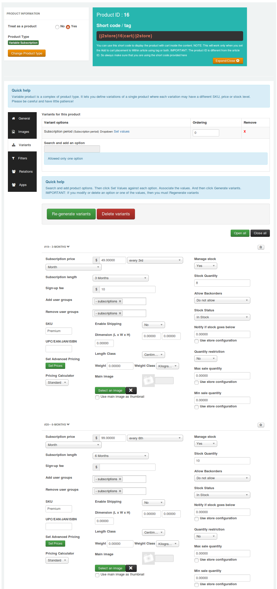

# Subscription Products

Now it is possible to create subscription based products in J2Store. The following features are possible with Subscription Products app :

1. Simple subscription
2. Variable subscription
3. Stock maintenance
4. Manage customer user group
5. Possible to apply sign-up fee
6. Possible to set expiry date

Following are the limitations in Subscription Products app

1. Paypal Standard for J2Store Subscription product is the only payment gateway supported by Subscription Products app.

2. Subscription Products app does not support for guest checkout.

3. Variable subscription product type allows you to add only one option with multiple values.

## Requirements

1. PHP 5.4+

2. J2Store 3.2.20 or above

3. Joomla 3.x or above

## Installation

1. Download Subscription Products package from our site and install it using Joomla installer.

2. After installing the app, go to J2Store > Apps and enable Subscription Products app.

3. Once enabled, you don't need to configure anything inside the app. Just go to Article manager and create new article.

## How to create subscription based products ?

Susbcription Products app allows you to create two types of subscription product.

1. Simple subscription

2. Variable subscription

Following are the step by step instructions to create subscription products.

- **[Creating simple subscription product](#simple-subscription)**
- **[Creating variable subscription product](#variable-subscription)**
- **[Pricing](#pricing)**
- **[Paypal Standard for J2Store Subscription product](#payment-subscription)**
- **[Frontend Demo](#demo)**

<a name="simple-subscription"/>
#### Creating simple subscription product

1. Go to Article Manager > create new article > Move to J2Store cart tab

2. Choose **YES** to Treat as a Product and select **Simple Subscription** as Product Type and click **Save and Continue**.

1. Set **YES** to Visible in storefront and navigate to **Pricing** tab.

2. Pricing tab, where you could set your subscription product's price, customer group, expiry date, etc.

You can set images, shipping, filters to your subscription product.

<a name="variable-subscription"/>
#### Creating variable subscription product

The variable subscription product allows you to add only one option with multiple values.

For example, create premium subscription providing customers an option to choose subscription period.

Go to J2Store > Catalog > Options and create a option "Subscription period" and add the option values such as 3 months, 6 months.

1. Go to Article Manager > create new article > Move to J2Store cart tab

2. Choose **YES** to Treat as a Product and select **Variable Subscription** as Product Type and click **Save and Continue**.

3. Set **YES** to Visible in storefront and navigate to **Variants** tab.

4. In variants tab, search and add Subscription period option and set values.

5. Generate variants and set price, subscription time period, images, shipping, filters for each variants.

<a name="pricing"/>
#### Pricing

- **Subscription price :** Enter the price (for example, $29) of your subscription product and choose the duration/recurring period. For example, if your subscription product's duration period is 3 months, then choose **every 3rd month**.

- **Subscription length :** This will be listed based on the time period you selected. Choose 3 months. So the subscription will end at the  end of 3rd month.

  If you would like to give a life time price for your subscription product (i.e.) wants to collect $29 at the end of every 3 months for lifetime, choose **Never Expire** to Subscription length. So $29 for every 3rd month for lifetime.

- **Add / Remove user groups :** Users will be added / removed to / from these Joomla user groups when their subscription to this level is enabled or disabled.

- **Sign-up fee :** This app allows you to collect one time set up fee or sign up fee from your customers. Enter your sign up fee here. For example, $5 or $10.

- **Set Advanced Pricing :** If you want advanced pricing, click the 'Set Prices' button and it will open up a pop-up window to allow you to set an advanced price setting.

<a name="payment-subscription"/>
#### Paypal Standard for J2Store Subscription product

**Payment option title**

Enter a title for this payment option. The value entered here will displayed at checkout payment step.

**Plugin Display Image**

This image will be displayed while payment options are listed in the checkout page.

**Paypal Email Address**

Enter the Email ID associated with your Paypal live account.

**API Username**

Enter the API user name provided by paypal.

**API Password**

Enter the API Password provided by paypal.

**API Signature**

Enter the API Signature provided by paypal.

**Use Paypal Sandbox** Choose YES to use the paypal in sandbox mode.

**Sandbox merchant email, API Username, API Password, API signature** Enter the sanbox merchant email address, API username, API password and API Signature associated with your Paypal sandbox's account.

**Article ID for Thank You message**

You can create a Joomla Article to say thanks to the users, who purchased in your online store. Enter the article ID here.

**Geozone**

By selecting a geozone here, you can restrict this payment method to only customers of that geo-region. Choose All geozones to show this method to all customers.

**Display text on selection**

The text entered here will be displayed when customer selects this payment method. You can enter a language constant as a value here if you are using a multi-lingual site and then write a language override. Refer the tips below

Tip - ONLY FOR MULTI-LINGUAL SITES For example, enter a language constant:

J2STORE_TEXT_TO_DISPLAY_ON_SELECTION.

Now you can go to Joomla admin-> Language Manager->Overrides and create overrides for the language constant in all your languages.

**Display text before payment**

The text entered here will be displayed to the customer at the order summary screen before he makes the payment. You can enter a language constant as a value here if you are using a multi-lingual site and then write a language override.

**Display text on after payment**

The text entered here will be displayed when customer completes the payment.

You can enter a language constant as a value here if you are using a multi-lingual site and then write a language override.

**Display text on error in payment**

The text entered here will be displayed to the customer when there is an error in the payment process.

You can enter a language constant as a value here if you are using a multi-lingual site and then write a language override.

**Payment button text**

The text of the payment button. The button will be displayed at the final checkout step.

**Debug**

Choose YES to enable the debug mode. If you set this to yes, then debug messages will be logged and saved in the cache folder in your Joomla root directory. DO NOT select YES in the live site.

<a name="demo"/>
#### Frontend Demo

### Check the subscription details and status from backend

Go to J2Store > Apps and Open Subscription Products app and you can see subscription button on top of the page. Click on this button to view the subscription details.

