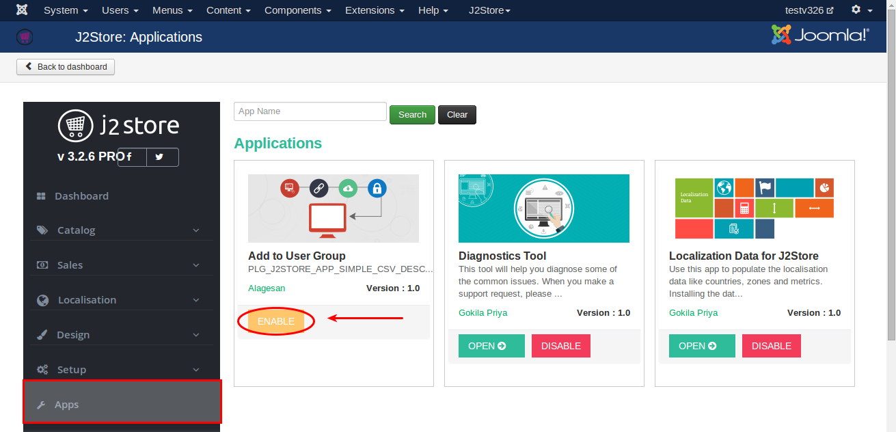
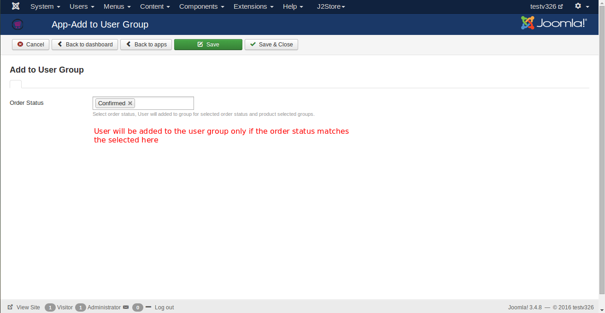
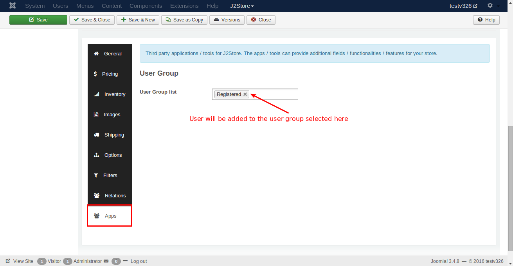

#Add to User Group

The Purpose of this app is to add the users to the user group for selected order status and product selected groups.

####Requirements

* PHP 5.4 or higher
* Joomla 3.3 or above
* J2Store 3.2.x or above

####Installation Instructions

1. Use the joomla installer to install the app.

2. In the backend, go to J2Store Dashboard -> Apps as shown in the image below.

3. Click Enable in the Add to User Group app.

4. Once the app is enabled, click an open to select the order status.

####Configuration

**Order Status**

  Selected order status here will be compared with the order status of the order made by the user. For example, if you set the order status as **confirmed** and if the user's order status is also in **confirmed** then the user will be moved to the user group selected in the product.

**Select User Group**

  Go to the product and navigate to the app menu where you should select the user group.
  
  

####Support

Still have questions? You can post in our support forum: http://j2store.org/forum/index.html

Thank you for using our extension.

