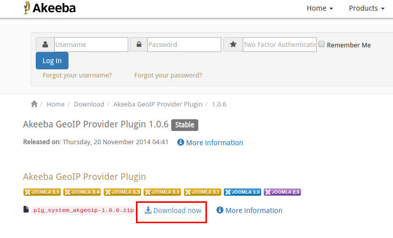

# Auto Currency Switch

This App automatically sets the store front's default currency based on the Country of the customer.

When a store user from canada visits the store you may show the store price in CAD (Cannadian dollers) and when a US customer visits the store, show the rate in USD. Configure any number of currencies and countries in the app settings.

####Requirements

1. PHP 5.4 or higher

2. Joomla 3.3 or above

3. J2Store 3.2.x or above

####Installation

Before installing the app, you must install the **Akeeba geo ip provider plugin** to find the location of the customer using IP address. Download the Akeeba geo ip provider plugin from here https://www.akeebabackup.com/download/akgeoip.html

Once installed the Akeeba geo ip provider, Go to Extension > Plugins and enable the plugin.

After installing and enabling the Akeeba geo ip provider plugin, install the pkg_j2store_app_autocurrencyswitch.zip using joomla installer.

Now go to J2Store > Apps and enable the **Auto change currency based on country** app.

Once enabled, open the app to set up the settings.

####Configuration

When you open the app, it will display you all the currencies you have created in the J2Store > Setup > Currencies.

For each currency you have to select countries to which the respective currency code must be shown. You can choose one or more countries.

Refer the following screenshot.

####Frontend

**BEFORE**

When customer comes from India, the currency switched to INR automatically.

####Support

Still have questions? You can post in our support forum: http://j2store.org/forum/index.html

Thank you for using our extension.