# Creating a bookable product

Once the global settings have been completed, we are all set to create a bookable product. To create a bookable product, go to Article Manager and create a new article.

While creating new product, choose **Booking** as a product type.
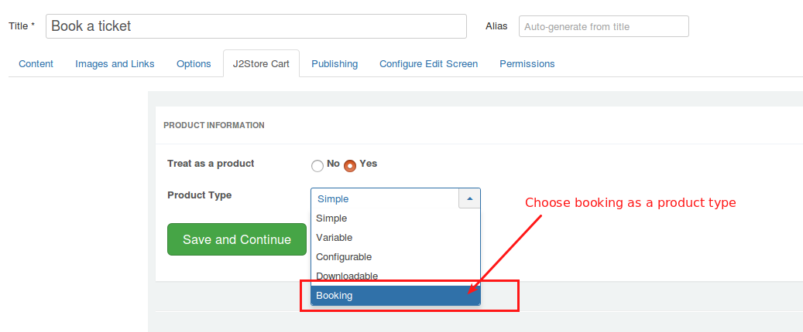

Apart form the default options that are available for all the product types, these are the various parameters that distinguish the booking type product from the other product types:

* **[Creating a bookable product](#creatingabookableproduct)**
   * **[General tab](#general)**
   * **[Pricing tab](#pricing)**
   * **[Persons](#persons)**
   * **[Availability](#availability)**
       * **[Example-1: Booking on daily basis](#day-booking)**
       * **[Example-2: Booking on monthly basis](#booking-monthly)**
       * **[Example-3: Booking on hourly basis](#booking-hourly)**

<a name="general"></a>
### General Tab

#### Booking duration

This options determines how long a booking is available. The duration can be defined by store admin (fixed block) or by customer (they need to input on the front-end). Duration can be set based on Hours, Minutes, Days or Months.

**Fixed blocks**  You can define a fixed block of dates that are to be allowed for booking while the others are being disabled in the frontend. For example: If you set up the booking duration parameter to be Fixed block of 1 day, then the user will be allowed to choose a single date for booking. That is, if customer books Dec 28, then the start date is Dec 28 and the End date is Dec 28.

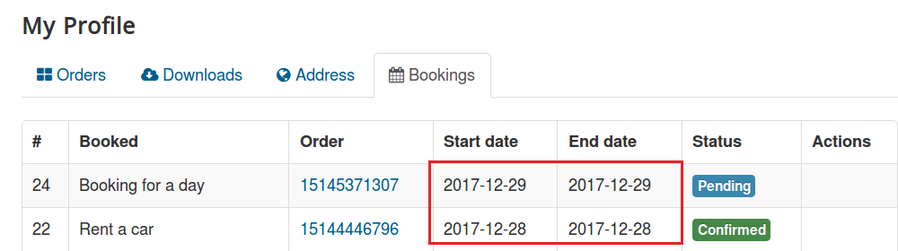

   * **Fixed block of 1 Month** - For example, if you are providing flats for a rent on monthly basis, you can choose the Booking duration **Fixed block of 12 months**.
   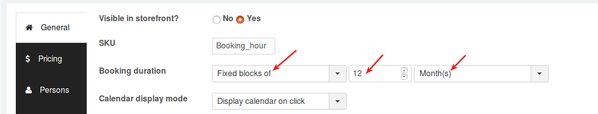
   
   On frontend, the blocks will be displayed like
   
   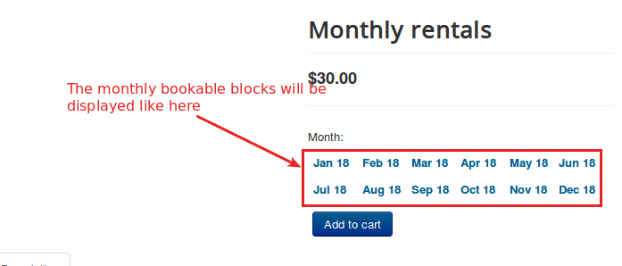
   
   * **Fixed block of 3 hours** - Take an example, a owner of conference hall allows hall booking for 3 hours. Lets see how you could setup the booking product for conference hall booking. Choose **Fixed block of 3 hours** as a booking duration.
    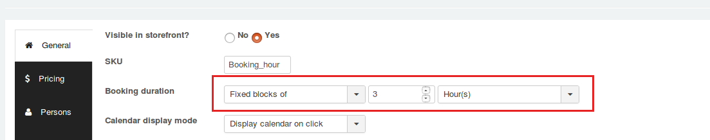
    
   On frontend, the block will be displayed like,
    
   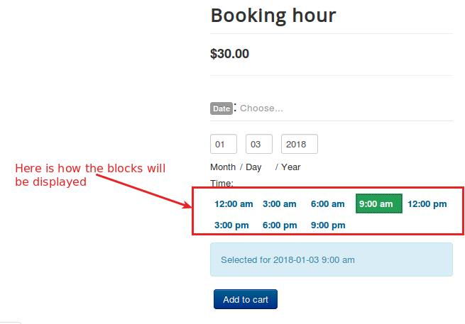

**Customer-defined blocks** you can allow the user to choose the start dates and end dates by themselves. You can also set up the minimum and maximum number of blocks that can be chosen when you choose the Booking duration as customer-defined blocks. 

If you select the booking duration to Customer-defined blocks of 1 days, you would be prompted to choose the minimum and maximum duration allowed. If you choose 2 and 4 respectively, then the users will get a message if they choose dates that are more than 4 days or less than 2 days.

 

 The frontend will be like this:

 

 When the booking duration is chosen to be Customer-defined blocks of 1 days, the following options pop up:

 * Minimum duration- To set the minimum number of blocks that have to be selected.

 * Maximum duration- To set the maximum number of blocks that have to be selected.

 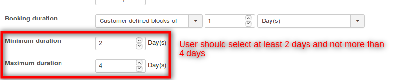

 The frontend will be like this:

 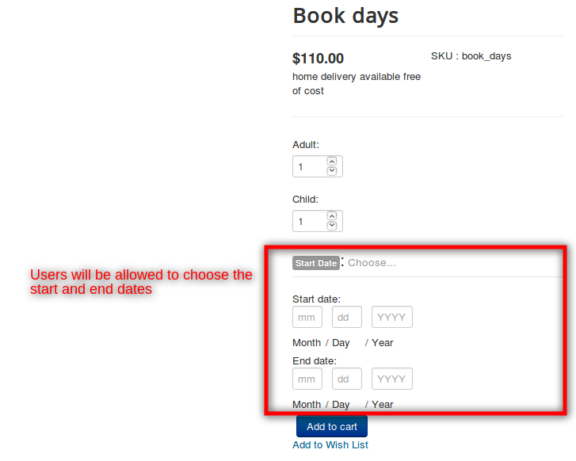

 When the user chooses more blocks than the specified limit, error occurs as follows:

 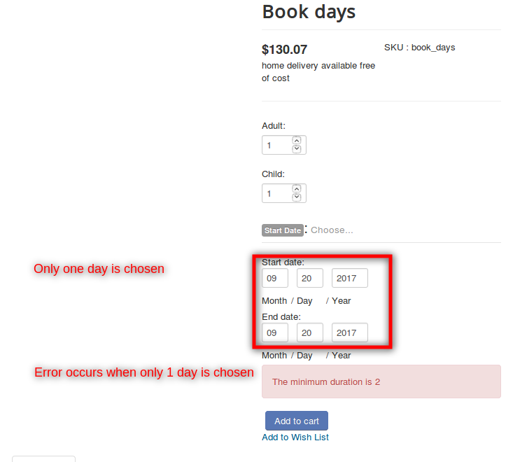

 When the maximum duration is exceeded, the following error occurs:

 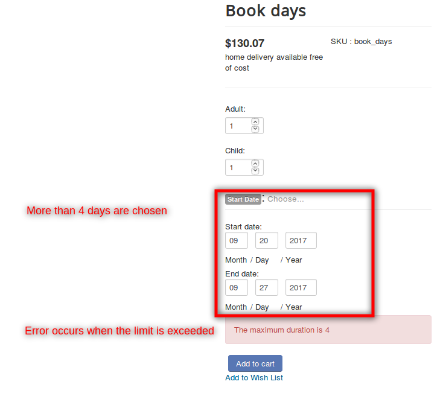

#### Calendar display mode

 Choose when to display the calendar. You can choose to display the calendar by default or only after clicking.

 The following video demonstrates the use of the calendar display mode option:

 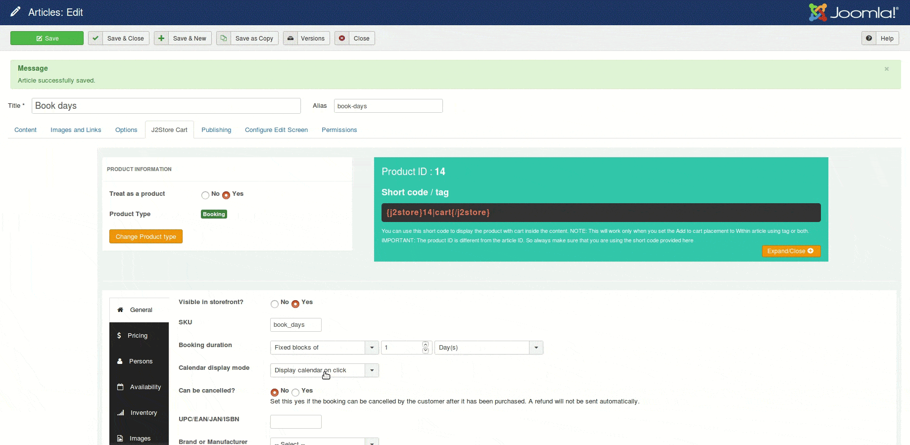
 
#### Allowing booking cancellation

It is possible to choose whether the store admin want his/her user to have the option to cancel their booking. Setting **YES** to **Can be cancelled?** will allow customer to cancel the booking after it has been purchased.

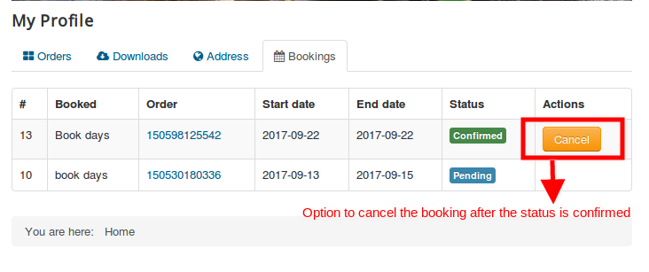

<a name="pricing"></a>
### Pricing tab

 The pricing tab for a booking type product has one extra option in addition to the default options as follows:

 **Block pricing**

 While you are able to set a price to the product, the booking type product allows block-wise price charging in addition to the regular pricing which is now an added advantage.

 Here is a screenshot to showcase the use of the block pricing option:

  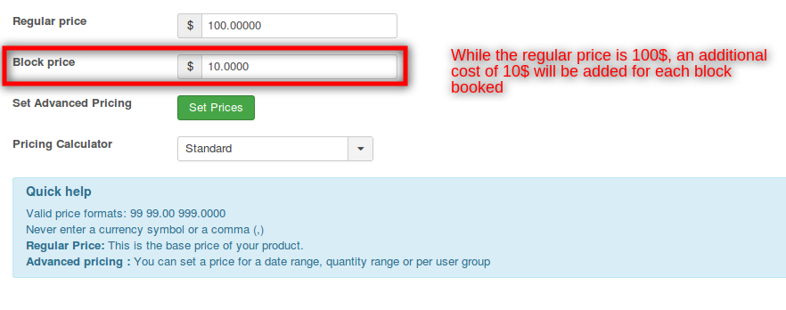

 Now that we have set up block pricing, the users will be charged in this way:

  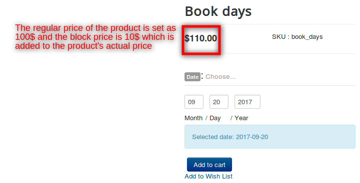

<a name="persons"></a>
## Persons

This tab allows you to make the booking for multiple persons. To enable this feature, select **YES**. It is also possible to set a minimum and maximum number of persons.

For example, A car could be rented and maximum 4 persons can only travel. So if you set **Minimum person : 1** and **Maximum persons: 4**, then booking will not be taken for more than 5 persons.

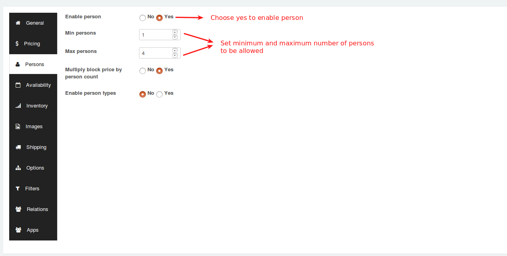

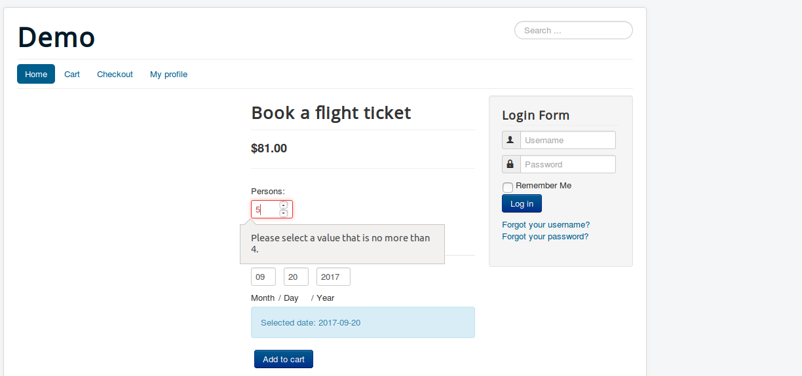

### Persons will also come into the following cost options:

**Multiply block price by person count**: If this option is enabled, all costs are multiplied by the number of persons the customer defines. It is also possible to enable person types. For example, Booking ticket for the journey might be having following restriction **Only 2 Adults and 3 Children allowed**. In this case, you could add person types and the pricing could be defined accordingly.


Once you enabled person types, you have the option to add multiple types.

Give your Person type a name (for example: Adult, Children) and define the cost (Base cost and Block cost) for the type. Adding a description is optional.

You can define a minimum and a maximum number for each person type. For example, you could require upto 2 adults and maximum 3 children for each booking. If you leave Max blank, there are no other restrictions than those of the bookable product itself.

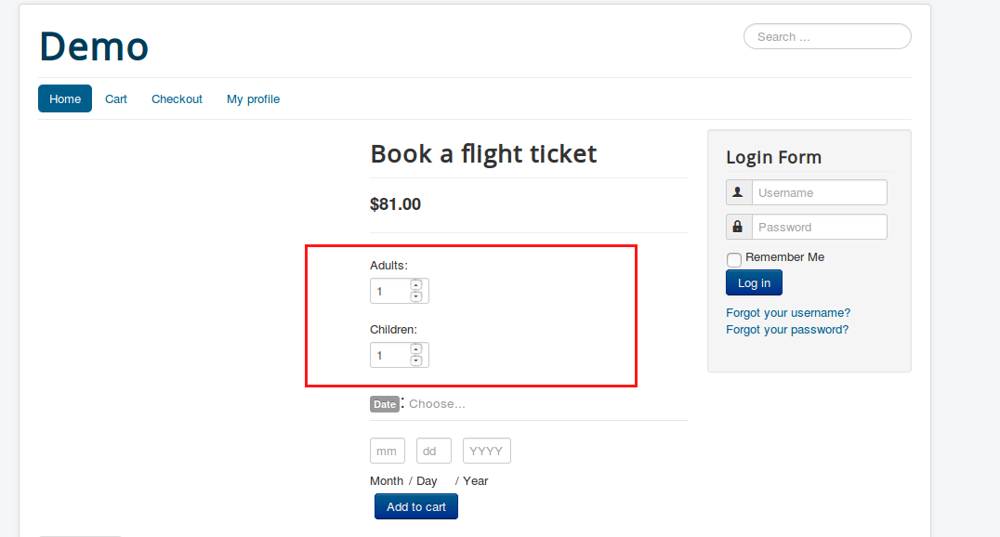

<a name="availability"></a>
## Availability

This tab controls the availability of blocks (i.e.) what blocks can be booked. Availability of blocks can be defined based on following time frame:

1. Day(s)
2. Month(s)
3. Hour(s)
4. Minute(s)

**Max bookings per block** : By using this option, you could define the number of bookings per block. For example, if you enter 2, more than 2 bookings on individual blocks are not allowed.

**Minimum block bookable and maximum block bookable** : If today is March 1 and you set minimum block bookable to 1 day into the future, then the first date a customer could book would be March 2. The same applies to the maximum date bookable. If you set maximum block bookable to 2 day into the future, then blocks avalaiable for booking are March 2, March 3.

**All dates are** : This option allows you to define specific date range to be **availble** or **not available by default**. The date range can be defined based on following time frames Months, Days, Hours, Minutes.

### Add date range

To add a custom date range, click the **Add Range** button:

On the new row created, choose a range type, From / to range and choose whether it is bookable or not and a priority number. The following are the several date ranges:

1. Date range – from and to will show a datepicker field
2. Range of days – from and to will show a dropdown of days of the week (Monday to Sunday)
3. Range of months – from and to will show a dropdown of months (January to December)
4. Range of weeks – from and to will show a dropdown of weeks (1 to 52)
5. Time ranges – from and to will show time inputs
6. Date Range with time – a time range can be set based on a custom date range

For example, if you would like to make the days from March 20 to March 22 to be non bookable, then you will have to choose **Available by default** to the All dates option and the date range should be set like below:


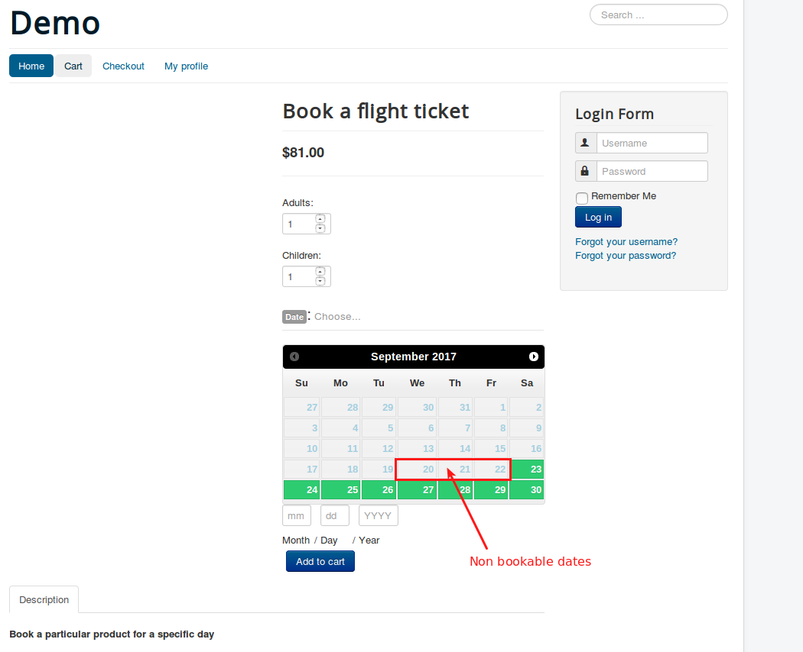

### More examples

<a name="day-booking"></a>
### 1. Rent a car for a day

#### Scenario:

1. Renting the car on a daily basis.
2. Setting the capacity of car to 5 persons.
3. Booking slots will be available only on week days and not on weekends.

#### Creating a product

1. Go to Article manager and create a new article.
2. Move to J2Store cart tab and choose YES to treat as a product.
3. Choose product type as Booking and save.

#### General tab

After creating the product, navigate to general tab.

**Booking duration**

In our sample scenario, we are renting the car on a daily basis. So Set the Booking duration to Fixed blocks of 1 day(s).

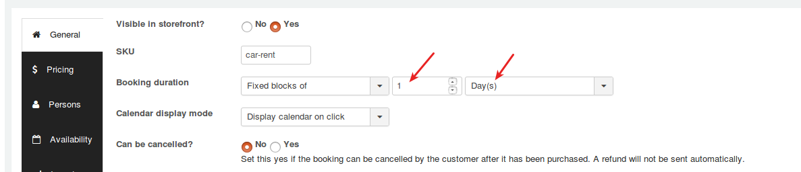

#### Pricing

Set pricing for car renting and move to next tab.

#### Persons

Our instance says that we are going to restrict the capacity only to 5 Persons. So following are the criteria to be set:
```
Min persons = 1

Max persons = 5
```
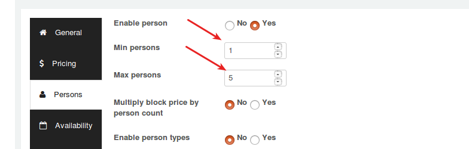

#### Availablity

The car would be rented on a daily basis. The parameters should be set as follows:
```
Max bookings per block = 4

Minimum block bookable= 1 day(s) into the future

Maximum block bookable= 30 day(s) into the future
```
To restrict the availability of the hall only to week days and block the availability on weekends:
```
Range type = Range of days

Range = Saturday to Sunday

Bookable = No
```
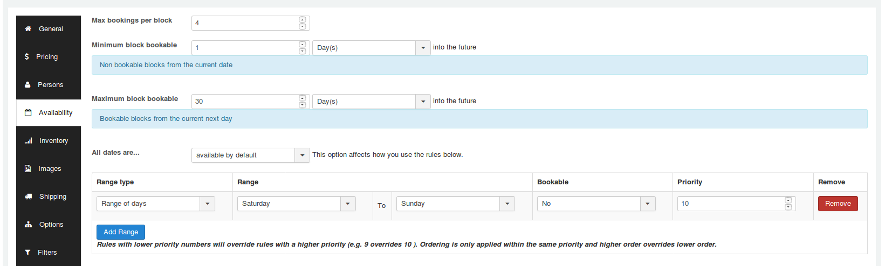

Following is the screenshot of frontend:

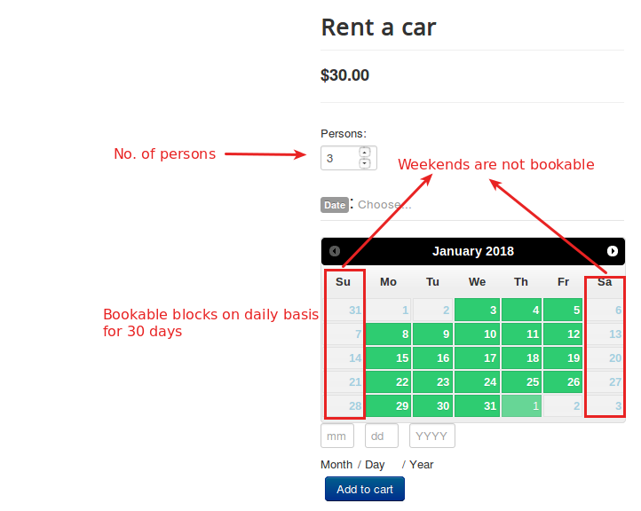

<a name="booking-monthly"></a>
### 2. Renting the flats on monthly basis

#### Scenario:

1. Renting the flats on a monthly basis.
2. Multiple bookings per block cannot be allowed.

#### Creating a product

1. Go to Article manager and create a new article.
2. Move to J2Store cart tab and choose YES to treat as a product.
3. Choose product type as Booking and save.

#### General tab 

After creating the product, navigate to general tab.

**Booking duration**

In our sample scenario, we are renting the flats on a monthly basis. So Set the Booking duration to Fixed blocks of 12 month(s).

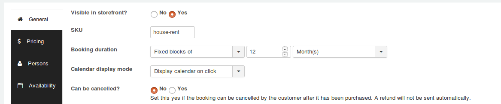

#### Pricing

Set pricing for car renting and move to next tab.

> There is no restriction for the capacity (persons) so navigate to the availability tab.

#### Availability

**Criteria**
1. The flats would be rendted on monthly basis. 
2. Restrict multiple booking per block because multiple persons could not be booked for a single flat.

```
Max bookings per block = 1

Minimum block bookable= 1 month(s) into the future

Maximum block bookable= 11 month(s) into the future
```

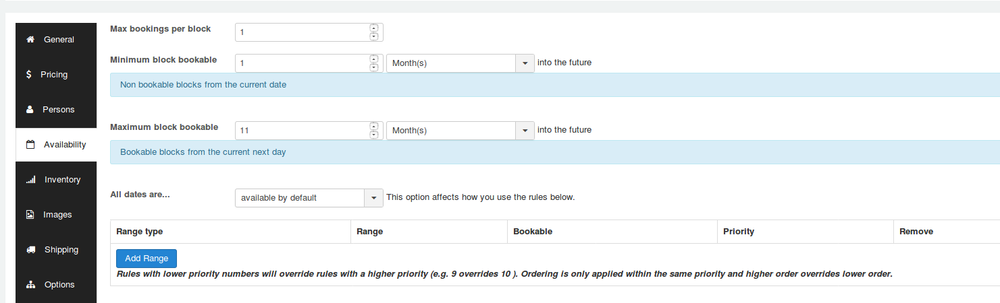

**Screenshot of frontend**

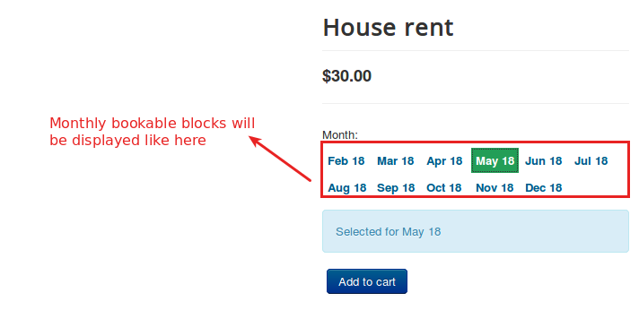

<a name="booking-hourly"></a>
### 3. Rent a sports helmet on hourly basis

#### Scenario:

1. Bookings will be opened daily for hourly basis(say 3 hours).
2. 10 bookings will only be taken per day.
3. The availability time range is 12:00 am to 09:00 pm.

#### Creating a product

1. Go to Article manager and create a new article.
2. Move to J2Store cart tab and choose YES to treat as a product.
3. Choose product type as Booking and save.

#### General tab

After creating the product, navigate to general tab.

**Booking duration**

Set this parameter to Fixed blocks of 3 Hour(s) to make the block available with custom time range.

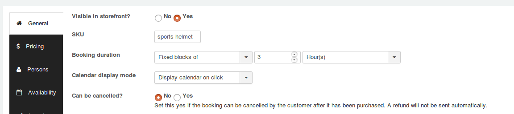

#### Pricing tab

Set the pricing accordingly and navigate to the availability tab.

#### Availability tab
```
Max bookings per block = 10

Minimum block bookable = 0 days into the future

Maximum block bookable = 1 month into the future

Range type = Time range(all weeks)

Range = 12:00 AM to 09:00 PM

Bookable = Yes
```
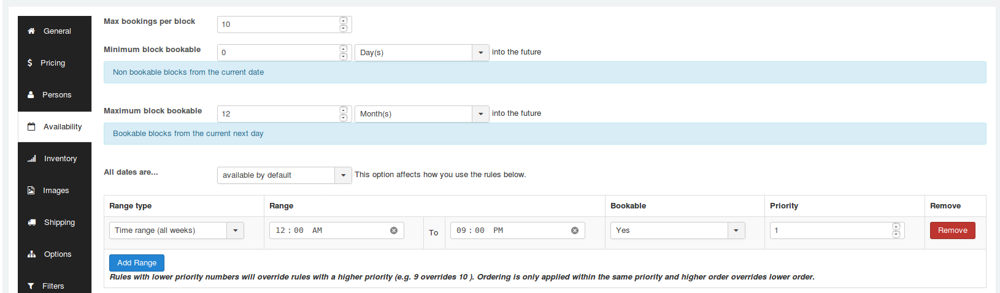

**Frontend screenshot**

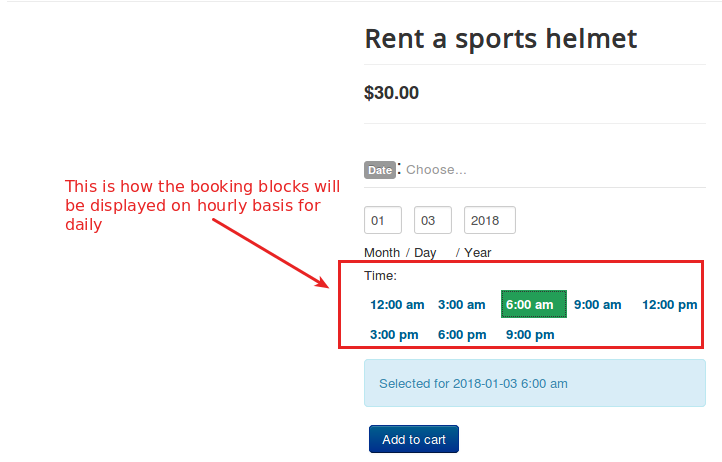