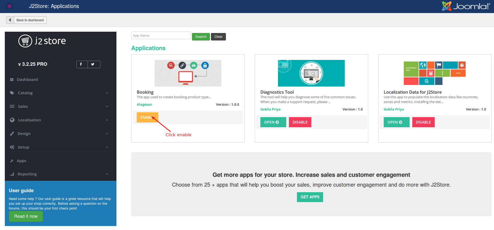

# Requirements and Installation

### Requirements

1. Joomla 3.4.x and above

2. J2Store 3.2.25 and above

3. PHP 5.6.4 or higher.

### Installation

 * The app could be downloaded from our site and installed using the default Joomla installer.

 * After installing the app, go to J2Store > Apps and activate the app by clicking on enable button.
 

 * Once it is enabled, click on open button to complete the basic configuration of the app.

 * Installing and configuring this app in your site would allow you to create a product of the type "Booking".