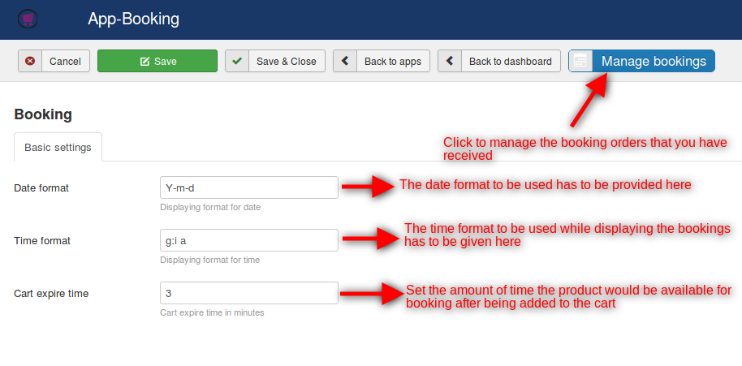
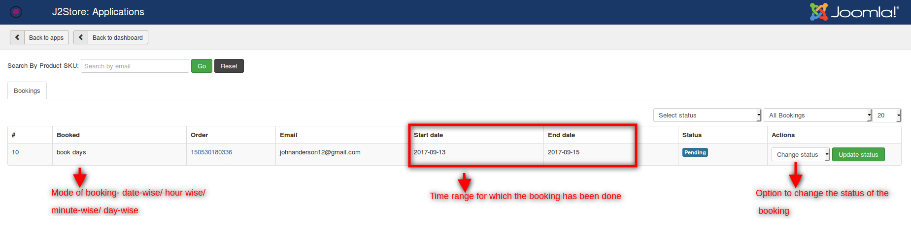

# Basic settings and booking management

## Basic Settings

 There are no much settings that have to be done to use this app.Here are the few parameters that are essential to start off with:

 * **Date format**

   Since you will be offering bookings and reservations, it is necessary that you specify the date format that you wish to use.

 * **Time format**

 Reservations and bookings will be based on time frames. Hence it becomes mandatory to set the time format.

* **Cart expire time**

 This option would help manage the abandoned bookings. There might be situations where a user adds a booking to the cart but exceeds a specific time period without proceeding to the checkout process. Since the booking process is dynamic, this option would be of great help to avoid conflicts.

 Setting the cart expire minutes would make the items in the cart disappear after the specified time limit if the user does not proceed to the checkout process.

 

## Manage bookings

 Clicking on the manage bookings option will allow you to manage the bookings that have been made by the users.

 Here is a screenshot that depicts the booking management:

 

