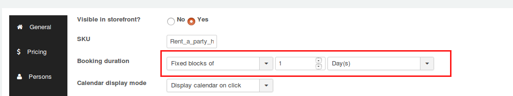
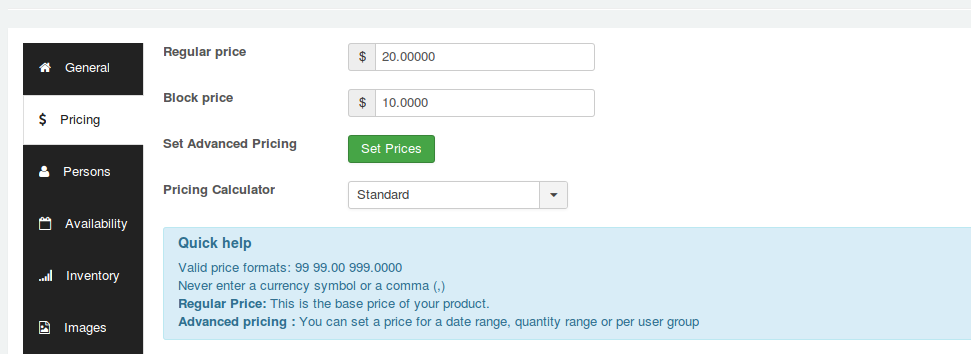
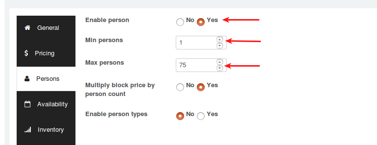
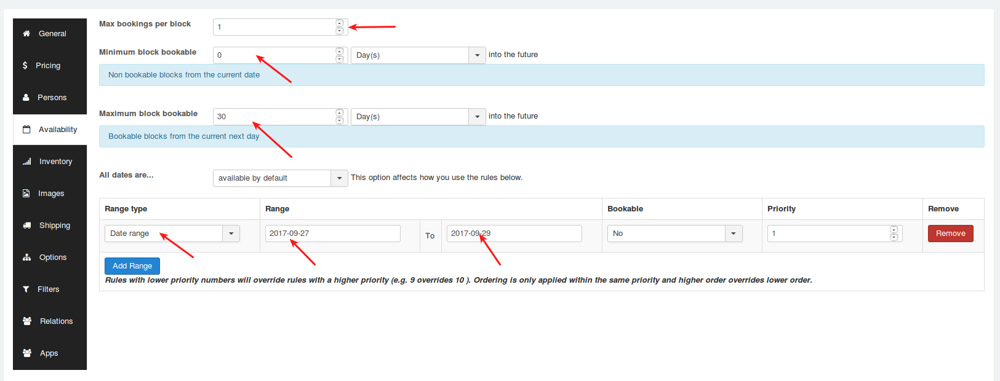
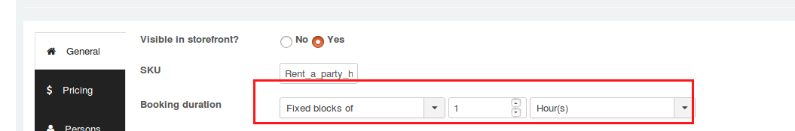
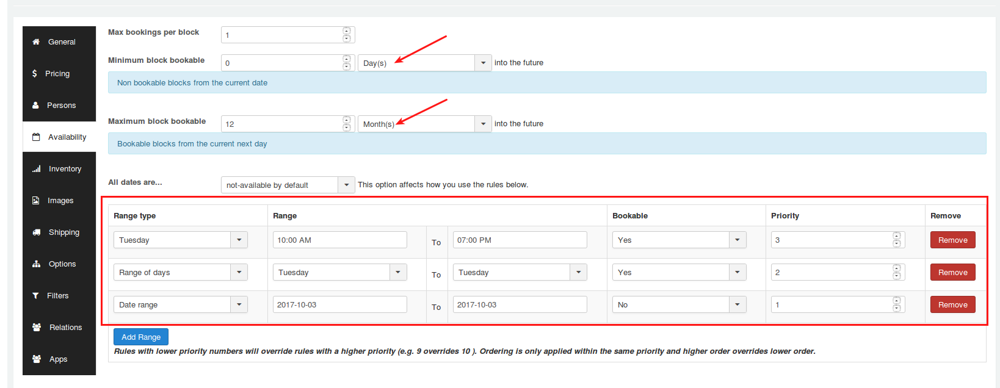
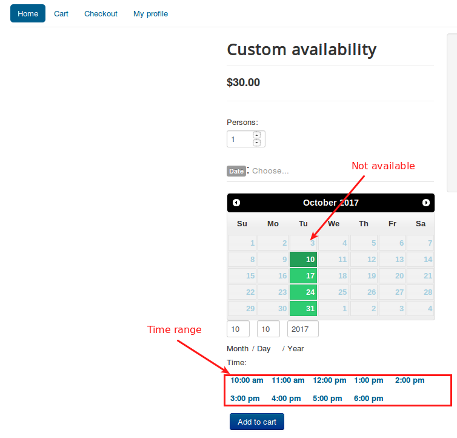

# Use cases

* **[Rent a party hall](#rent-party-hall)**
* **[Block availability with date and hour range](#custom-date-time-range)**

<a name="rent-party-hall"></a>
### 1. Rent a party hall

A person owns a party hall that people can rent for a Birthday parties. 

##### Instance

1. The hall will be available for only 30 days.
1. It can accommodate upto 75 people.
2. The party hall owner wants customers to not book a party hall on specific set of date range. 
3. The party hall owner wants to restrict multiple bookings per block.
4. The hall can be booked for only one day.

### Booking Configuration

#### Creating product

1. Go to Article manager and create a new article.
2. Move to J2Store cart tab and choose **YES** to treat as a product.
3. Choose product type as **Booking** and save.

#### General tab

After creating the product, navigate to general tab.

**Booking duration**

To allow customers to book the party hall only for one day, set this parameter to **Fixed blocks of 1 day(s)**.

**Calendar display mode**

Choose whether the calendar must be opened by default or should be displayed when customer click on choose button. Setting **Display calendar on click** will hide the calendar until customer clicks on choose date.



#### Pricing tab

After defining booking duration, navigate to pricing tab and set the product's regular price and block price.



#### Persons tab

In our example, the maximum persons we allowed is 75. So set **YES** to enable person and then set

```
Min persons = 1

Max persons = 75
```


If you would like to multiply the block price with person count then set **YES** to **Mutiply block price by person count**.

#### Availability

1. To restrict customers from multiple booking per block, give **1** (one) to the text box named **Max bookings per block**.

2. **To make the hall unavailable after 30 days, set**

   ```
   Minimum block bookable = 0 or 1 day(s)

   Maximum block bookable = 30 day(s)
   ```

3. **Restrict booking on specific date range**

 To make specific date range to be unavailable for booking, set **All dates** parameter to **available by default** and click on **Add range** button to define specific date range.

 After clicking on Add range, on the new row created, define the date range like below:
 
 **Range type** - Date range
 **Range** - 27-09-2017 to 29-09-2017
 **Bookable** - No
 **Priority** - 1
 
 
 
<a name="custom-date-time-range"></a>
### 2. Block availability with date and hour range

This use case will show you how to make the blocks available with date and hour range.

#### Instance

1. Booking will be available only on **Tuesdays** from **10.00 AM to 7.00 PM**
2. Booking will be unavailable on **03-10-2017**.

#### Creating product

1. Go to Article manager and create a new article.
2. Move to J2Store cart tab and choose **YES** to treat as a product.
3. Choose product type as **Booking** and save.

#### General tab

After creating the product, navigate to general tab.

**Booking duration**

Set this parameter to **Fixed blocks of 1 Hour(s)** to make the block available with custom time range.

Then move to pricing tab to define the booking cost and then navigate to Person tab if you would like to define minimum and maximum persons.



#### Availability

1. Define the number of bookings per block. If you wish to restrict customers from multiple booking then give 1 to this option.

2. To make the blocks available for 12 months, you will have to set the minimum and maximum bookable block like below:

```
Minimum block bookable = 0 Day(s)

Maximum block bookable = 12 Month(s)
```

Then, set all the dates to not available. Choose **not-available by default** to All dates are parameter.

Now set the date and time range by click in **Add Range** button and set priority accordingly. Refer the screen shot below:



#### On frontend

