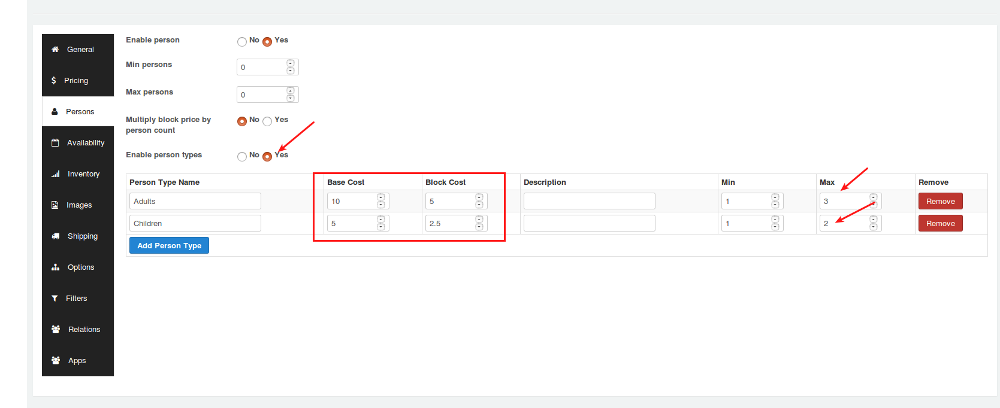
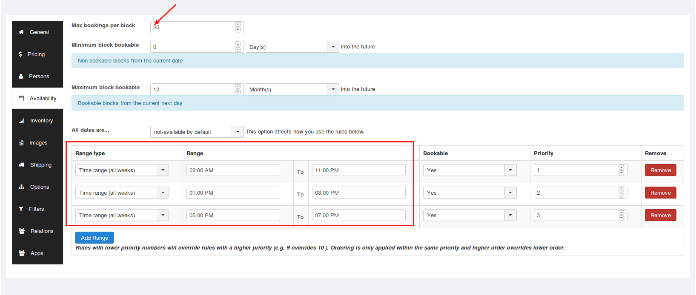
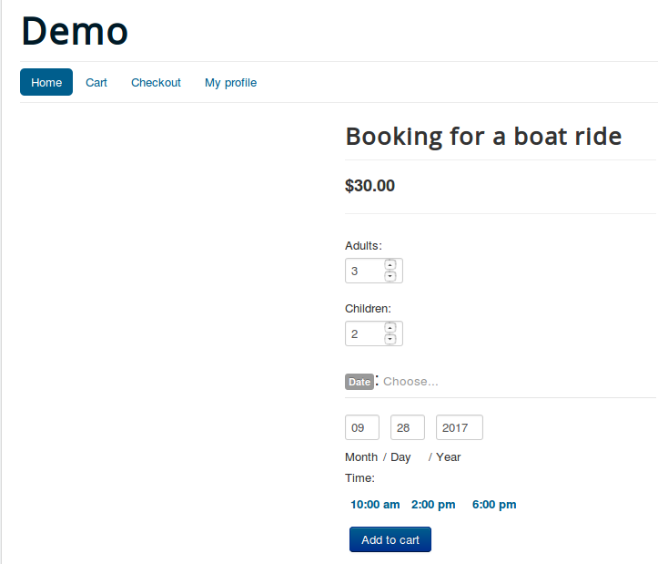

# Use cases

- **[Book a conference hall](#hallbooking)**
* **[Book a service](#servicebooking)**
* **[Book for a boat ride](#boatride)**

#### Book a hall
<a name="hallbooking"></a>
#### Scenario:

1. Renting the hall on a daily basis.
2. Setting the capacity of the hall to 50 persons.
3. Booking slots will be available only on week days and not on weekends.

#### Creating a product

1. Go to Article manager and create a new article.
2. Move to J2Store cart tab and choose **YES** to treat as a product.
3. Choose product type as **Booking** and save.

#### General tab

After creating the product, navigate to general tab.

**Booking duration**

In our sample scenario, we are renting the hall on a daily basis. So Set the Booking duration to Fixed blocks of 1 day(s).

#### Pricing tab

Set the pricing and navigate to the next tab.

#### Persons tab

Our instance says that we are going to restrict the capacity only to 50 Persons. So following are the criteria to be set:

```
Min persons = 1

Max persons = 50
```
#### Availability tab

The hall would be rented on a daily basis. The parameters should be set as follows:

```
Max bookings per block = 1

Minimum block bookable= 1 day(s) into the future

Maximum block bookable= 30 day(s) into the future

```

To restrict the availability of the hall only to week days and block the availability on weekends:


```
Range type = Range of days

Range = Saturday to Sunday

Bookable = No

```

Here are the screenshots that demonstrate the workflow of the above conditions:


#### Service Booking
<a name="servicebooking"></a>
#### Scenario:

1. Bookings will be open daily for hourly basis(say 3 hours).
2. 10 bookings will only be taken per day.
3. The availability time range is 6:00 am to 11:00 pm.

#### Creating a product

1. Go to Article manager and create a new article.
2. Move to J2Store cart tab and choose **YES** to treat as a product.
3. Choose product type as **Booking** and save.

#### General tab
After creating the product, navigate to general tab.

**Booking duration**

Set this parameter to **Fixed blocks of 3 Hour(s)** to make the block available with custom time range.


#### Pricing tab

Set the pricing accordingly and navigate to the availabilitytab.

#### Availability tab

```
Max bookings per block = 10

Minimum block bookable = 0 days into the future

Maximum block bookable = 1 month into the future

Range type = Time range(all weeks)

Range = 06:00 to 23:00

Bookable = Yes

```


The above settings will implement the following changes in the  frontend.


<a name="boatride"></a>
### Book for a boat ride

#### Instance

An owner of boat offers boat ride for daily on hourly basis. The duration of journey is 2 hours and the start times are 10:00 AM, 2:00 PM, & 6:00 PM. The booking price for Adults and Children can be vary. The maximum capacity of boat is 25.

#### Configuration of bookable product

1. Go to Article manager and create a new article.
2. Move to J2Store cart tab and choose **YES** to treat as a product.
3. Choose product type as **Booking** and save.

#### General tab

After creating the product, navigate to general tab.

**Booking duration**

In our example, the duration of boat ride is **2 hours**. So set booking duration to **Fixed blocks of 2 Hour(s)**.

#### Persons tab

In this example, the pricing can be vary based on person types. To set different pricing for Adults and Children, **Enable person types**.

Set **YES** to Enable person types and 	click on **Add person types** button to add person type Adults and Children. And then define the base cost, block cost, minimum and maximum number for each person type.

Take a look at below demo screen shot to see how the parameters under person tab are configured.



#### Availability

```
Maximum bookings per block = 25
All dates are = not available by default
```
**Add time range for boat ride by referring to the below picture**



#### Frontend


