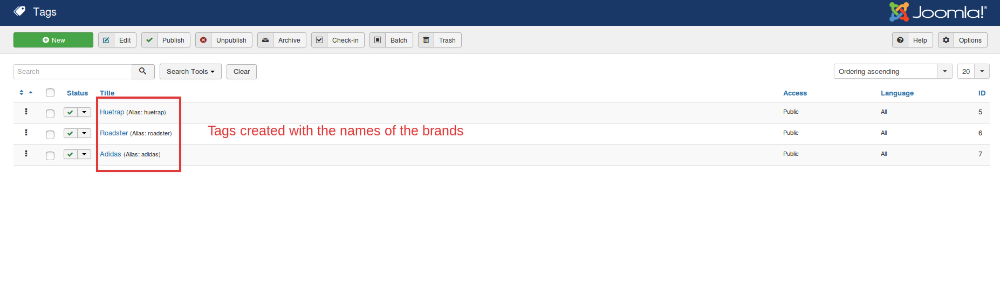
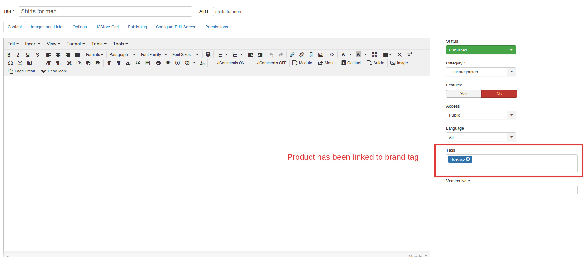
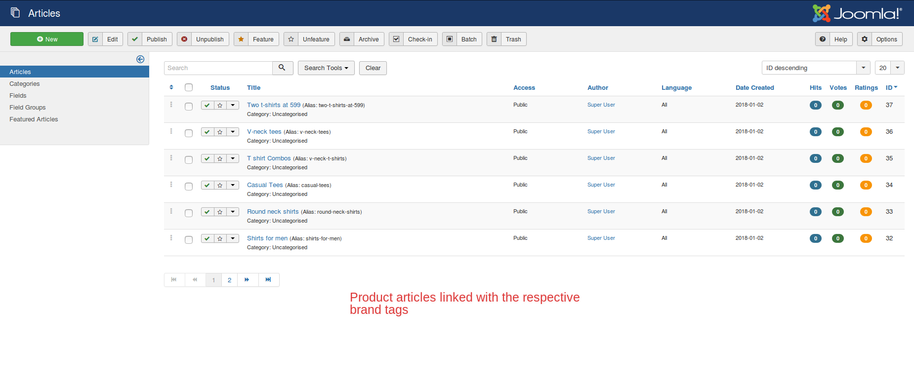
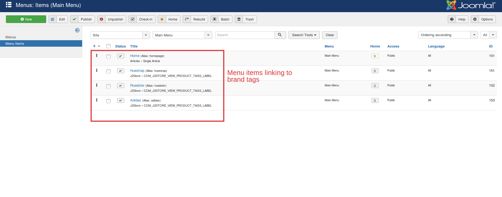
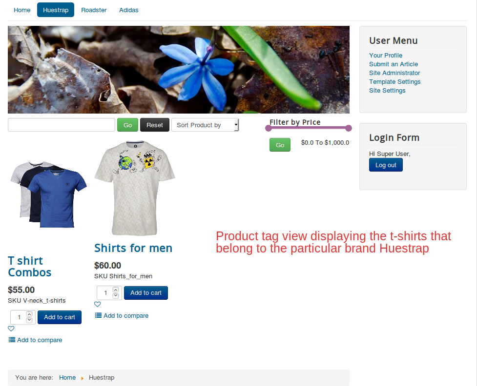
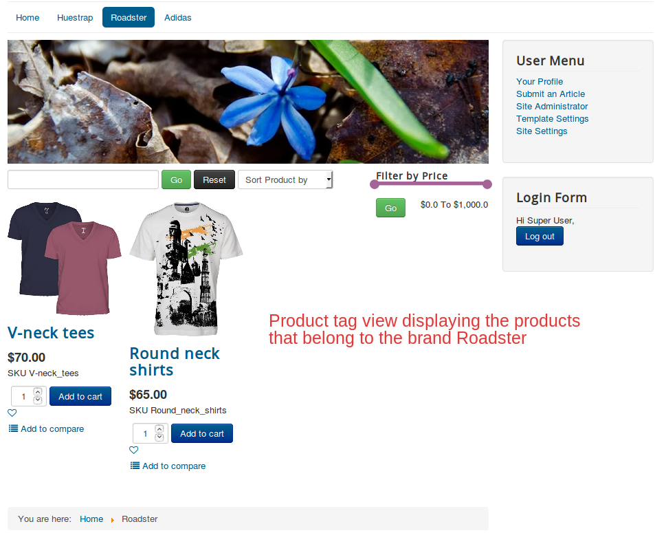
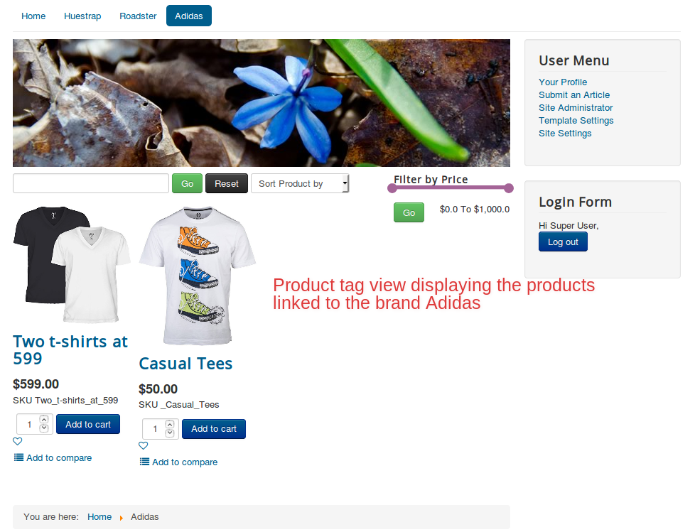

## Displaying products brand-wise

If you own a multi-brand store, then this feature might help you the most.
You could display your products brand-wise. All you have to do is this:

  * Create tags with the brand name.
  * Create products and link them to their corresponding brands(tags).
  * Create menu items of the type Tag view and associate the tags with them accordingly.

##  Scenario  

 Our goal is to list the shirts in the store according to their brand.
 We have following brands:
  * Huetrap
  * Roadster
  * Adidas

## Steps to be done:

* Create tags of the name Huetrap, Roadster and Adidas.
* Create corresponding products and link them to the tag Huetap and repeat the similar process for other brands.
* Create menu items that associate with the brand tags respectively.

## Relevant Screenshots

