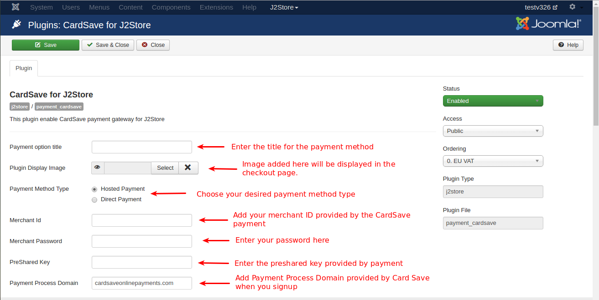
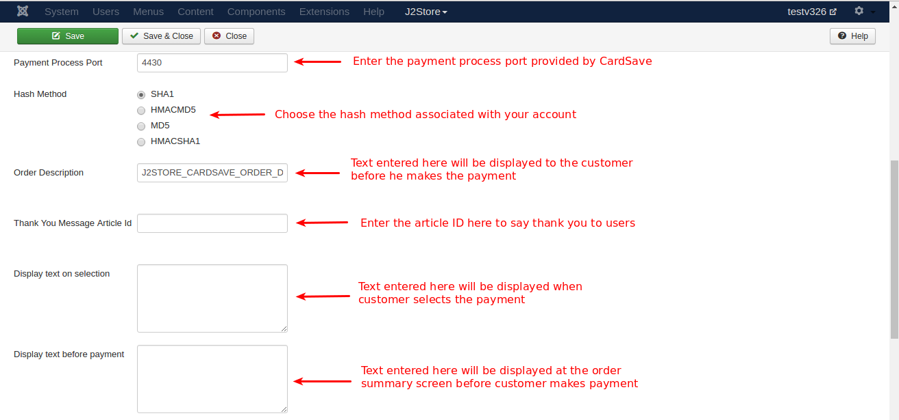

#CardSave Pyament Plugin
This pulgin integrates CardSava payment plugin with J2store.

####System Requirements

* PHP 5.4 or greater
* Joomla 3.x
* J2Store 3.2.x or greater

####Installation Instructions

1. Use the Joomla installer to install the plugin.

2. In the backend, go to J2store Dashboard -> Payment methods and enable plugin.

3. Open the plugin and enter the parameters (read the explanation about each parameter given below)

4. Save and close it.

####Configuration

The plugin has the following parameters need to be addressed.

**Payment option title**

  The value entered here will be used as the title for this payment method. Customer will see this value when he checks out.
  
**Plugin Display Image**

  This image will be displayed while payment options are listed in the checkout page.
  
**Payment Method Type**

  Choose your payment type
  * ***Hosted Payment:*** Payment transaction will be processed in payment's domain.
  * ***Direct Payment:*** Payment transaction will be processed in J2store itself.
  
**Merchant Id**

  This is your merchant ID provided by CardSave payment. You will get this when you signup. Payment will send you an email with merchant ID and password.
  
**Merchant Password**

  Please enter the password provided by the Cardsave payment.
  
**PreShared Key**

  Please enter the PreShared key associated with your CardSave payment.
  
**Payment Process Domain**

  Add Payment Process Domain provided by the CardSave when you signup.
  
  
**Payment Process Port**

  You will get your Payment Process Port with payment process domain through Email when you signup.
  
**Hash Method**

  Choose the Hash Method associated with your CardSave account.
  
**Order Description**

  The text entered here will be displayed to the customer before he makes the payment.Using this [ORDERID] tag, you can add order ID in your description. Using this [INVOICE_NO] tag, you can add invoice number in your description.
  
**Thank You Message Article Id**

  You can create a Joomla Article to say thanks to the users, who purchased in your online store. Enter the article ID here.
  
**Display text on selection**

  The text entered here will be displayed when customer selects this payment method. You can enter a language constant as a value here if you are using a multi-lingual site and then write a language override. For example, enter a language constant:

J2STORE_TEXT_TO_DISPLAY_ON_SELECTION.

Now you can go to Joomla admin-> Language Manager->Overrides and create overrides for the language constant in all your languages.

**Display text before payment**

  The text entered here will be displayed to the customer at the order summary screen before he makes the payment. You can enter a language constant as a value here if you are using a multi-lingual site and then write a language override. Refer the Display text on selection parameter.
  
**Display text on after payment**

  The text entered here will be displayed when customer completes the payment.

  You can enter a language constant as a value here if you are using a multi-lingual site and then write a language override. Refer the Display text on selection parameter.
  
**Display text on error in payment**

  The text entered here will be displayed to the customer when there is an error in the payment process.

  You can enter a language constant as a value here if you are using a multi-lingual site and then write a language override. Refer the Display text on selection parameter.
**Display text if customers cancels payment**

  The text entered here will be displayed to the customer when he cancels the payment at the gateway (NOT in your site).

  You can enter a language constant as a value here if you are using a multi-lingual site and then write a language override. Refer the Display text on selection parameter.

**Debug**

  Choose YES to enable the debug mode. If you set this to yes, then debug messages will be logged and saved in the cache folder in your Joomla root directory. DO NOT select YES in the live site.
  
####Support

Still have questions? You can post in our support forum: http://j2store.org/forum/index.html

Thank you for using our extension.