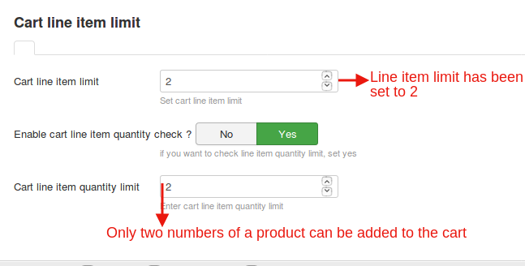
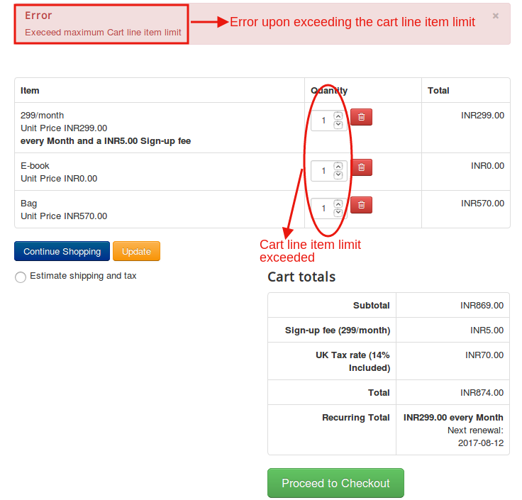
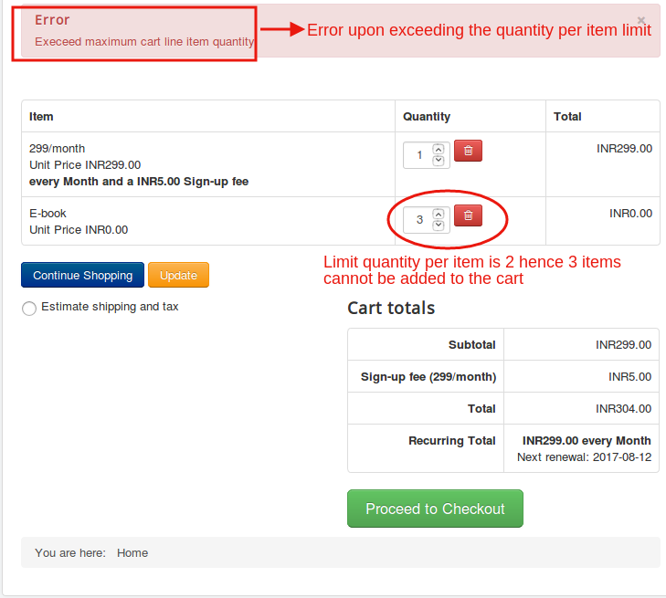

# Cart Item Limit

This app allows the user to control the total number of items that can be added to the cart and the number of items that can be added per line item.

## Installation
Cart Item Limit could be downloaded from our site and installed using the default joomla installer.

* Post installation,Go to j2Store->Apps.

* Click Enable under "Cart item limit".

* Click Open to Configure the settings.

## Configuration

* **Cart line item limit**

   Set the line item limit
     (For example:If you set the limit to 2,only 2 products can be added to the cart).

* **Enable cart line item quantity check**

  Setting this to Yes will allow a restriction on the number of items that can be added per product.

  **NOTE:**
   If this is set to YES, then the Cart line item quantity limit has to be provided.
* **Cart line item quantity limit**

* Set the number of items to be added per product
(For example:If this is set to three only 3 numbers of a product can be placed in the cart).

**Relevant Screenshot**

  For the above settings,
  the cart behaviour will be like this if the item limit exceeds the specified count:

  

  For the above settings,if the quantity of any of the products exceeds the provided limit, the following error will occur:

  
