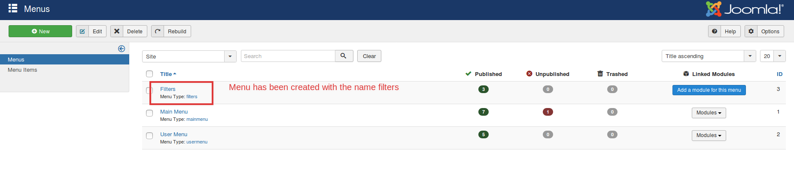

# Category Tree for displaying filters

Sometimes you might want to display the filters in a tree structure. Or achieve a SEF URL for category filters. Here is what you can do to achieve that.

## Steps to be followed:

*  Create a menu with the name filters.
*  Create menu items with the names of categories.
*  Add the menu items to the menu filters.
* Navigate to Extensions->modules->New->Menu.
* Choose the menu filters in the option "Select Menu".
*  Set the position to "j2store-filter-right-top"(Please note that you have to type this fully at the position field).

## Relevant Screenshots

The following screenshots will be of help:

Create a menu of the name filters:

Add menu items with category names to the menu filters:

Create a menu module in extensions with the name Filters:

Frontend view:

