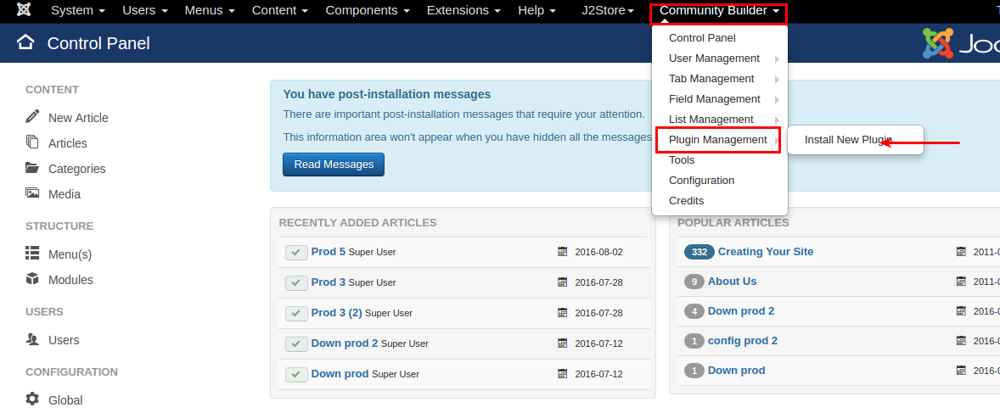
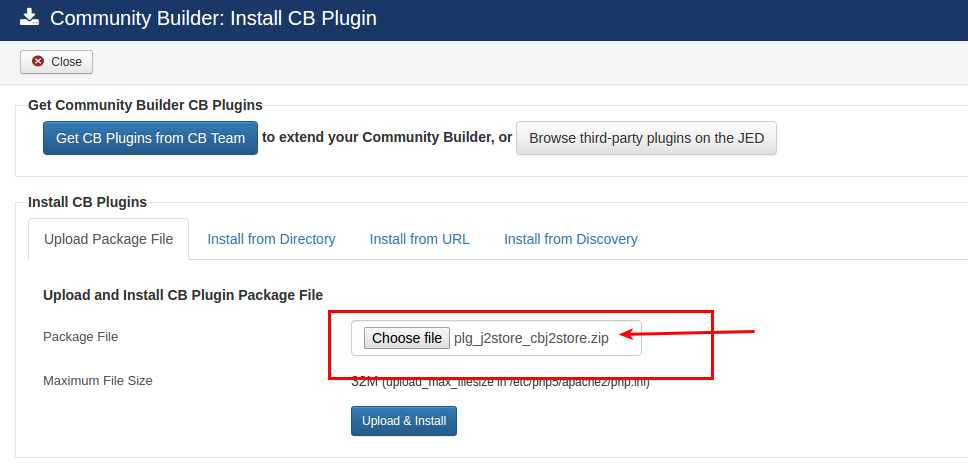
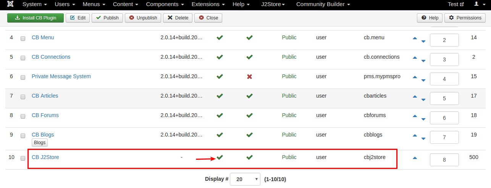
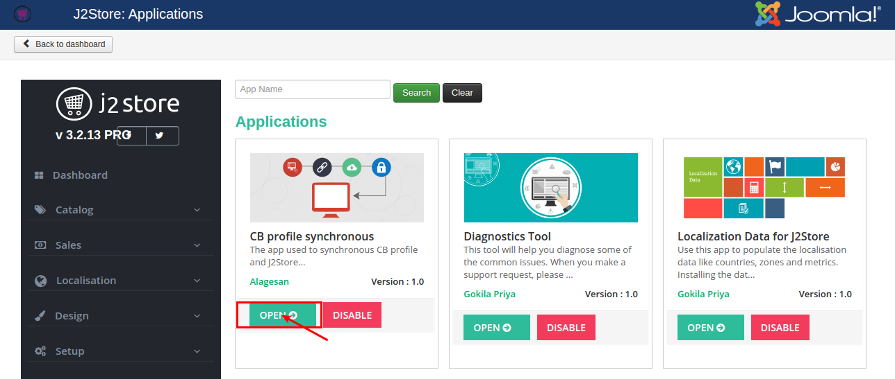
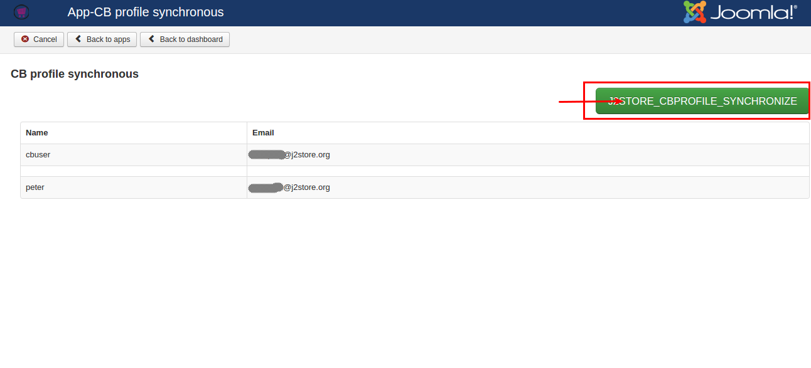
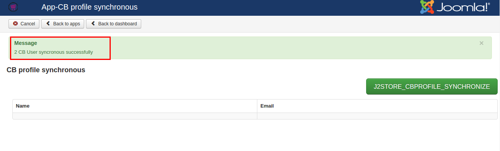
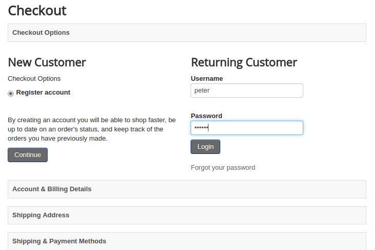
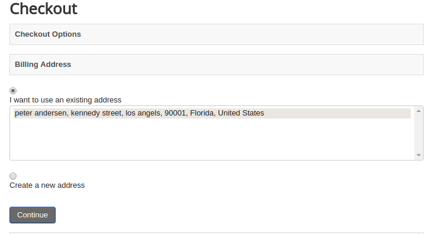
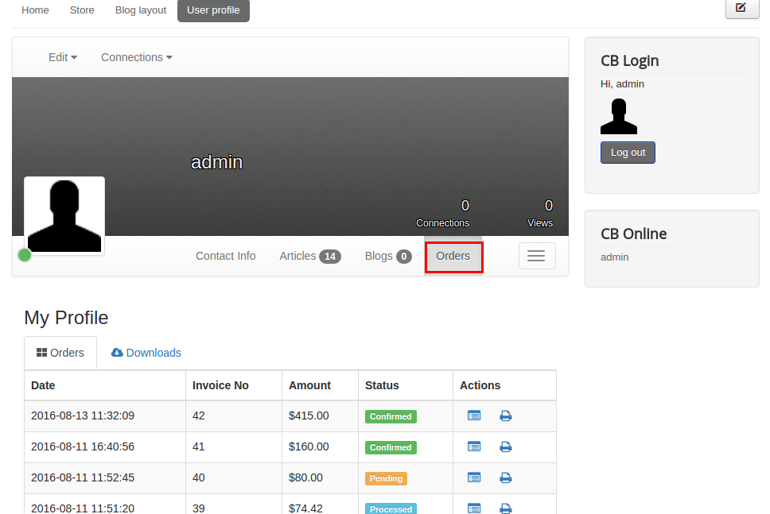

# CB Profile Sync

Community Builder is a Joomla component that helps you create customised user profiles. This app integrates with Community Builder so you can access user profile information on your store. This way your customer doesn't have to keep filling in his details everytime he makes a purchase. The app can also access and display order history.

#### Requirements

1. PHP version 5.4 or higher

2. Joomla version 3.x or higher

3. J2Store version 3.2.8 or higher

4. Community Builder 2.0.x

#### Installation

1. Download and install community builder package using Joomla installer.

2. Next, download CB Profile Sync app from our site's extensions section. Once downloaded, extract the package file and you will be having two zip files.

3. Install plg_j2store_app_cbprofile.zip using joomla installer and enable the app in J2Store Dashboard > Apps section.

4. Now go to Community Builder > Plugin Management > Install new plugin where you should install plg_j2store_cbj2store.zip

5. After installing above package, Go to Community Builder > Plugin Mnanagement and enable CB J2Store available in the list.

#### How CB Profile Synch works ?

If user has already entered an address during Profile creation in Community Builder, this app will synchronize all the required profile details during checkout. Clicking on one single button will make everything easy.
**Step-1**
Go to J2Store > Dashboard > Apps and open CB Profile Synchronous app

**Step-2**
On opening app, the page will list down the available users who are registered newly.

On top right of that page, you will be having large green coloured button named with CB Profile Synchronize. Clicking on that button will synchronize the users details with J2Store. Refer the screenshots below

**Step-3**
Now go to your store front and add the item into the cart -> proceed checkout -> Login.

Usually, if new user login first time at J2Store checkout page, in the next step Billing address will ask you to enter your address and personal information. But with CB Profile synchronous, the address will be synchronized from community builder and no need to re-enter everything. Refer the screenshots below

**Step-4**
Order history also will be displayed in the Community Profile itself. Refer the screenshot below

#### Support

Still have questions? You can post in our support forum: http://j2store.org/forum/index.html

Thank you for using our extension.