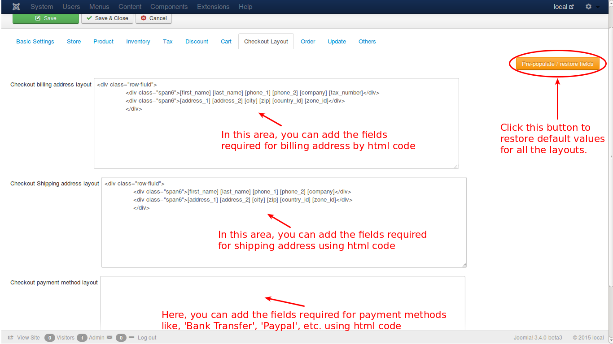
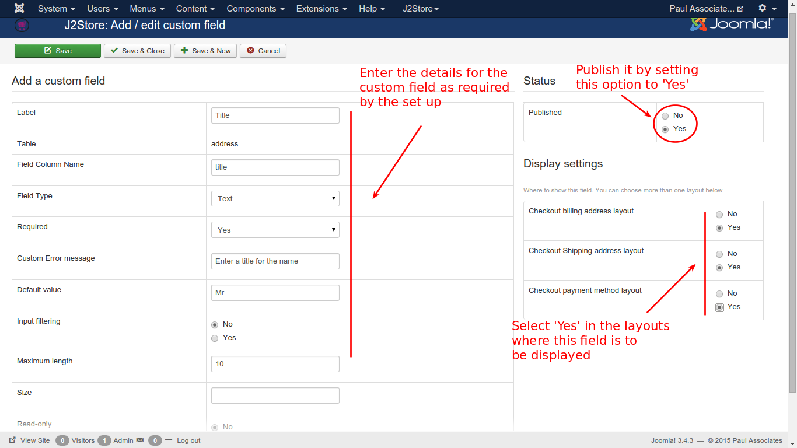
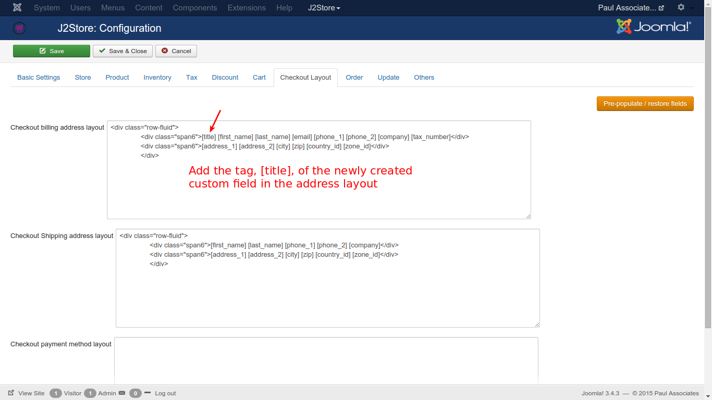
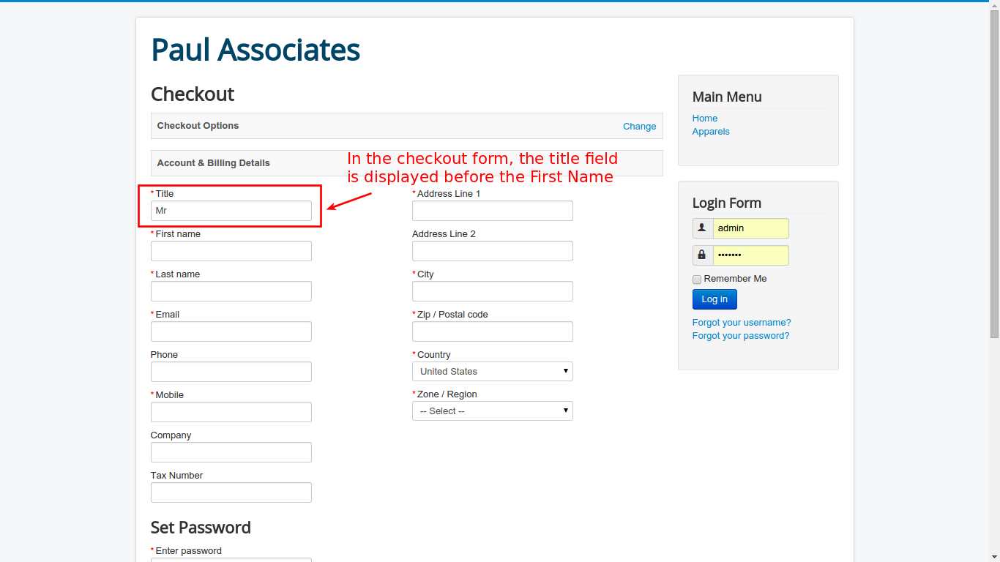

# Checkout Layout

In this tab, the checkout layout can be set.

* ***Checkout Billing Address Layout***

    This option helps to include/exclude the required fields in the layout of Billing Address. For e.g.,
    

		
[first_name] [last_name] [phone_1] [phone_2] [company] [tax_number]

		
[address_1] [address_2] [city] [zip] [country_id] [zone_id]

		

    Like this any html code can be added here for one's desired layout.
    
* ***Checkout Shipping Address Layout***

    This option helps to include/exclude the required fields in the layout of Shipping Address.
    
* ***Checkout Payment Method Layout***

    This option is to decide which fields are required in the layout for the Payment Method while checking out.
    
* ***Pre-populate / Restore***

    This is a button, that restores the default setting of all the three options given above, when clicked.
    
For a better understanding, check the image below:

    
    
### Example to add a custom field
Assume that it would be better to add a **Title** field before the **First Name**. To achieve that, create a custom field with *title* as its name, as shown in the image:

After that, the custom field has to be added to the layout settings in configuration. Go to **J2Store -> Setup -> Configuration** and select **Checkout Layout** tab.Then add the tag for the newly created custom field in the position of the desired display area. Save and close.  Check the image below:

Now, in the checkout process, the added custom field **Title** will be displayed before the **First Name** field, as illustrated in the following image:

In this way, new custom fields can be added according to the needs of the user.