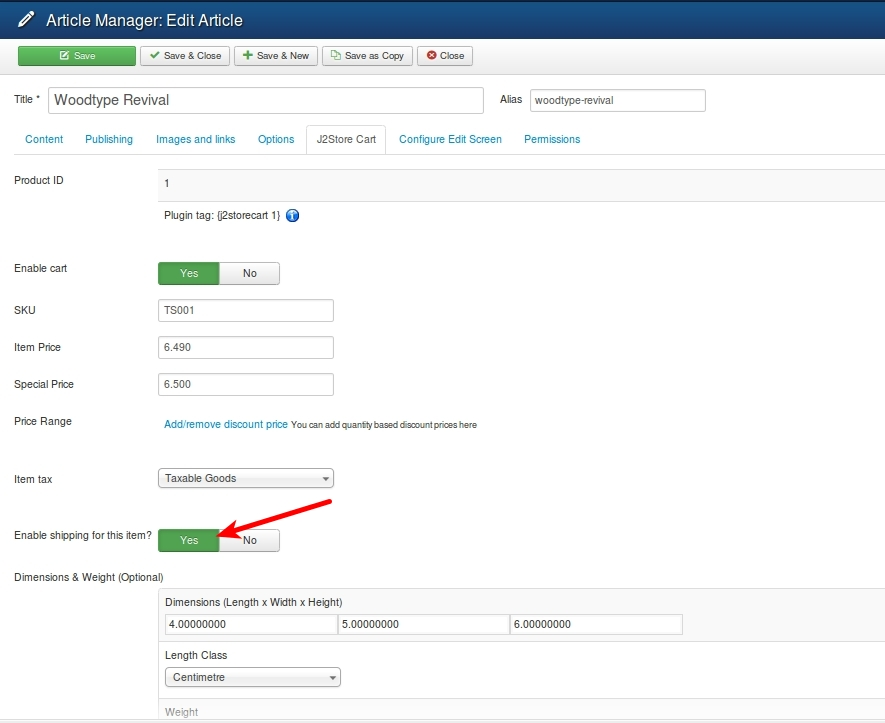
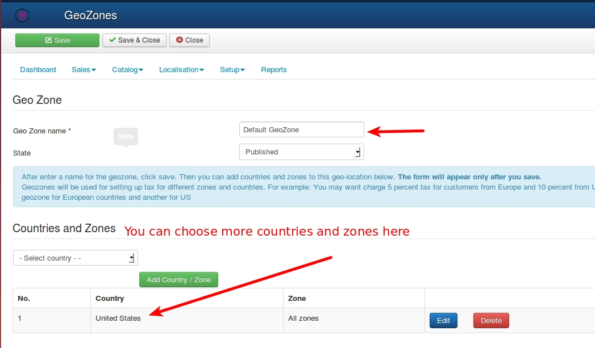
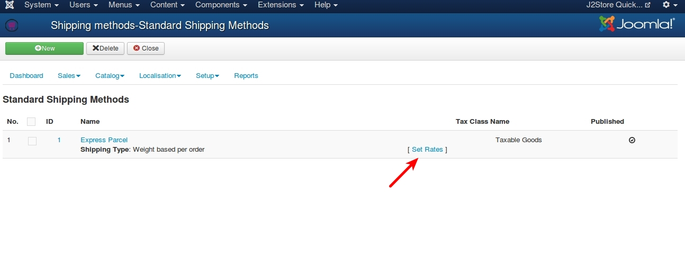
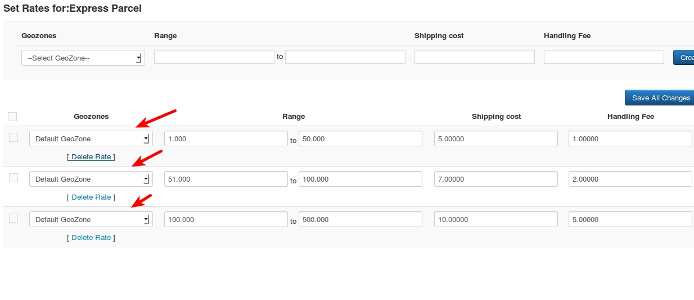

# Common mistakes to avoid when setting up Standard Shipping methods in J2Store

A number of store owners use the standard shipping methods that come integrated with J2Store.

The standard methods - flat rate, weight based, quantity based and price based - are very simple to configure and use. However, owners often make a few simple mistakes, leading to the disappearance of the shipping methods during the checkout.

This post aims to help the store owners to set up the shipping methods properly.

## 1. Enable shipping in the product parameters

While creating a product, the **Enable Shipping** param is by default set to ***No***. Most store owners do not notice this. If the product requires shipping, make sure that you set this param to ***Yes***.

## 2. Geozones

All the standard shipping methods in J2Store are bound by the Geozones. That is, you should always select a geozone while setting the rates. So, make sure that you have created the Geozones and added countries or zones inside them.

The concept of Geozone is very simple. Example: You have a store in the United States, Texas.

When you ship your goods to the nearby states, Oklahoma, Arkansas, and Louisiana, it costs you USD 20. But when you ship the same goods to California, it costs you USD 50.

So, group the Oklahoma, Arkansas, and Louisiana states into one Geozone and give it a name, for example, Nearby States. Then you create a second Geozone including California.

Refer the User guide for more examples.

## 3. Set shipping rates

After creating a shipping method (by going to J2Store admin -> Set up -> Shipping methods -> Standard Shipping Methods), you can see a link named Set Rates. Click on it to set the shipping rates for the chosen shipping type.

While Setting Rates, make sure that you select the Geozone. If you have two or more Geozones, then you should set rates for all. 

