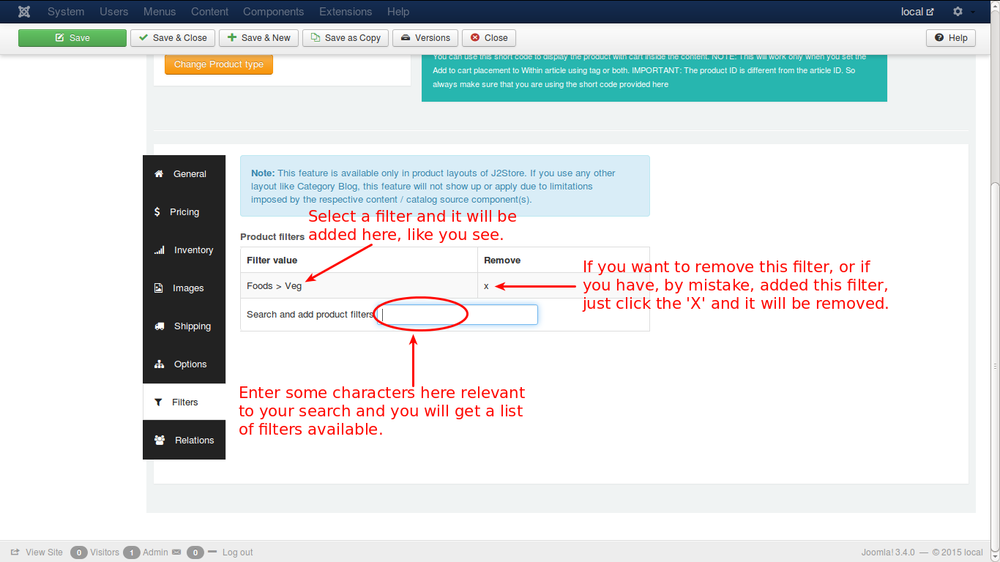

# Filters

Filters are certain attributes that help narrow the search of a particular product.

For e.g., assume that a customer searches for vegetarian pizza in the store. Pizza, is classified in foods category. So, the productfilter is set to be Foods > Veg, to narrow the search. See the image below:

Since you have selected the filter to be veg, the pizza products shown in the site will be only vegetarian.