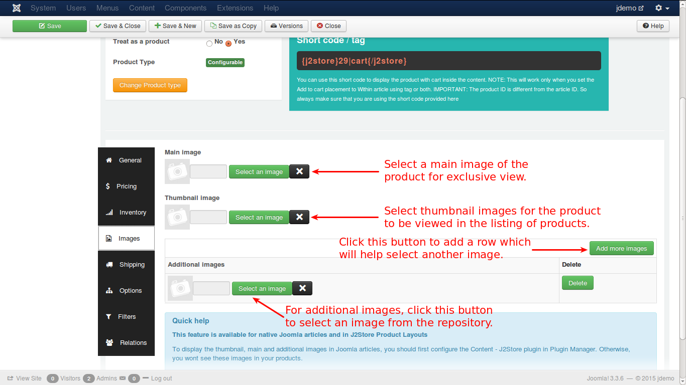

# Images

In this tab you can add images that can help the customer in more clear understanding of the product he wants to buy. Images help the prospect to imagine how the product intended to purchase will look like.

See the image below:

Let us understand this with an example. 

Lets assume that a customer would like to purchase a pizza. You need pizza images to be loaded in this tab. 

* **Main Image** - The main image will be a general photo image of the pizza, that has to be uploaded by clicking on the 'Select an image' button and select the appropriate image from the files.

* **Thumbnail Image** - The thumbnail image would be something that represents the original product, but it would be a much smaller one to fit into a button, that will be shown up in the cart. By seeing this, the customer will understand that his product is displayed on the button and will click the button to see more details about the pizza.

* **Additional Images** - Additional images help the customer to know more details about the pizza, which will be showing the pizza view in many variations, with other add ons, and the customer will understand it clearly how it looks like, what are the add-ons available with the pizza, the prize, and so on.
 
The button with the caption, **Add more images**, when clicked, inserts a new row below the **Additional images** to select another image of the product.
