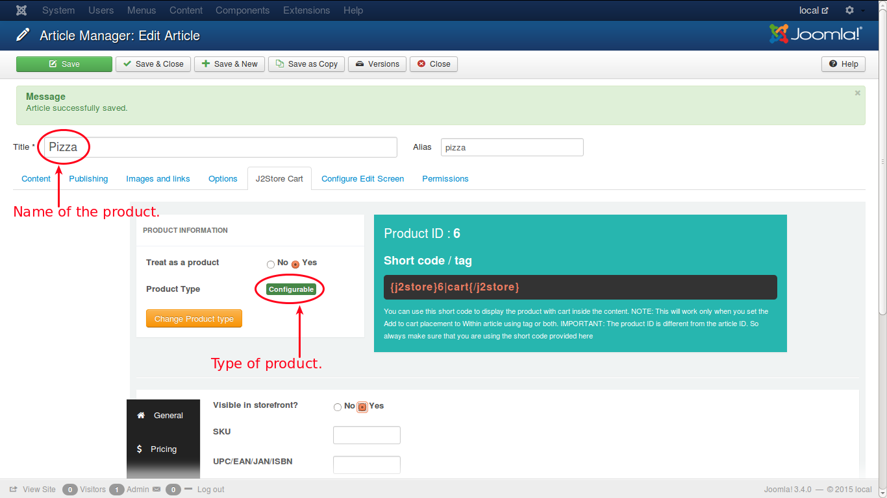

# Configurable Product

This product can be configured according to the needs of the customer and hence the name.

The options for this product are exactly similar to that of simple product except in the options tab, where there is an additional field **Parent Option** is available to select a parent option. In the options listed, for all options, except first one, a parent option can be selected.

The tabs that we are going to explore to configure this product type are:

* **[General](http://j2store.gitbooks.io/user-guide/content/conf_general.html)**
* **[Pricing](http://j2store.gitbooks.io/user-guide/content/conf_pricing.html)**
* **[Inventory](http://j2store.gitbooks.io/user-guide/content/conf_inventory.html)**
* **[Images](http://j2store.gitbooks.io/user-guide/content/conf_images.html)**
* **[Shipping](http://j2store.gitbooks.io/user-guide/content/conf_shipping.html)**
* **[Options](http://j2store.gitbooks.io/user-guide/content/conf_options.html)**
* **[Filters](http://j2store.gitbooks.io/user-guide/content/conf_filters.html)**
* **[Relations](http://j2store.gitbooks.io/user-guide/content/conf_relations.html)**