# Configuration

There are several options available for your online store. Any mis-configuration here will affect your storefront's behaviour. So take your time and configure the store correctly.  

The configuration page has several tabs. Each one is explained in detail. They are:
* **[Basic Settings](#basic_settings)**
* **[Store](#store)**
* **[Product](#product)**
* **[Inventory](#inventory)**
* **[Tax](#tax)**
* **[Discount](#discount)**
* **[Cart](#cart)**
* **[Checkout](#checkout_layout)**
* **[Order](#order)**
* **[Update](#update)**
* **[Others](#others)**

## Basic Settings

Some basic settings need to be done before you proceed. This will be handled by the following options.

 * ***Enable J2Store CSS***
 
    If this option is enabled, J2store loads the **j2store.css** file for customizing the template style. First, this will look in to the template CSS file. If it is not included, then J2Store loads it own **J2Store.css** file.
    
* ***Load jQuery UI***
    
    This option is same as the previous one. Here, there are four options available for selection. 
1. **No** -> Do not load jQuery UI
2. **Only Frontend** -> Load jQuery UI for frontend only
3. **Only Backend** -> Load jQuery UI for backend only
4. **Both frontend and backend** -> Load jQuery UI for frontend and backend

* ***Load jQuery UI Localisation for date picker***

     The date picker will be translated in your language when you set this to **YES**.

* ***Load full bootstrap css***

    If the template is loaded with bootstrap, and if the user does not want it to be loaded, the user may choose **NO**, otherwise choose **YES** to load the default Bootstrap CSS packed with **j2store**.
    
* ***Load minimal bootstrap css***

     If your template does not support the bootstrap, you can consider setting this to **YES** to load a minimal bootsrap support. So that your cart, checkout and order history pages looks good.

* ***Who can see 'add to cart'***
 
    This is an option for the user to add his/her product of choice to the cart to proceed for billing. This can be set to be viewed by **'everyone'** or for **'registered users only'**.

* ***Date Format***

    Here one can choose the display format of date from several [available options](http://php.net/manual/en/datetime.formats.date.php). 
    
* ***Folder path for digital goods***

    The relative path to the folder with your corresponding files. Eg., **'/media/myfiles/xyz.css'**

##Store

Configure the address, administrator email and some defaults for your storefront
    
* ***Store Administrator Email(s)***

    This is administrator's email and can have multiple emails, separated by comma. The order notification and payment validation errors will be sent to mail ids provided here.
    
* ***Store Name***

    Name of the store. One must enter a valid store name.

* ***Address, City***

    The address and city of the store is not mandatory. You can enter an address or simply leave the fields empty.
    
* ***ZIP/Postal code***

    Enter a valid postal code for the store. This field can not be empty.
    
Check the image below to understand how to enter emails, store name and address etc.
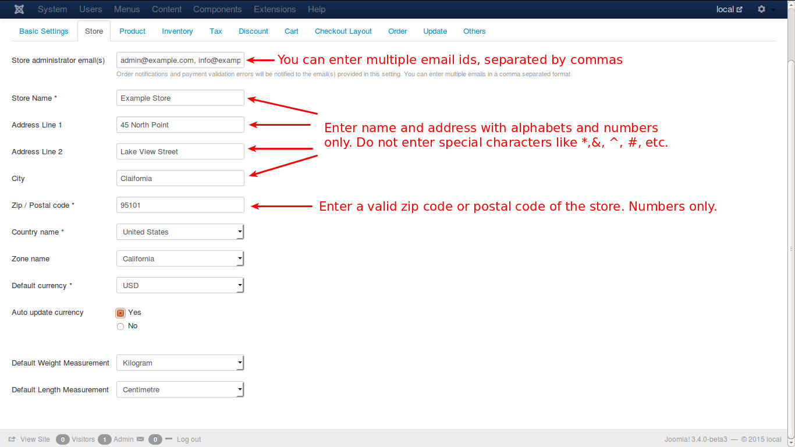

    
* ***Country Name***

    Name of the country in which the store exists. To be selected from the given list.

* ***Zone Name***

    Name of the zone in the country. To be selected from the given list.
    
* ***Default Currency***

    The currency that has been a legal tender in the country. To be selected from the given list.

* ***Auto Update Currency***

    Setting this option to *Yes* will automatically update the latest exchange values for the currency that is being dealt with. For e.g., the daily exchange values of INR against US $ will be updated automatically.
    
* ***Default Weight Measurement***

    Select the default weight measurement in use for any country from the available options. (Kilograms, Grams, Ounce, Pounds)
    
* ***Default Length Measurement***

    Select the default length measurement in use for any country from the available options. (Centimetre, Inch, Millimetre)

##Product
These are global parameters for product display. You can override some of these parameters if you are using the J2Store's product layout.

* ***Catolog Mode***

    Setting this option to **'Yes'** will disable all the features of the cart except the 'price' of the product.

* ***Show SKU?***

    SKU stands for **Stock Keeping Unit**. If this option is set to **'No'**, the SKU will become hidden in both product and cart views.
    
>CAUTION: SKU Show/Hide setting can be done in two places, i.e., in configuration setup and in product layout. Product layout setting will be given higher priority, i.e., if SKU is set to **Show** in configuration and again it is set to **Hide** in product layout, the configuration setting will be overridden and the SKU will be set to **Hide** as it is in product layout. As a result, SKU will not be shown in frontend.   
    
* ***Manufacturer/Brand***

    If it is set to '**YES**', the manufacturer name will be visible.
    
* ***Show Quantity Field***

    If it is set to 'Yes', the manual input for quantity will be visible, else quantity can not be given manually.
    
    
* ***Show Price***

    To hide the price of a product, set this option to **'No'**.
    
* ***Show Base/Regular Price***

    If advanced pricing option is used, i.e., a discount is offered on base price, it can be displayed using this option by setting it to **'Yes'**. It will show the base price in **~~strikedout~~** format.
    
Example:
In J2Store we can set the base price for the product and we can also offer some discount on base price. This discount on baseprice is called advanced price. If this option is **Enabled**(set to 'Yes'), it will show the base price in strikedout format and display the advanced price. 

Lets assume that the base price of a product is $ 300.00 and it is offered a discount of $ 50.00, then the new price will be $ 250.00

It will be displayed as below:

~~$ 300.00~~ (This is the base price)

$ 250.00 (This is the advanced price)

* ***Product Option Price***

    If this option is set to **'Show'**, product option price will displayed along with the option name.

* ***Product Option Price Prefix***

This option will work only when the previous option is enabled.

Setting this option to **'Show'**, will show the prefix for price modifier. i.e., a modifier '+/-' will be shown in the view, to modify the product price.

> Note: The options, ***Product Option Price*** and ***Product Option Price Prefix***, are applicable to **Simple** and **Configurable** product types only and not for **Variable** and **Downloadable** product types.
 
* ***Show Image for Product Options***
    
    This will be applicable for radio button option only. Setting this will show an image near the options in products page.
    
* ***No of columns for related products (upsells & cross sells)***

    This will be used for up-sells and cross-sells display layout when you use the shortcode for displaying up-sells and cross-sells in your article layouts.

# Inventory
***This is a J2Store PRO feature***

* ***Enable Inventory***

    Set this option to **'Yes'** to enable inventory management. Provide the available quantity when a product is added and it will be kept in track whenever an order is processed. Upon successful completion of an order, the ordered product quantity will be deducted from the available quantity and the result will be the new available quantity and when available quantity for a particular product becomes zero, the add to cart button will be disabled. Also, the user cannot enter a quantity greater than available quantity.
    
* ***Cancel New/Pending orders to release stock***

    Enabling this option by setting it to **'Yes'** will cancel the orders with status **'Pending' / 'New'**, if they were not confirmed within the stipulated time, and the stock will be released and added to available quantity.

* ***Hold stock for (in minutes) before canceling***

    If the previous option is set to yes, this option will be enabled for entering the allowed time for order confirmation, else, it will stay disabled.

* ***Stock Display Format***    

    This option is used to display the available stock. There are three formats available for the view.
    1. Always Show Stock e.g., 12 in stock.
    2. Show only when stock reaches low stock threshold. e.g., only 2 left in stock.
    3. Never show stock.

* ***Min Sale Quantity***

    This global setting default value is 1 and it can be overwritten for user's desired quantity in products view.

* ***Max Sale Quantity***

    Global setting. By default, it is left empty. It can also be overwritten.

* ***Notify if stock goes below***

    The global setting for this field is empty and it can be overwritten for the user's desired quantity. And when the stock goes beyond the preset level it will be notified.
    
Check the image below for a clear understanding.

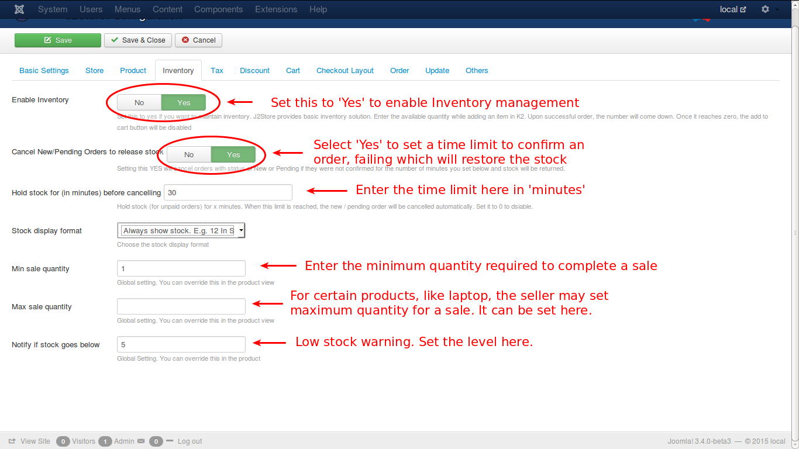

## Tax
An important area. Please think twice before you configure. Read the description carefully while configuring the following options.

* ***Prices Entered with tax***

    This is a very important option which deserves careful attention when entering the price of a product. The two options are:
    1. ***Yes***, I will enter prices inclusive of tax
    2. ***No***, I will enter prices exclusive of tax
    
The price entered initially will be the one till the end. Later alterations will not reflect in the product price.

* ***Calculate Tax based on***

    Three options available. Based on the option selected, tax will be calculated since the tax may vary depending upon the address.
    1. **Billing Address**
    2. **Shipping Address**
    3. **Store Address**
    
* ***Default Customer Address***

    Customer's address should be selected automatically from the available options in the list, before the customer inputs his/her own.
    
* ***Price Display Options***

Price of a product can be displayed in three formats.
1. Only the price of the product.
2. Price inclusive of relevant tax, as a single figure.
3. Price and Tax separately.

* ***Display tax information below the prices (in product pages)***

     Set this to **YES** will display (Incl.19% tax) or (excl.19% tax) to product pages.
     
* ***Display prices during cart / checkout Excluding tax***

     Choose how do you want to display the prices(including tax or excluding tax) during the checkout.
     

One of these options can be selected here.
    
Check the image below for a visual aid.

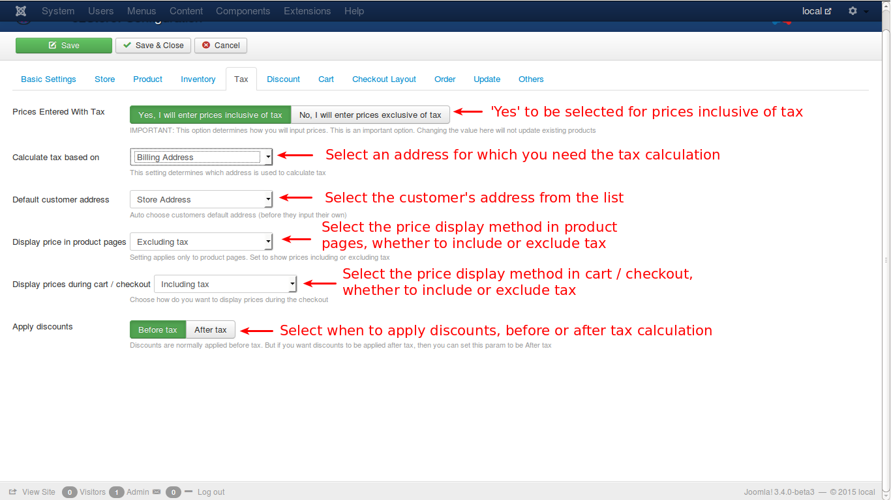

## Discount

#### *This is a J2Store PRO exclusive feature*

This is for discounts that are offered to customers.

* ***Enable Coupons***

    By default this option is set to **No**. If the product has some discounts based on the coupons, then set this option to **Yes**.
    
* ***Enable Gift Vouchers***

    By enabling this option with a '**Yes**', the customers can be offered gift vouchers with fixed value, say **$ 25.00**, which in turn, can be applied during the checkout.

# Cart

Cart and checkout settings for your store.

* Add to Cart Placement

    This option is for placing the **add to cart** button. Three options are available to choose.
    
    1. ***Default Position***
    
        If this option is selected, the add to cart button will be shown at the bottom of the product.
        
    2. ***Within Article using Tag***
    
        A tag can be added with article id (e.g., **{j2store}5|cart{/j2store}**) inside the text in a desired location, and j2store will place the **add to cart** button in that location.
        
    3. ***Both***
    
        Selecting this option will display the **add to cart** both at the bottom and also parse the tag, provided one(e.g., **{j2store}5|cart{/j2store}**) is added in the article text.
        
* ***Add to cart action***

    This option helps to decide on what has to be done when the **add to cart** button is clicked by the customer. Two options has been provided.
    
    1. Stay in the same page and show an inline link to a predefined location
    
    2. Redirect to default view of the cart
    

* ***Continue Shopping URL***

    After a product is added to the cart, the customer has been offered with three options to choose from, if the customer wishes to continue shopping.
    
    1. Redirect to the previous page where he added the product
    
    2. Redirect to a menu
    
    3. Redirect to a custom URL

* ***Add to cart button class***

    This option is used to set the **CSS class** for the **add to cart** button.

* ***Product Thumbnail***

    Enabling this option by choosing **Show** will display the thumbnail image of the product in the cart view.

* ***Show Tax for each cart item***

    If this option is set to **Yes**, tax will be levied for each item in the cart.

* ***Enable Shipping address fields***

    If the product has to be shipped to an address different from the customer's billing address, it can be added by selecting this option to **Yes**.

* ***Show login form during checkout***

    Enabling this option to **Yes** will show the login form during the checkout process, if a customer is not previously logged in during shopping. Without logging in, the customer cannot checkout, if this option is set to **Yes**.
    
Check the image for more clarification.
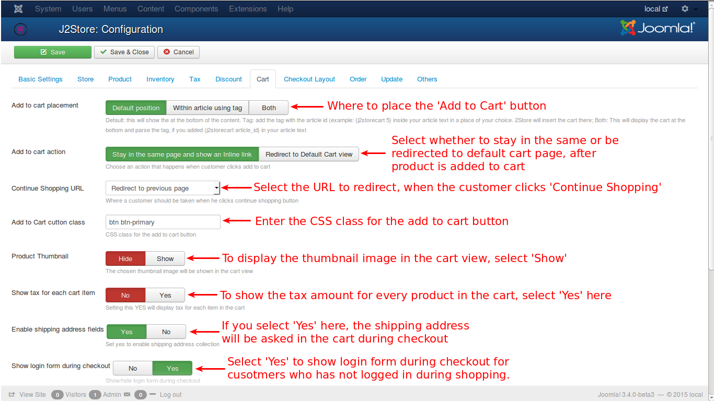

* ***Allow Quick New User Registration***

    If a customer is not registered before adding the products to the cart and checks out, a quick **new user registration** is possible by enabling this option to **Yes**. The customer will also be added to your customer database.

* ***Allow Guest Checkout***

    Guests are usually not allowed to checkout in shopping but if it is required, it can be set by enabling this option to **Yes**.

* ***Show Customer Note***

    Customer note is allowed and will be displayed in the checkout process pages but if it needs to be eliminated, then set this option to **No**.

* ***Show Tax and Shipping estimation tool***

    There is a facility to estimate the probable tax and shipping cost based on some preliminary details and this can be enabled by setting the option to **Yes**.
    
* ***Make postal code required in the shipping/tax estimator***

     Set this to **YES** will the make the entry of postal code mandatory while estimating shipping and tax in the cart page.
     
* ***Clear cart items***

     Choose when to clear the cart.
     **On confirmation :** When the order is confirmed by the payment gateways.
     **On order placement :** cart will be emptied when the customer places the order.
     
* ***Default payment method***

    Choose the default payment method from the list of payment available. This will be selected by default when customers checkout.
    
* ***Prevent customer from checking out if shipping method was not chosen***

     Set this to **YES** will prevent the customer from checking out if shipping method was not selected
     Make sure you have configured your shipping methods correct. Otherwise, shipping methods will not show up and your customers wont be able to place an order.
     
* ***Hide shipping costs until an address is entered***

     Set this to **YES** will show the shipping methods when an address is entered.

Check the image below for more clear understanding.

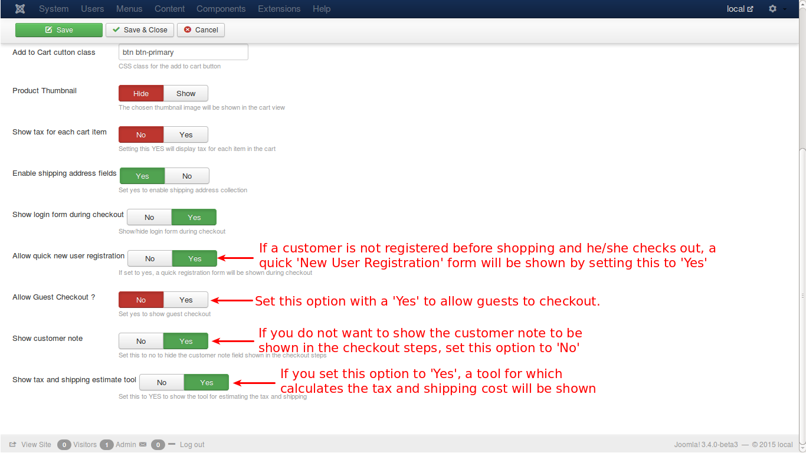

## Checkout Layout

The layout of the checkout address fields.
**NOTE:** Removing a field here will NOT remove it actually. Go to Setup -> Custom Fields to enable or disable the fields. This tab just decides the display and ordering of the fields in the checkout steps.

* ***Checkout Billing Address Layout***

    This option helps to include/exclude the required fields in the layout of Billing Address. For e.g.,
    

		
[first_name] [last_name] [phone_1] [phone_2] [company] [tax_number]

		
[address_1] [address_2] [city] [zip] [country_id] [zone_id]

		

    Like this any html code can be added here for one's desired layout.
    
* ***Checkout Shipping Address Layout***

    This option helps to include/exclude the required fields in the layout of Shipping Address.
    
* ***Checkout Payment Method Layout***

    This option is to decide which fields are required in the layout for the Payment Method while checking out.
    
* ***Pre-populate / Restore***

    This is a button, that restores the default setting of all the three options given above, when clicked.
    
For a better understanding, check the image below:

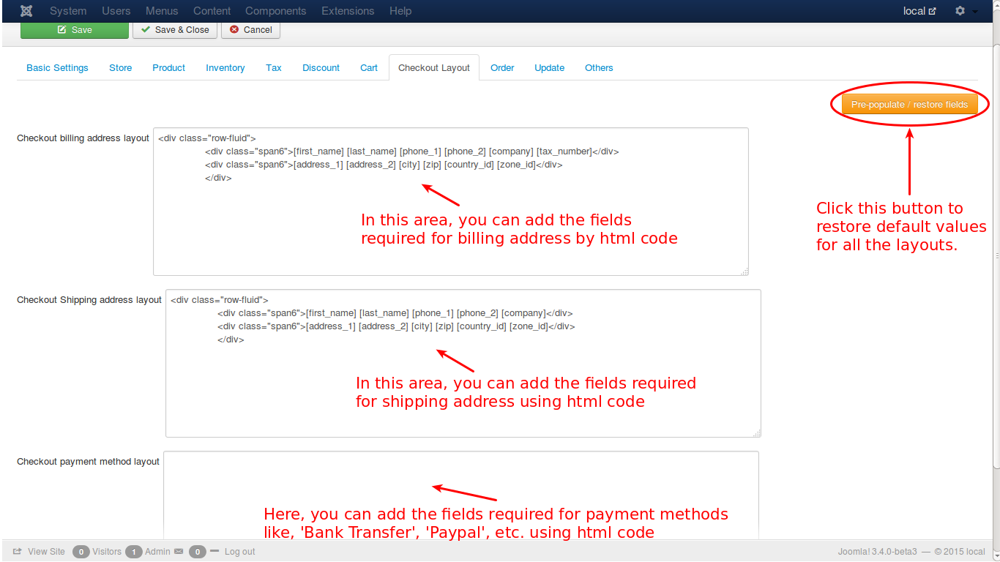
    
    
### Example to add a custom field
Assume that it would be better to add a **Title** field before the **First Name**. To achieve that, create a custom field with *title* as its name, as shown in the image:

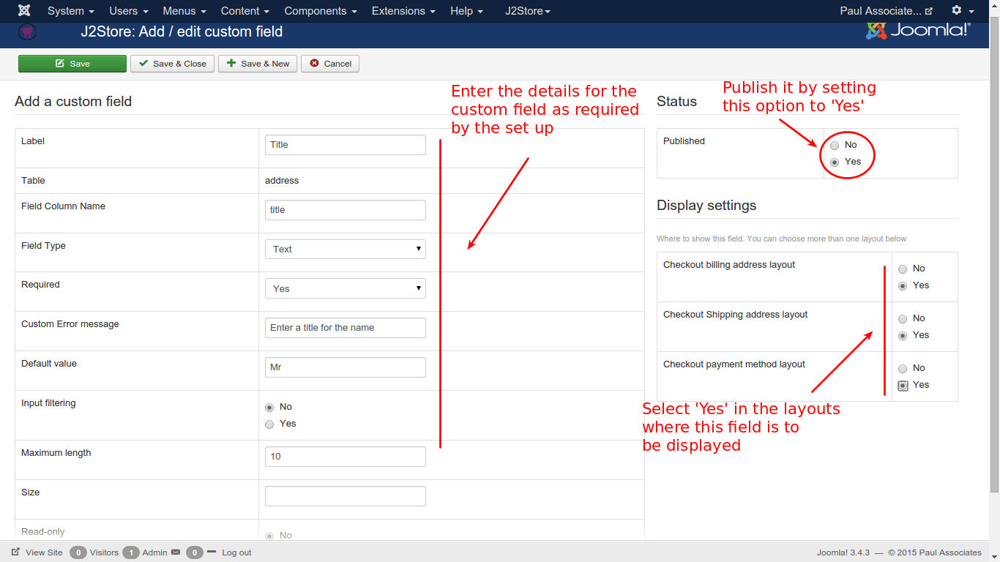

After that, the custom field has to be added to the layout settings in configuration. Go to **J2Store -> Setup -> Configuration** and select **Checkout Layout** tab.Then add the tag for the newly created custom field in the position of the desired display area. Save and close.  Check the image below:

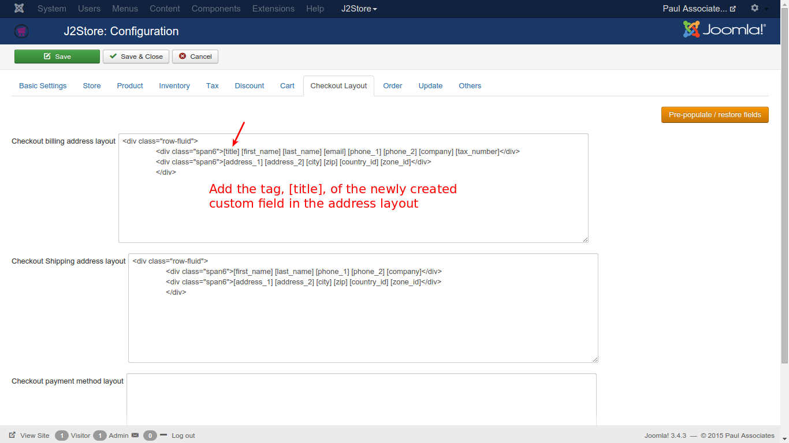

Now, in the checkout process, the added custom field **Title** will be displayed before the **First Name** field, as illustrated in the following image:

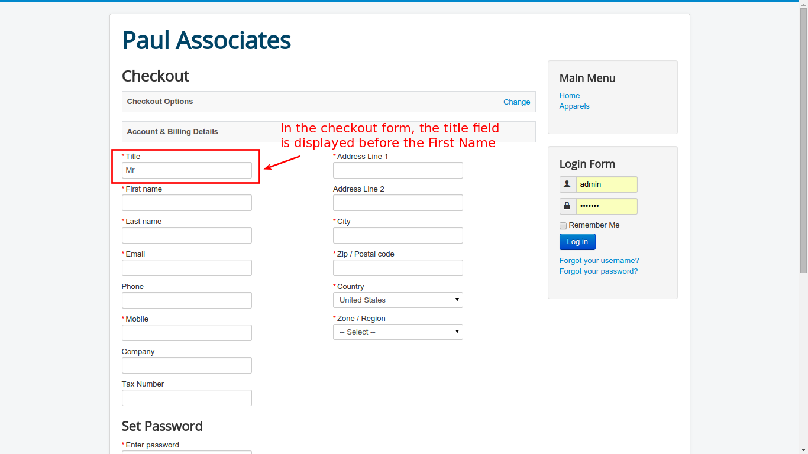

In this way, new custom fields can be added according to the needs of the user.

## Order

* ***Invoice Prefix***

    This is the prefix of the Invoice generated when payment is done. For e.g., the system generates only numbers and if one wants to add some prefix to the invoice number to add information about the invoice, it can be done by setting this field with the prefix.
    * Let's assume a company with a name RB Corporation, sells some products and the invoice prefix can be anything customized by the owner of the company. Some of the possibilities are:
        * **RBC/S/000**
        * **RBC-2015-S-000**

In the above example, **RBC/S/000**, ***RBC*** is the initials of the company, ***S*** can be added for sales classification, ***000*** for number prefix.

Likewise, in ***RBC-2015-S-000***, all are same and the extra 2015 may be added for the sales for the year ***2015***.

Now the system generated invoice number, say 1, will be appended with this prefix, and will be displayed as **RBC/S/0001** in the invoice.

For a better understanding, check the image below.
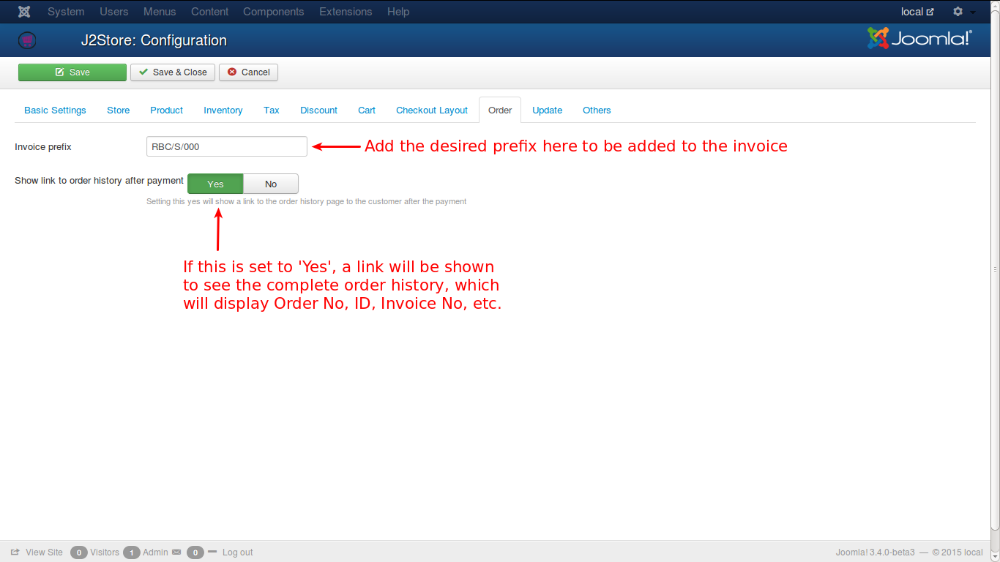

* ***Show Link to Order History after payment***
    
    Enabling this will show the user a link which will take to the user's order history page. This will be done only after payment.
    
* ***Downloads tab in My Profile***

     Set this to **SHOW** will display the download tab in the myprofile section.
     
* ***Customers can see orders with the status of**

     All, Confirmed,Processed,Failed,Pending,New,Cancelled

## Update

***Applies only for J2Store PRO users***

This tab has a text input to enter the **Download ID** provided by **[J2Store](http://j2store.org)**, which is a requirement for updating the j2store component's PRO version. Without this ID, [j2store PRO](http://j2store.org/my-downloads) cannot be downloaded. This ID will be available in the Invoice as well as in **My Download** of [j2store.org](http://j2store.org)

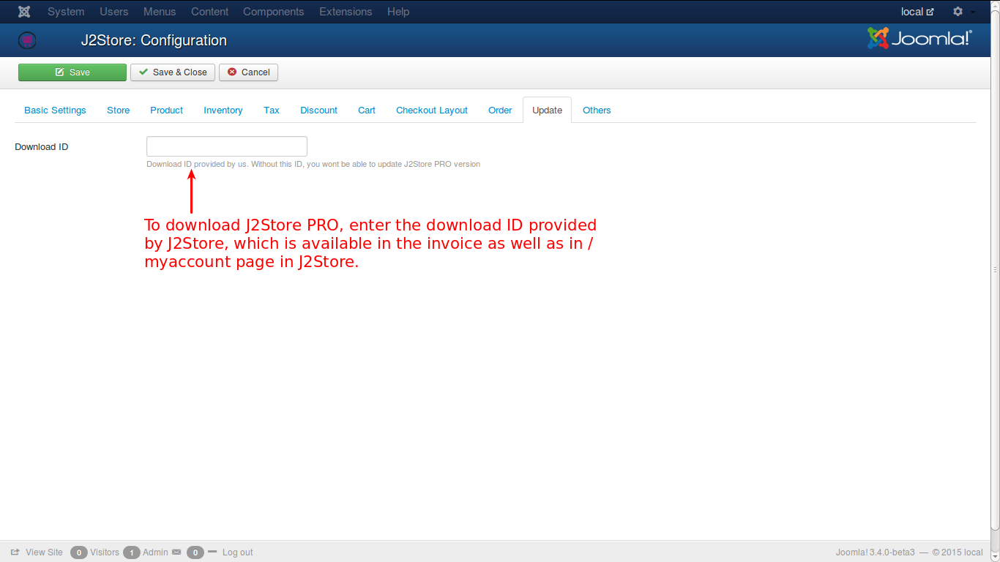

	

## Others

Misc. options for the store

* ***Show Terms and Conditions during Checkout***

    If this option is set with a **Yes**, a checkbox with a link to the article that contains the Terms and Coditions will be shown. 

* ***Terms and Conditions Display Type***

    This is to decide how the Terms and Conditions link is to be displayed. By default, it will be a **Link** but if it is desired to be a check box, it is possible by selecting **Checkbox**.

* ***Article ID of the Terms and Conditions***

    The ID of the article that holds the Terms and conditions is to be given here.
    
Check the image below for a better idea.

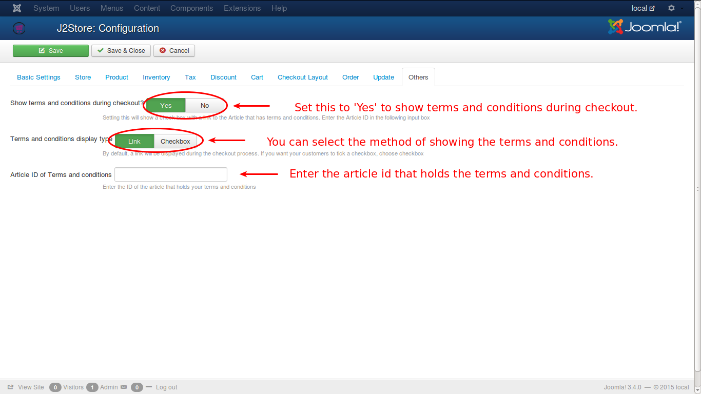