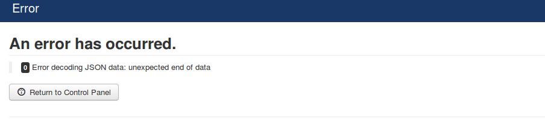
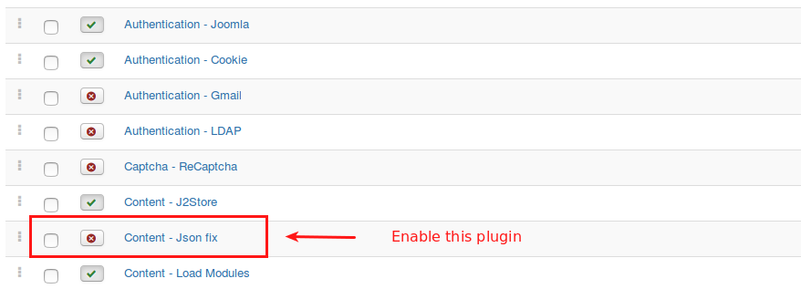
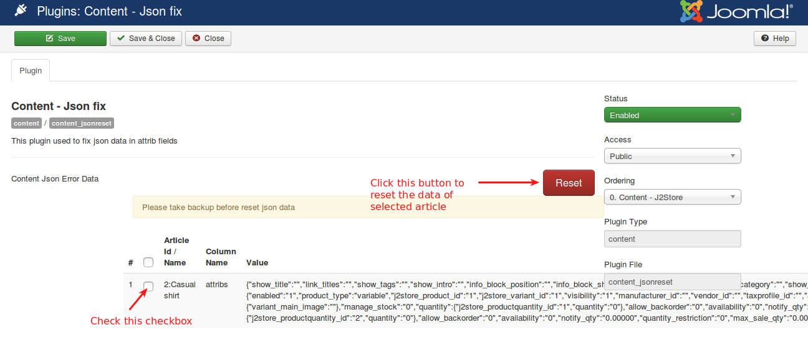
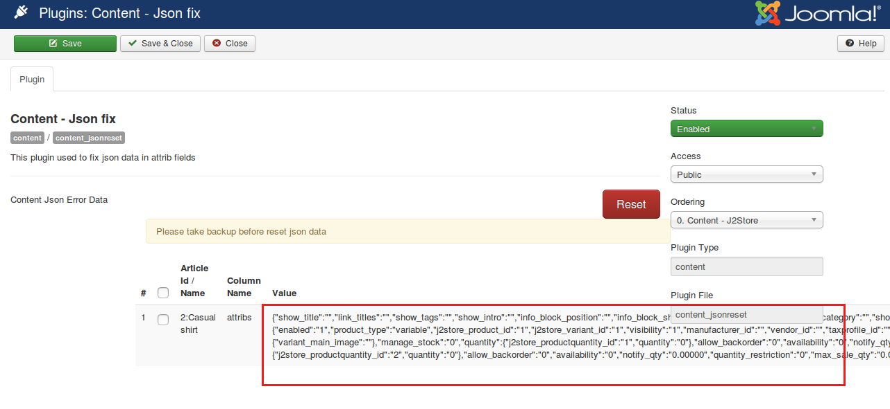

# [SOLVED] Joomla article error decoding json data

After updating Joomla version from 3.6.2 to 3.6.3 or 3.6.4, you might be facing below error when editing article/product. Some of them had large entries, so since attribs column was limited to 5120 characters, data was truncated. So then opening any article with truncated attribs spit this error.

> **"Error decoding JSON data: unexpected end of data"**

To overcome this error, we have developed a plugin "**Content - Json fix**". You can download and install the plugin from below url:

<https://bitbucket.org/j2store/content_jsonreset/downloads>

This pugin is a troubleshooting plugin which will list all the articles triggering above error and used to fix invalid json data in article attrib fields by resetting the data.

Download and Install this plugin using Joomla installer. Once installed, please go to Extensions > Plugin and enable the **Content - Json fix** plugin.

After enabling, open the plugin to start troubleshoot.

Check the check box to select the articles to which you would like to reset the data. Choose the articles and click **Reset** button.

> Clicking on reset button will remove data stored in the attribs field of that article and you will have to put the data again manually. You don't need to worry about **J2Store** data. J2Store data (price, varaints, etc) is stored in J2Store's own tables.

If you don't want to reset the data and would like to know which one causing this error, it is very simple. Just copy the value and validate it using online JSON validator tool. It will show you the data causing this issue and you can correct that data manually.

Another useful tool related to same Error decoding JSON data <https://github.com/robwent/joomla-json-db-check>
